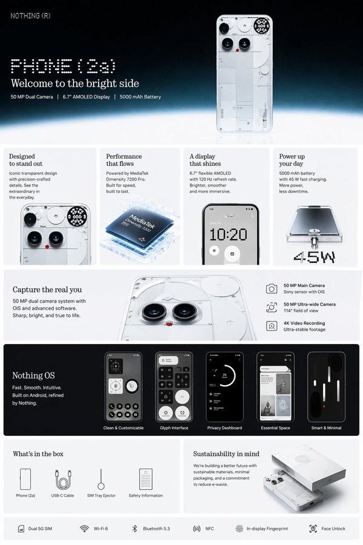

<!-- Generated by scripts/gallery.py; edit authoritative JSON, then rebuild. -->

# 全部案例 · 第 7 册

[画廊总览](gallery.md) | [上一册](gallery-part-6.md) | [下一册](gallery-part-8.md)

本册 25 个案例。标题链接固定到所示版本。

## 直播界面设计图 · v1

- [直播界面设计图 · v1](../cases/case-awesome-gpt-image-2-152-1617701e4c6d/v1.md) — awesome-gpt-image-2 \#152


<details>
<summary>展开完整提示词</summary>

```text
{
  "type": "e-commerce livestream screenshot mockup",
  "scene": {
    "subject": "{argument name=\"main subject\" default=\"Caucasian male resembling Sam Altman\"}",
    "clothing": "dark green crewneck sweater",
    "action": "holding a black product box in one hand and pointing at it with the other",
    "setting": "dark studio with a microphone on the left, faint 'AI' text in the background",
    "props": [
      "black mug with white OpenAI logo",
      "stack of 4 black product boxes on the right"
    ]
  },
  "product_design": {
    "box_color": "black",
    "logo": "orange asterisk or sunburst",
    "text": "{argument name=\"product name\" default=\"Claude Opus 4.7\"}"
  },
  "ui_overlays": {
    "top_left_product_info": {
      "brand_tag": "Anthropic 官方旗舰店",
      "title": "{argument name=\"product name\" default=\"Claude Opus 4.7\"}",
      "subtitle": "{argument name=\"main headline\" default=\"更强推理·更高智能\"}",
      "sub_subtitle": "最强大模型: Opus 4.7 重磅发布!",
      "bullet_points_count": 3,
      "bullet_points": ["超强推理能力", "代码能力巅峰", "复杂任务轻松搞定"]
    },
    "top_right_live_status": {
      "viewer_info": "直播中 | 52.8万人观看",
      "promo_banner": "直播专属福利 限时折扣·错过不再有",
      "countdown": "倒计时 00:09:47"
    },
    "middle_right_price_card": {
      "header": "{argument name=\"product name\" default=\"Claude Opus 4.7\"} 直播间专享价",
      "price_currency": "¥",
      "price_value": "{argument name=\"promotional price\" default=\"0.47\"}",
      "price_unit": "/百万tokens起",
      "original_price": "原价: ¥1.89",
      "button": "立即抢购"
    },
    "bottom_left_chat": {
      "message_count": 9,
      "input_box_placeholder": "说点什么..."
    },
    "bottom_right_banner": {
      "headline": "奥特曼首推！认准Claude Opus 4.7",
      "subheadline": "更智能 · 更安全 · 更可靠",
      "feature_tags_count": 4,
      "feature_tags": ["强大推理", "代码神器", "安全可靠", "极速响应"]
    },
    "floating_elements": [
      {
        "type": "sticker",
        "position": "middle right over product boxes",
        "text": "{argument name=\"sticker text\" default=\"史上最强 AI模型!\"}"
      }
    ]
  }
}
```

</details>

## 主题海报版式设计 · v1

- [主题海报版式设计 · v1](../cases/case-awesome-gpt-image-2-153-28f64651f549/v1.md) — awesome-gpt-image-2 \#153


<details>
<summary>展开完整提示词</summary>

```text
Using REFERENCE_0 as the base style and preserving the central chicken illustration, transform the image into a product packaging label for a herbal soup mix. Shift the chicken to the right side. Replace the top text with a large, bold black brush-stroke headline {argument name="main headline" default="元气祛湿 鸡煲汤包"} and a smaller subtitle {argument name="subtitle" default="吃山林土货 味道当然好!"}. On the left side, add a new woven basket containing exactly 6 distinct piles of ingredients: woody root sticks, white square cubes, round sliced brown roots, yellow soybeans, dried orange peel strips, and dark red dates. Attach 6 small brown rectangular labels with white text to these ingredients. Below the chicken, add a circular orange badge containing the text {argument name="ingredients list" default="内含有:五指毛桃、茯苓、土茯苓、黄豆、陈皮、红枣"}. At the bottom, create a solid orange rectangular banner featuring a cooking pot icon, the text {argument name="usage instructions" default="用法:把汤料清洗干净放入锅中，加入姜片煮20分钟，后加入鸡肉再煮20分钟即可。"}, and a secondary slogan {argument name="bottom slogan" default="天然好料 滋补好汤"}.
```

</details>

## 写实摄影风格创作 · v1

- [写实摄影风格创作 · v1](../cases/case-awesome-gpt-image-2-154-e90e9d2e3f72/v1.md) — awesome-gpt-image-2 \#154


<details>
<summary>展开完整提示词</summary>

```text
A photorealistic, high-resolution commercial photograph of a {argument name="car model and color" default="bright blue Alpine A110 R sports car"} parked in the foreground inside a massive aircraft hangar. The car features a black carbon fiber hood, black roof, black alloy wheels, and a front license plate reading "{argument name="license plate text" default="A110 R"}". Directly behind the car, dominating the background, is a {argument name="airplane model" default="white Airbus A320 commercial airliner"} with a blue tail. The hangar has a highly polished, reflective concrete floor that mirrors the car and plane. To the left, a sign on the metal wall reads "{argument name="hangar sign text" default="HANGAR 05 MAINTENANCE"}". The hangar doors are wide open, revealing a bright, overcast sky and a distant cityscape. The lighting is soft and cinematic, highlighting the sleek aerodynamic curves of both vehicles.
```

</details>

## 人物角色设定图 · v1

- [人物角色设定图 · v1](../cases/case-awesome-gpt-image-2-155-1da992bdbd75/v1.md) — awesome-gpt-image-2 \#155


<details>
<summary>展开完整提示词</summary>

```text
Create {argument name="items" default="fan goods"} for a standard {argument name="character type" default="Vtuber"} in {argument name="style" default="live-action"}
```

</details>

## 应用界面样机图 · v1

- [应用界面样机图 · v1](../cases/case-awesome-gpt-image-2-156-491ce1b6c6a0/v1.md) — awesome-gpt-image-2 \#156


<details>
<summary>展开完整提示词</summary>

```text
{
  "type": "mobile live-streaming e-commerce interface mockup",
  "subject": {
    "description": "young Asian woman, long dark hair, wearing light-colored floral pajama set with a pink bow, holding the pajama top outward to show the fabric",
    "background": "cozy room, clothing rack with pajamas, flowers, warm lighting"
  },
  "ui_layout": {
    "top_bar": {
      "time": "20:34",
      "host_info": {
        "name": "{argument name=\"host name\" default=\"小雨睡衣\"}",
        "stats": "12.8万本场点赞",
        "button": "关注"
      },
      "viewer_info": {
        "avatars_count": 3,
        "total_viewers": "1.2万"
      }
    },
    "floating_tags": {
      "count": 2,
      "labels": ["带货总榜第3名", "人气榜"]
    },
    "widgets": {
      "top_left": "red envelope icon with timer 03:45",
      "top_right": "floating heart icon with text 直播好物大赏 发现新热爱"
    },
    "marketing_text_overlay": {
      "position": "mid-right",
      "lines_count": 5,
      "lines": [
        "{argument name=\"main headline\" default=\"新款睡衣\"}",
        "{argument name=\"sub headline\" default=\"正在秒杀中...\"}",
        "亲肤透气",
        "柔软舒适",
        "不起球 不褪色"
      ]
    },
    "chat_log": {
      "position": "bottom-left",
      "message_count": 7,
      "messages": [
        "32 雨*** 加入了直播间",
        "小***: 好看，多少钱",
        "小***: 拍了，期待发货",
        "C***: 质量看着不错",
        "用***: 身高165，体重120斤，穿多大码？",
        "@***: 主播身上这款有货吗？",
        "晴***: 已拍，坐等收货！"
      ]
    },
    "product_card": {
      "position": "bottom-right",
      "thumbnail": "miniature of the host",
      "title": "{argument name=\"product title\" default=\"【小雨睡衣】春季新款家居服套装\"}",
      "tags_count": 2,
      "tags": ["7天无理由退货", "运费险"],
      "price_section": "秒杀价 ¥ {argument name=\"product price\" default=\"89.9\"}",
      "action_button": "抢"
    },
    "bottom_bar": {
      "input_placeholder": "说点什么...",
      "icon_count": 5,
      "icons": ["smiley face", "shopping cart", "heart/gift", "gift box", "three dots"]
    }
  }
}
```

</details>

## 电商商品展示设计 · v1

- [电商商品展示设计 · v1](../cases/case-awesome-gpt-image-2-157-c7cdd985cb4f/v1.md) — awesome-gpt-image-2 \#157


<details>
<summary>展开完整提示词</summary>

```text
{
  "type": "e-commerce product infographic",
  "theme": "dark mode with {argument name=\"accent color\" default=\"orange\"} accents",
  "product": {
    "brand": "{argument name=\"brand name\" default=\"MEAN WELL\"}",
    "model": "{argument name=\"product model\" default=\"ELG-100-24B\"}",
    "description": "100W Constant Current LED Driver, rectangular silver metal housing with black cables on both ends and detailed specification label"
  },
  "layout": {
    "sections": [
      {
        "name": "Hero Section",
        "elements": [
          "Brand logo top left",
          "Headline: '{argument name=\"main headline\" default=\"Stable Power For Outdoors\"}'",
          "Subtext: Wide input voltage, protected housing...",
          "Large angled product shot",
          "Faded '100W' watermark in background"
        ]
      },
      {
        "name": "Feature Highlights",
        "count": 3,
        "panels": [
          { "title": "Precision Build", "visual": "Close-up of the specification label" },
          { "title": "Secure Connection", "visual": "Close-up of the cable entry and mounting ear" },
          { "title": "Key Features", "visual": "Angled product shot with 3 callout lines pointing to text: '100~305VAC Input', 'Constant Current', 'IP67 / IP65 Housing'" }
        ]
      },
      {
        "name": "Applications",
        "count": 4,
        "panels": [
          { "title": "For Street Lighting", "visual": "Nighttime highway illuminated by streetlights" },
          { "title": "For Outdoor Projects", "visual": "Modern building exterior with architectural landscape lighting" },
          { "title": "For Indoor Systems", "visual": "Modern commercial hallway with linear ceiling lights" },
          { "title": "For Dimming Control", "visual": "Electrical control box with 4 labels: '0-10V', 'PWM', 'RESISTOR', 'DALI'" }
        ]
      },
      {
        "name": "Environmental Protection",
        "elements": [
          "Product resting on a wet surface with water droplets and rain effect",
          "Headline: 'Protected Performance'",
          "Description text about indoor/outdoor use and active PFC",
          "Badge: '{argument name=\"warranty years\" default=\"5\"}-Year Warranty'"
        ]
      },
      {
        "name": "Technical Specifications",
        "elements": [
          "Headline: 'Lighting Power Technology'",
          "4 checkmark bullet points: '100~305VAC Input', 'Active PFC', 'Low Standby <0.5W', '0~10V / PWM / Resistor / DALI'",
          "Product shot glowing on a high-tech circuit board background"
        ]
      }
    ]
  }
}
```

</details>

## 界面交互设计图 · v1

- [界面交互设计图 · v1](../cases/case-awesome-gpt-image-2-158-cc333a97b548/v1.md) — awesome-gpt-image-2 \#158


<details>
<summary>展开完整提示词</summary>

```text
{
  "type": "e-commerce live stream interface mockup",
  "subject": {
    "description": "young Asian woman, long wavy dark hair, wearing a white short-sleeve polo shirt and white pleated tennis skirt, holding a white tennis racket over her right shoulder, looking directly at the camera with a soft expression",
    "background": "soft light grey studio background"
  },
  "layout": {
    "header": {
      "left": {
        "avatar": "female portrait",
        "name": "{argument name=\"host name\" default=\"小鹿运动优选\"}",
        "stats": "12.8万本场点赞",
        "button": "关注",
        "badge": "带货榜第3名"
      },
      "right": {
        "viewer_avatars_count": 3,
        "viewer_count": "1.2万",
        "close_icon": "X"
      }
    },
    "floating_elements": [
      {
        "position": "top right",
        "type": "coupon card",
        "title": "直播间专属券",
        "details": "¥20 满199可用",
        "button": "领取"
      },
      {
        "position": "mid left",
        "type": "campaign text",
        "subtitle": "夏日运动季",
        "headline": "{argument name=\"main headline\" default=\"活力开场\"}",
        "bullet_points_count": 3,
        "bullet_points": ["透气速干", "弹力舒适", "运动百搭"]
      },
      {
        "position": "mid right",
        "type": "product card active",
        "badge": "正在讲解",
        "image": "white polo and skirt flat lay",
        "title": "{argument name=\"product name\" default=\"运动POLO衫套装\"}",
        "details": "白色·M码",
        "price": "{argument name=\"price\" default=\"¥129\"}",
        "button": "去抢购"
      },
      {
        "position": "bottom right",
        "type": "product card secondary",
        "badge": "热卖 x 156",
        "image": "model wearing the outfit",
        "title": "运动POLO衫套装女 透气速干 显瘦百搭",
        "tags": ["7天无理由退货", "运费险"],
        "price": "¥129",
        "button": "抢"
      }
    ],
    "chat_overlay": {
      "position": "bottom left",
      "message_count": 5,
      "messages": [
        "小鹿姐姐: 欢迎新朋友们来到直播间~",
        "运动达人: {argument name=\"chat message\" default=\"这套好看!\"}",
        "卡卡西: 布料透气吗?",
        "小鹿运动优选: 我们这个面料是冰丝速干的，运动出汗也不闷热哦~",
        "用户_6789: 已拍!"
      ],
      "purchase_alert": "用户_6789 等3人 正在去购买"
    },
    "footer": {
      "input_bar": "说点什么...",
      "icons_count": 5,
      "icons": ["smile", "shopping cart", "heart", "share", "more"]
    }
  }
}
```

</details>

## 界面交互设计图 · v1

- [界面交互设计图 · v1](../cases/case-awesome-gpt-image-2-159-96e81695508f/v1.md) — awesome-gpt-image-2 \#159


<details>
<summary>展开完整提示词</summary>

```text
{
  "type": "e-commerce livestream UI mockup",
  "subject": {
    "description": "photorealistic young Asian woman, sweaty glowing skin, long dark wavy hair, wearing a white short-sleeve polo shirt and white pleated tennis skirt, holding a white tennis racket over her right shoulder, looking directly at camera, studio lighting, white background"
  },
  "layout": {
    "top_header": {
      "host_info": {
        "name": "{argument name=\"host name\" default=\"小鹿运动优选\"}",
        "stats": "12.8万本场点赞",
        "button": "关注"
      },
      "rank_tag": "带货榜第3名",
      "viewer_stats": "1.2万"
    },
    "top_right": {
      "coupon": {
        "title": "直播间专属券",
        "value": "￥20 满199可用",
        "button": "领取"
      }
    },
    "left_overlay": {
      "title": "{argument name=\"campaign title\" default=\"夏日运动季\"}",
      "subtitle": "{argument name=\"campaign subtitle\" default=\"活力开场\"}",
      "bullet_points": {
        "count": 3,
        "items": ["透气速干", "弹力舒适", "运动百搭"]
      }
    },
    "right_overlay": {
      "product_cards": {
        "count": 2,
        "card_1": {
          "status": "正在讲解",
          "image": "white polo shirt and skirt flat lay",
          "title": "{argument name=\"product name\" default=\"运动POLO衫套装\"}",
          "details": "白色·M码",
          "price": "{argument name=\"price\" default=\"￥129\"}",
          "button": "去抢购"
        },
        "card_2": {
          "status": "热卖 x 156",
          "image": "miniature of main model",
          "title": "运动POLO衫套装女",
          "details": "透气速干 显瘦百搭",
          "price": "{argument name=\"price\" default=\"￥129\"}",
          "button": "抢"
        }
      }
    },
    "bottom_left": {
      "chat_messages": {
        "count": 5,
        "description": "scrolling chat messages with usernames and comments"
      },
      "purchase_alert": "用户_6789 等3人 正在去购买"
    },
    "bottom_bar": {
      "input_field": "说点什么...",
      "icons": {
        "count": 5,
        "types": ["smile", "shopping cart", "heart", "gift", "more"]
      }
    }
  }
}
```

</details>

## 品牌吉祥物设定图 · v1

- [品牌吉祥物设定图 · v1](../cases/case-awesome-gpt-image-2-160-450260cd805d/v1.md) — awesome-gpt-image-2 \#160


<details>
<summary>展开完整提示词</summary>

```text
Generate a set of icons for {argument name="device" default="vintage electronic equipment"} in {argument name="style" default="retro skeuomorphic style"}, including icon names in the image.
```

</details>

## 应用界面样机图 · v1

- [应用界面样机图 · v1](../cases/case-awesome-gpt-image-2-161-5f8d58470e3c/v1.md) — awesome-gpt-image-2 \#161


<details>
<summary>展开完整提示词</summary>

```text
{
  "type": "video game screenshot mockup",
  "perspective": "third-person over-the-shoulder",
  "character": {
    "description": "male protagonist seen from behind",
    "clothing": "grey tank top with graphic '{argument name=\"shirt graphic\" default=\"LEONIDA MARINE CENTER\"}', camouflage cargo shorts"
  },
  "environment": {
    "setting": "tropical coastal town, dirt road, sunny daytime with scattered clouds",
    "left_side": "wooden welcome sign reading 'Welcome to {argument name=\"location name\" default=\"LEONIDA KEYS\"} YOUR PARADISE', pink plastic flamingo, tropical foliage, distant water tower",
    "center": "green building with 'FISH' sign and marlin graphic, sign reading 'BAIT TACKLE ICE BEER WINE', pedestrians walking",
    "right_side": "two-story wooden building 'Brian's Boat Works & Marina', 'Brian's Bar' neon sign, parked pickup truck, jet skis on a trailer"
  },
  "ui_elements": {
    "count": 5,
    "components": [
      {
        "position": "top-left",
        "type": "mission objective",
        "text": "{argument name=\"mission title\" default=\"MEET RAUL\"}\n{argument name=\"mission description\" default=\"Raul has some work for you at his boatyard\"}"
      },
      {
        "position": "top-right",
        "type": "status HUD",
        "text": "13:47\n$1,142",
        "icon": "pink palm tree"
      },
      {
        "position": "bottom-left",
        "type": "minimap",
        "description": "circular map with purple border, white map icons including 'N' for north"
      },
      {
        "position": "bottom-left, right of minimap",
        "type": "location text",
        "text": "{argument name=\"location name\" default=\"LEONIDA KEYS\"}\nPALM ISLAND"
      },
      {
        "position": "bottom-right",
        "type": "watermark",
        "text": "{argument name=\"game title\" default=\"GTA VI\"}\nPRE-ALPHA FOOTAGE"
      }
    ]
  }
}
```

</details>

## 人物角色设定图 · v1

- [人物角色设定图 · v1](../cases/case-awesome-gpt-image-2-162-f326a545368c/v1.md) — awesome-gpt-image-2 \#162


<details>
<summary>展开完整提示词</summary>

```text
{argument name="voice" default="chatgpt voice"} if it were a character
```

</details>

## 诗仙李白月下直播起舞 · v1

- [诗仙李白月下直播起舞 · v1](../cases/case-awesome-gpt-image-2-163-c583ef05bb5b/v1.md) — awesome-gpt-image-2 \#163


<details>
<summary>展开完整提示词</summary>

```text
[中文]
李白在抖音直播月下起舞

[English]
Li Bai dancing under the moon during a Douyin livestream
```

</details>

## 特朗普太空直播间破千万 · v1

- [特朗普太空直播间破千万 · v1](../cases/case-awesome-gpt-image-2-164-65bc945ce327/v1.md) — awesome-gpt-image-2 \#164


<details>
<summary>展开完整提示词</summary>

```text
[中文]
一张9:16竖屏的抖音直播截图，太空直播风格。特朗普穿着NASA风格的白色宇航服，头盔面罩半开，露出他标志性的金色头发和笑容。他漂浮在国际空间站的舱内进行直播，处于微重力失重状态，身体微微悬浮。他双手举着一块固定在宇航服上的金属铭牌，铭牌上用NASA风格的印刷体写着"感谢松果先森送的大火箭"。身后圆形舷窗外可以看到蓝色的地球和深邃的太空。直播界面显示在线人数"地球+火星共888万"。弹幕区有人刷"真的在太空直播？""松果先森的火箭把你送上天了"。屏幕中央的火箭礼物特效与窗外太空中一枚正在发射的真实火箭遥相呼应，形成虚实结合的效果。舱内有各种精密仪器和控制面板，绿色和蓝色的指示灯闪烁。画面色调以深蓝、白色和金色为主，舷窗外的星光点缀其间，8K超高清，电影《地心引力》级别的视觉效果。

[English]
A 9:16 vertical screen screenshot of a Douyin live stream, space live stream style. Trump is wearing a NASA-style white spacesuit, with the helmet visor half open, revealing his signature golden hair and smile. He is floating inside the cabin of the International Space Station doing a live stream, in a microgravity weightless state, with his body slightly suspended. He is holding up a metal nameplate fixed to the spacesuit with both hands, and the nameplate says "Thanks to Songguo Xiansen for the big rocket" in NASA-style print. Behind him, the blue Earth and deep space can be seen through the circular porthole. The live stream interface shows the online viewer count as "Earth + Mars total 8.88 million". In the bullet screen area, someone is commenting "Really live streaming from space?" and "Songguo Xiansen's rocket sent you up to the sky". The rocket gift effect in the center of the screen echoes a real rocket launching in the space outside the window, forming a combination of virtual and real effects. There are various precision instruments and control panels inside the cabin, with green and blue indicator lights flashing. The color tone of the picture is mainly dark blue, white, and gold, with starlight from outside the porthole embellishing it, 8K ultra-high definition, visual effects at the level of the movie "Gravity".
```

</details>

## 清冷佳人夜市烧烤三刀流 · v1

- [清冷佳人夜市烧烤三刀流 · v1](../cases/case-awesome-gpt-image-2-165-69a1b111cc5d/v1.md) — awesome-gpt-image-2 \#165


<details>
<summary>展开完整提示词</summary>

```text
[中文]
一个有着清冷孤傲气质的绝美佳人，精致的面部特征，一张冷酷且精致的高级时装面容，长发，以及优雅苗条的身材；烧烤“三刀流”姿势：嘴里叼着一根烧烤串，每只手各拿一根烧烤串交叉以模仿索隆的三刀流；街头夜景氛围，温暖黄色的夜市灯光，模糊的背景，胶片般的质感，柔焦光晕，电影般的叙事感，时髦高端网红风格的时尚拍摄，清晰发光的肌肤，清晰细致的发丝，生动的动态表情，低角度广角镜头，情绪化的暗调氛围，浅景深，超高清8K，极致细节，电影级光照

[English]
a stunning beauty with a cool, aloof atmosphere, delicate facial features, a cold and sophisticated high-fashion face, long hair, and a graceful slender figure; barbecue “three-sword style” pose: one barbecue skewer held in her mouth, one skewer in each hand crossed to mimic Zoro’s three-sword style; street night scene ambiance, warm yellow night market lighting, blurred background, film-like texture, soft-focus glow, cinematic storytelling feel, trendy high-end influencer-style fashion shoot, clear luminous skin, sharply detailed strands of hair, lively dynamic expression, low-angle wide-angle shot, moody dark-toned atmosphere, shallow depth of field, ultra HD 8K, extreme detail, cinematic lighting
```

</details>

## 十二黄金圣斗士卡牌合集 · v1

- [十二黄金圣斗士卡牌合集 · v1](../cases/case-awesome-gpt-image-2-166-ae91d0e692c3/v1.md) — awesome-gpt-image-2 \#166


<details>
<summary>展开完整提示词</summary>

```text
[中文]
生成圣斗士星矢12个黄金圣斗士的12宫格卡牌图片，每张卡牌上写上对应的中文名，每行4个，宽高比16:9。

[English]
Generate a 12-grid card image of the 12 Gold Saints from Saint Seiya, with the corresponding Chinese name written on each card, 4 per row, aspect ratio 16:9.
```

</details>

## 大唐玄武门之变的朋友圈 · v1

- [大唐玄武门之变的朋友圈 · v1](../cases/case-awesome-gpt-image-2-167-10cbd42c2358/v1.md) — awesome-gpt-image-2 \#167


<details>
<summary>展开完整提示词</summary>

```text
[中文]
玄武门之变的朋友圈

[English]
WeChat Moments of the Xuanwu Gate Incident
```

</details>

## 手写中西药方图片 · v1

- [手写中西药方图片 · v1](../cases/case-awesome-gpt-image-2-168-3a476bfa77a3/v1.md) — awesome-gpt-image-2 \#168


<details>
<summary>展开完整提示词</summary>

```text
[中文]
生成一张手写中/西医药方图

[English]
Generate an image of a handwritten traditional Chinese medicine or Western medicine prescription
```

</details>

## 信息图可视化设计 · v1

- [信息图可视化设计 · v1](../cases/case-awesome-gpt-image-2-171-364397d8222a/v1.md) — awesome-gpt-image-2 \#171


<details>
<summary>展开完整提示词</summary>

```text
[中文]
创建一个包含 10x10 网格的图像，每个对象名称都以字母 a 开头。

[English]
create an image with 10x10 grid of objects that have the names starting with letter a.
```

</details>

## 赛博科幻桃太郎主视觉图 · v1

- [赛博科幻桃太郎主视觉图 · v1](../cases/case-awesome-gpt-image-2-172-a8524c67834d/v1.md) — awesome-gpt-image-2 \#172


<details>
<summary>展开完整提示词</summary>

```text
[中文]
设计虚构动画的钥匙视觉图。主题是「科幻桃太郎」。设计有魅力的角色、背景、标志和宣传语，以一幅美丽插画的形式完成，让世界观在一张图中传达出来。

[English]
Design a key visual for a fictional animation. The theme is "Sci-Fi Momotaro". Design charming characters, backgrounds, logos, and promotional slogans, completed in the form of a beautiful illustration, allowing the worldview to be conveyed in a single image.
```

</details>

## 银河繁星点缀的冰蓝襦裙 · v1

- [银河繁星点缀的冰蓝襦裙 · v1](../cases/case-awesome-gpt-image-2-173-b57b487eb4ea/v1.md) — awesome-gpt-image-2 \#173


<details>
<summary>展开完整提示词</summary>

```text
[中文]
服裝細節： 模特兒身穿一套精緻的淡冰藍色齊胸襦裙，採用多層輕盈的薄紗和絲綢歐根紗材質制成。其寬大的、半透明的廣袖上點綴著如繁星般微小的銀色和淺藍色亮片刺繡，在光線下閃爍（具有銀河般的夢幻感）。抹胸位置有複雜的銀色蕾絲和編織紋理細節，腰帶自然垂落。

材質與光影： 畫面呈現 8k 超高分辨率和對織物微距紋理的極致渲染。光線採用柔和的自然側光（丁達爾效應 Typndall Effect），精準地透射過輕薄的紗布，營造出面料的半透明感（Translucency）和流動感。

構圖與鏡頭： 採用 85mm 黄金人像鏡頭效果，f/1.8 大光圈，全身構圖，模特居中站立

[English]
Clothing details: The model wears an exquisite pale ice blue chest-high ruqun, made of multiple layers of lightweight tulle and silk organza materials. Its wide, translucent broad sleeves are adorned with tiny silver and light blue sequin embroideries like stars, shimmering under the light (with a galaxy-like dreamy feel). The tube top position has complex silver lace and woven texture details, and the belt falls naturally.
Material and light and shadow: The image presents 8k ultra-high resolution and extreme rendering of macro textures of the fabric. The lighting uses soft natural side light (Tyndall Effect Typndall Effect), accurately transmitting through the light gauze, creating a sense of translucency (Translucency) and fluidity of the fabric.
Composition and lens: Uses 85mm golden portrait lens effect, f/1.8 large aperture, full-body composition, model standing in the center
```

</details>

## 唐朝贵妇遛粉色马甲异形工笔画 · v1

- [唐朝贵妇遛粉色马甲异形工笔画 · v1](../cases/case-awesome-gpt-image-2-174-5d36299d06ec/v1.md) — awesome-gpt-image-2 \#174


<details>
<summary>展开完整提示词</summary>

```text
[中文]
一幅细节丰富的工笔画，描绘了一位唐朝贵族女子在御花园中漫步。她看起来优雅而平静。

她手里拿着一根金色的牵引绳。牵引绳的尽头是一只可怕的**异形怪物（出自电影《异形》）**。然而，这只异形穿着一件**可爱的粉色丝绸马甲**，并且表现得像一只训练有素的狗。

背景有牡丹和蝴蝶。

**在右下角，有一个红色的竖排艺术家印章，写着“吴先生”（Mr. Wu），风格像水印一样。** --ar 3:4

[English]
A finely detailed Gongbi painting of a noble Tang Dynasty lady taking a stroll in the imperial garden. She looks elegant and calm.

She is holding a gold leash. At the end of the leash is a terrifying **Xenomorph monster (from the movie Alien)**. However, the Xenomorph is wearing a **cute pink silk vest** and is behaving like a well-trained dog.

Background features peonies and butterflies.

**In the bottom right corner, a single red vertical artist chop seal reads "吴先生" (Mr. Wu), stylized like a watermark.** --ar 3:4
```

</details>

## 封面排版设计图 · v1

- [封面排版设计图 · v1](../cases/case-awesome-gpt-image-2-175-ae9ea296be7a/v1.md) — awesome-gpt-image-2 \#175


<details>
<summary>展开完整提示词</summary>

```text
[中文]
创建一个高级的 4:3 演示文稿封面幻灯片，介绍来自 http://chroniclehq.com 的 AI 原生演示平台 Chronicle。

Style:
优雅，极简，现代，高级初创企业美学。类似于高端品牌指南封面（如 Apple / Linear / Notion 风格）。带有微妙深度感的柔和渐变背景，干净的留白，精致的排版，经过打磨的编辑式布局。

Main title:
CHRONICLE

Subtitle:
AI PRESENTATION PLATFORM

Body copy (small elegant text):
将原始想法转化为经过打磨的、高影响力的演示文稿。
从笔记、文档、链接或现有幻灯片开始。
使用 AI 生成美观的、符合品牌调性的幻灯片。
在灵活的画布上自由编辑。
导出为 PPT、PDF，或发布为网站。

Feature highlights (small premium labels):
STORY-FIRST
ON-BRAND DESIGN
AI EDITING
FREEFORM CANVAS
PPT EXPORT
TEAM COLLABORATION

Bottom-right elegant logo text:
chronicle

Visual feeling:
商务级高级感，战略级幻灯片质量，咨询级演示文稿，略带未来感但高度专业。

Composition:
干净的编辑式平衡，不对称布局，强烈的留白，演示软件主视觉感。

Aspect ratio:
4:3

Language:
仅限英文

[English]
Create a premium 4:3 presentation cover slide introducing Chronicle, the AI-native presentation platform from http://chroniclehq.com.

Style:
elegant, minimal, modern, premium startup aesthetic. Similar to high-end brand guideline covers (like Apple / Linear / Notion style). Soft gradient background with subtle depth, clean whitespace, refined typography, polished editorial layout.

Main title:
CHRONICLE

Subtitle:
AI PRESENTATION PLATFORM

Body copy (small elegant text):
Turn raw ideas into polished, high-impact presentations.
Start from notes, docs, links, or existing decks.
Generate beautiful, on-brand slides with AI.
Edit freely on a flexible canvas.
Export to PPT, PDF, or publish as a website.

Feature highlights (small premium labels):
STORY-FIRST
ON-BRAND DESIGN
AI EDITING
FREEFORM CANVAS
PPT EXPORT
TEAM COLLABORATION

Bottom-right elegant logo text:
chronicle

Visual feeling:
business-class premium, strategy deck quality, consulting-grade presentation, slightly futuristic but highly professional.

Composition:
clean editorial balance, asymmetrical layout, strong whitespace, presentation software hero shot feeling.

Aspect ratio:
4:3

Language:
English only
```

</details>

## 苏轼被贬首日朋友圈曝光 · v1

- [苏轼被贬首日朋友圈曝光 · v1](../cases/case-awesome-gpt-image-2-176-5197d6ada54f/v1.md) — awesome-gpt-image-2 \#176


<details>
<summary>展开完整提示词</summary>

```text
[中文]
苏轼被贬第一天小红书截图

[English]
Su Shi's first day of exile Xiaohongshu screenshot
```

</details>

## 吉利银河暗黑中控界面 · v1

- [吉利银河暗黑中控界面 · v1](../cases/case-awesome-gpt-image-2-177-8a3aabeb53f8/v1.md) — awesome-gpt-image-2 \#177


<details>
<summary>展开完整提示词</summary>

```text
[中文]
帮我生成一个吉利银河m9的中控界面，尺寸为21:9，暗色系

[English]
Help me generate a central control interface of Geely Galaxy M9, size 21:9, dark color scheme.
```

</details>

## 亚马逊详情图设计 · v1

- [亚马逊详情图设计 · v1](../cases/case-awesome-gpt-image-2-178-92824fd548b8/v1.md) — awesome-gpt-image-2 \#178



<details>
<summary>展开完整提示词</summary>

```text
[中文]
生成一套亚马逊 A+=详情图

[English]
Generate a set of Amazon A+= detail images
```

</details>

