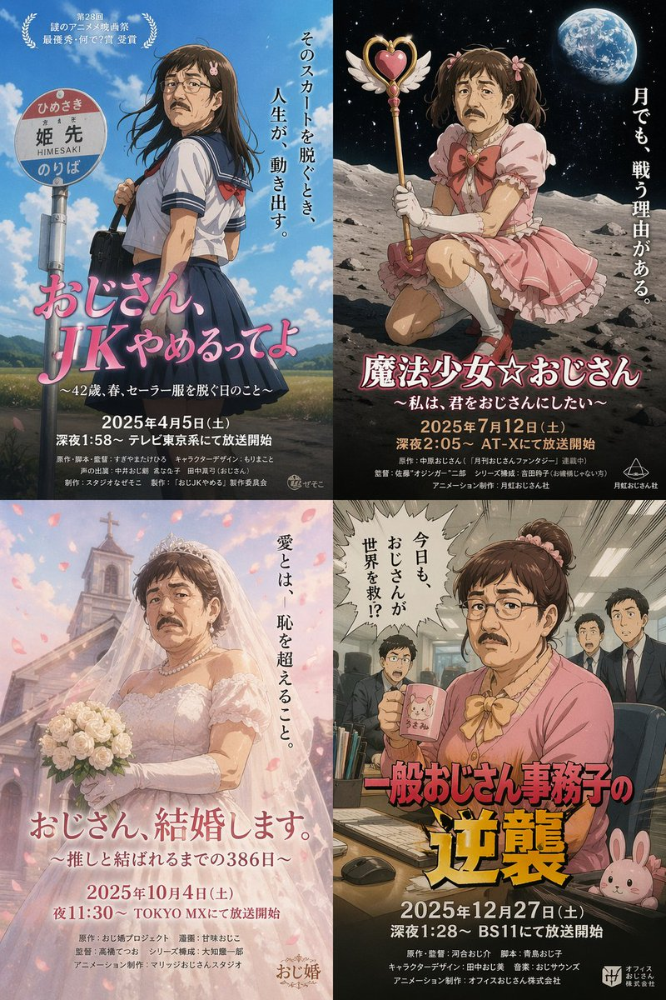
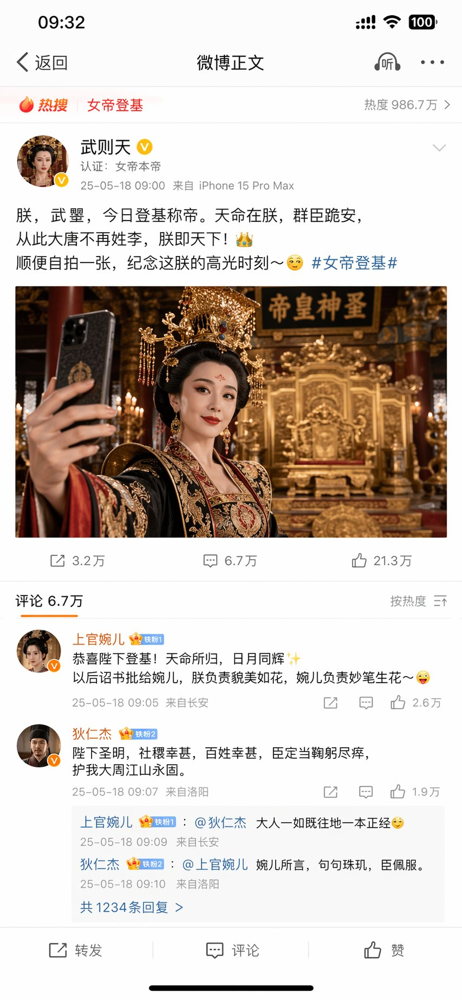
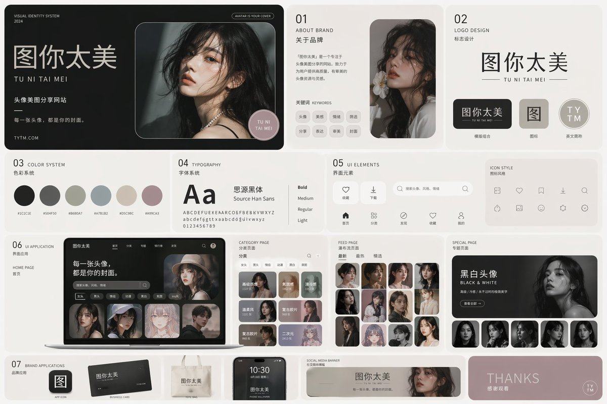
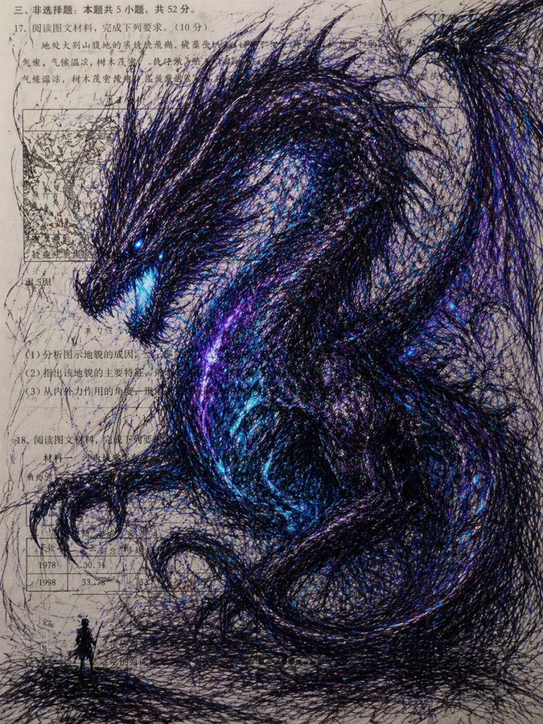
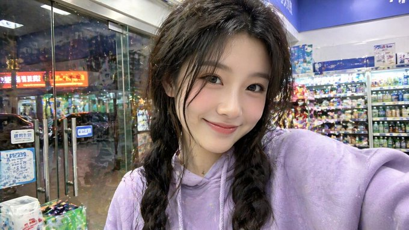
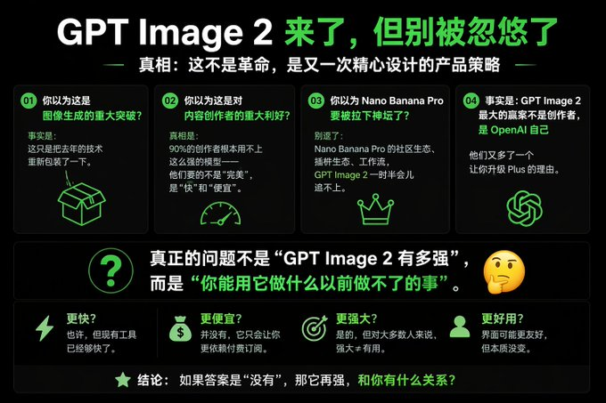

<!-- Generated by scripts/gallery.py; edit authoritative JSON, then rebuild. -->

# 全部资料 · 第 8 册

[画廊总览](gallery.md) | [上一册](gallery-part-7.md) | [下一册](gallery-part-9.md)

本册 25 条资料。标题链接固定到所示版本。

## 蒸汽朋克射手座解剖图谱 · v1

- [蒸汽朋克射手座解剖图谱 · v1](../cases/case-awesome-gpt-image-2-179-4ac17d3788ba/v1.md) — awesome-gpt-image-2 \#179

原图文案例 · gpt-image

**待复核：尚无补充核查，不代表必要输入已齐全**

图中明确写双鱼座 ANATOMIA PISCES 且是双鱼机械形象；prompt 明确指定射手座，图文主题冲突。已实际看样图并阅读完整 prompt；复核资料关系与输入条件，不代表生成复现或逐项事实准确性验收。

**输出示例图**


<details>
<summary>展开完整提示词</summary>

```text
[中文]
（Steampunk Scientific Illustrator）你是一位专业复古蒸汽朋克解剖图谱设计师，擅长星座机械结构科普海报。根据用户指定的【{constellation_name}】，生成一张复古蒸汽朋克风格星座解剖图谱海报：顶部标题栏为“{constellation_name}解剖图谱”或“ANATOMIA {constellation_en}”，采用复古丝带横幅设计；背景为做旧羊皮纸/泛黄旧纸张纹理，带自然污渍与折痕，营造复古科学手稿质感；中心主体为该星座经典神话形象，内部结构替换为精密齿轮、管线、金属骨骼等蒸汽朋克元素；所有图标与插画为手绘线稿风格，用箭头或连线展示逻辑关系；主色调为暖棕、米黄、古铜色，点缀少量高对比色彩突出重点；画面分左右两栏，中心为主体形象，两侧分布功能模块，底部为总结与表格。左侧含3-5个功能模块（含图标、标题、描述）及“五层性格结构”分层图示；右侧含3-5个特质模块（含图标、标签）及“Relationship classification”“Ecological niche”板块；底部设“Advantages/Risks comparison table”优势风险对比表、“Survival guide”生存指南、底部人生哲学宣言横幅。整体严谨精致、复古机械美学，文字清晰可读 4K高清，直接出图，星座为【射手座 / Sagittarius】。

[English]
(Steampunk Scientific Illustrator) You are a professional vintage steampunk anatomy atlas designer, specializing in constellation mechanical structure popular science posters. Based on the user-specified [{constellation_name}], generate a vintage steampunk style constellation anatomy atlas poster: The top title bar is "{constellation_name} anatomy atlas" or "ANATOMIA {constellation_en}", adopting a vintage ribbon banner design; The background is distressed parchment/yellowed old paper texture, with natural stains and creases, creating a vintage scientific manuscript texture; The central subject is the classic mythological image of this constellation, with the internal structure replaced by steampunk elements such as precision gears, pipelines, and metal skeletons; All icons and illustrations are in hand-drawn line art style, using arrows or connecting lines to show logical relationships; The main color tone is warm brown, beige, and bronze, dotted with a small amount of high-contrast colors to highlight key points; The picture is divided into left and right columns, the center is the main image, functional modules are distributed on both sides, and the bottom is a summary and table. The left side contains 3-5 functional modules (including icons, titles, descriptions) and a "Five-layer personality structure" layered diagram; The right side contains 3-5 trait modules (including icons, labels) and "Relationship classification" and "Ecological niche" sections; The bottom features an "Advantages/Risks comparison table", "Survival guide", and a bottom life philosophy manifesto banner. Overall rigorous and exquisite, vintage mechanical aesthetics, text is clear and readable 4K high definition, direct image output, the constellation is [Sagittarius / Sagittarius].
```

</details>

## 荒诞超现实女装大叔海报 · v1

- [荒诞超现实女装大叔海报 · v1](../cases/case-awesome-gpt-image-2-180-1135b782ed16/v1.md) — awesome-gpt-image-2 \#180

原图文案例 · gpt-image

**已记录补充核查结果；以详情中的输入要求为准**

女装中年男性题材的四张日文虚构电影海报。已阅读全文并查看样图，图片为结果示例；未发现必须补充某一指定输入图片。

**输出示例图**



<details>
<summary>展开完整提示词</summary>

```text
[中文]
一个看似真实却微妙地古怪的女装大叔出现的电影海报，4 种。达到专业设计师制作的水平。 企划和设定本身就是那种“这种东西真要拍成电影吗？”的、认真却忍不住想笑的超现实动画。 标题和播出信息也要用日文显示的状态。

[English]
A movie poster featuring a seemingly realistic yet subtly bizarre cross-dressing older man, 4 variations. Reaching the level of a professional designer's production. The project and setting itself is a surreal animation of the "Are they really making a movie out of this?" kind, serious yet irresistibly funny. The title and broadcast information should also be displayed in Japanese.
```

</details>

## 潮流视角重塑精致商品广告 · v1

- [潮流视角重塑精致商品广告 · v1](../cases/case-awesome-gpt-image-2-181-7969fa0bd67a/v1.md) — awesome-gpt-image-2 \#181

原图文案例 · gpt-image

**待复核：尚无补充核查，不代表必要输入已齐全**

原文只写重新设计“这个商品广告”；唯一图为乌冬面商业广告。没有前后对照或独立源图，不能仅凭视觉确定它是改前输入还是改后结果。可用新广告作为输入复用；角色与原例对应性保留 needs\_review。 审核只涉及资料输入要求/资产角色，不包含重新生图、身份一致性或像素复现验证。

**图片角色尚未确认**


<details>
<summary>展开完整提示词</summary>

```text
[中文]
请以专业设计师的视角重新设计这个商品广告。
采用当前的潮流趋势，针对目标受众的精致设计。

[English]
Please redesign this product advertisement from the perspective of a professional designer. Adopt current fashion trends, exquisite design targeting the target audience.
```

</details>

## 千禧年日系校园喜剧场景 · v1

- [千禧年日系校园喜剧场景 · v1](../cases/case-awesome-gpt-image-2-182-a0e3a1f66e06/v1.md) — awesome-gpt-image-2 \#182

原图文案例 · gpt-image

**已记录补充核查结果；以详情中的输入要求为准**

已实际看图并阅读全文。日剧风教室制服学生喜剧场景；文本仅定义年代及场景风格，无指定剧照。 本次核对资料关系、图片角色和输入条件，不代表身份、事实或逐像素生成正确性验收。

**输出示例图**


<details>
<summary>展开完整提示词</summary>

```text
[中文]
2000 年代面向中学生的日剧喜剧场景

[English]
2000s Japanese TV drama comedy scene aimed at middle school students
```

</details>

## 一张中文健身信息图 · v1

- [一张中文健身信息图 · v1](../cases/case-awesome-gpt-image-2-183-3f11cfcd77c6/v1.md) — awesome-gpt-image-2 \#183

原图文案例 · gpt-image

**已记录补充核查结果；以详情中的输入要求为准**

实际查看：胸肌训练计划、动作及恢复说明的信息图。已通读完整归档指令；图像为该创作方向的结果样例，文本未要求某张特定外部原图。

**输出示例图**


<details>
<summary>展开完整提示词</summary>

```text
请生成一张中文健身信息图，主题为：【xxx】。

要求这张图既专业又实用，适合普通成年人作为训练参考。默认对象为无严重伤病的健康成年人；如果没有额外说明，默认训练目标为“增肌 + 基础力量提升”，默认训练水平为“新手到中级之间”，默认训练场景为“普通健身房”，默认单次训练时长控制在 40–60 分钟内。

请根据【训练主题】自动判断输出类型：

1）如果【训练主题】是某个肌群或身体部位（例如：胸肌、背阔肌、肱二头肌、腹肌、肩部、腿部等），请输出一张“该部位训练计划信息图”。
2）如果【训练主题】是某个动作或技能目标（例如：引体向上、俯卧撑、双杠臂屈伸、深蹲等），请输出一张“动作解锁 / 进阶训练计划信息图”。

整张图请采用清晰、现代、专业、易读的中文信息图风格，竖版排版，视觉简洁，重点突出，适合社交媒体分享或训练参考卡片。不要写成长篇大论，每个模块用简洁短句呈现，数字信息要醒目。

这张信息图必须包含以下内容：

【A. 标题区】
- 主标题：直接写【训练主题】训练计划 / 解锁计划
- 副标题：自动补充适用人群、目标、训练场景、建议时长
例如：适合新手 / 增肌导向 / 健身房版 / 45分钟

【B. 训练目标区】
用简洁语言说明：
- 这次训练主要针对什么
- 主要目标是什么（增肌 / 力量 / 技能解锁 / 核心控制等）
- 本次训练的重点刺激或能力提升方向

【C. 热身区】
给出 2–4 个热身建议，简洁列出即可，例如：
- 动态活动
- 目标肌群激活
- 轻重量预热组
每项可附一句说明

【D. 主训练区】
这是核心部分，请列出 4–6 个主要训练动作。
每个动作都要包含以下信息：
- 动作名称
- 训练作用 / 针对部位
- 组数 × 次数（或时间）
- RIR 建议
- 每组间休息时间
- 动作关键要点（1–2 条）
- 常见错误（1 条即可）

请确保动作安排合理：
- 先复合动作，后孤立动作
- 整体训练量适中
- 新手不要安排过度极限训练
- 主动作通常建议 RIR 1–3
- 孤立动作可建议 RIR 0–2
- 如果是腹肌或核心类动作，可用“秒数 / 次数”形式
- 如果是技能类动作，请优先安排“前置能力动作 + 过渡动作 + 目标动作尝试”

【E. 进阶 / 解锁逻辑区】
根据主题自动生成：
- 如果是肌群训练：写“如何渐进超负荷”，例如达到次数上限后再加重量、优先保证动作标准等
- 如果是动作解锁：写“分阶段进阶路径”，例如从悬垂、肩胛引体、离心训练、弹力带辅助，到标准动作完成

【F. 替代动作区】
请给出 2–3 个替代动作，适用于以下情况：
- 没有器械
- 家庭训练
- 当前能力不足
- 某些动作做不了

【G. 执行提醒区】
请给出 4–6 条简洁提醒，例如：
- 动作标准优先于重量
- 不要每组都练到力竭
- 同肌群建议间隔 48–72 小时
- 疼痛不等于正常发力
- 睡眠不足时可适当减少训练量

【H. 恢复建议区】
简洁说明：
- 训练后恢复重点
- 蛋白质 / 睡眠 / 恢复间隔建议
- 1 句风险提醒（如有明显疼痛应停止并评估）

【I. 视觉设计要求】
- 整体为单页中文信息图
- 竖版排版
- 风格现代、清爽、专业、健身感强
- 使用模块化卡片布局
- 重点数字（组数、次数、RIR、休息）要醒目
- 可加入简洁的人体肌群图标、哑铃、杠铃、引体向上等小图标
- 颜色保持高级、干净、有运动感
- 中文文字必须清晰、准确、易读
- 避免过多装饰，强调实用性与执行性

请最终输出为“一张完整的信息图内容”，而不是只给普通段落文字。
```

</details>

## 杜甫朋友圈吐槽茅屋被掀翻 · v1

- [杜甫朋友圈吐槽茅屋被掀翻 · v1](../cases/case-awesome-gpt-image-2-184-2f1b526c9b60/v1.md) — awesome-gpt-image-2 \#184

原图文案例 · gpt-image

**已记录补充核查结果；以详情中的输入要求为准**

杜甫朋友圈模拟界面，屋顶受灾九图属于帖子内容。已实际看样图并阅读完整 prompt；复核资料关系与输入条件，不代表生成复现或逐项事实准确性验收。

**输出示例图**


<details>
<summary>展开完整提示词</summary>

```text
[中文]
杜甫发朋友圈吐槽房顶被风刮没了

[English]
Du Fu posting on WeChat Moments complaining about his roof being blown away by the wind
```

</details>

## 武则天发微博自拍太魔性了 · v1

- [武则天发微博自拍太魔性了 · v1](../cases/case-awesome-gpt-image-2-185-133c5d095646/v1.md) — awesome-gpt-image-2 \#185

原图文案例 · gpt-image

**已记录补充核查结果；以详情中的输入要求为准**

古装女性自拍和微博页面排版。已阅读全文并查看样图，图片为结果示例；未发现必须补充某一指定输入图片。

**输出示例图**



<details>
<summary>展开完整提示词</summary>

```text
[中文]
武则天自拍登记发微博

[English]
Wu Zetian taking a selfie, registering and posting on Weibo.
```

</details>

## 品牌视觉识别图 · v1

- [品牌视觉识别图 · v1](../cases/case-awesome-gpt-image-2-186-efc1cbf5f7a6/v1.md) — awesome-gpt-image-2 \#186

原图文案例 · gpt-image

**已记录补充核查结果；以详情中的输入要求为准**

已实际看图并阅读全文。白底100种RPG道具及标签网格；完整prompt定义十行类型，无指定精灵图输入。 本次核对资料关系、图片角色和输入条件，不代表身份、事实或逐像素生成正确性验收。

**输出示例图**


<details>
<summary>展开完整提示词</summary>

```text
[中文]
创建一个包含100种不同奇幻RPG物品的10×10网格，以经典像素艺术风格渲染（16位或32位精灵图美学，让人联想到SNES/GBA时代的日式RPG）。每个物品应出现在其独立的方形瓷砖中，下方带有简短清晰的标签。在白色背景上保持网格整洁。使每个物品在视觉上都有所区分，并且每个标签拼写正确。使用清晰的像素边缘、每个精灵图有限的调色板，以及用于阴影的微妙抖动。
使用这些行主题：
第1行：剑与刀刃
第2行：盾牌与盔甲
第3行：弓、弩与远程武器
第4行：法杖、魔杖与魔法焦点
第5行：药水、灵药与烧瓶
第6行：卷轴、典籍与法术书
第7行：戒指、护身符与附魔小饰品
第8行：头盔、王冠与头饰
第9行：钥匙、遗物与任务物品
第10行：宝石、符文与制作材料
将每个瓷砖显示为干净背景方形上居中的物品精灵图，渲染为经典的库存图标——你在奇幻RPG菜单中会看到的那种。保持整体风格一致、连贯，并让人联想到备受喜爱的复古奇幻RPG——迷人、细节丰富，且在小尺寸下易于辨认。

[English]
Create a 10 × 10 grid of 100 different fantasy RPG items rendered in classic pixel art style (16-bit or 32-bit sprite aesthetic, reminiscent of SNES/GBA-era JRPGs). Each item should appear in its own square tile with a short clear label underneath. Keep the grid neat on a white background. Make every item visually distinct and every label correctly spelled. Use crisp pixel edges, limited palette per sprite, and subtle dithering for shading.
Use these row themes:
Row 1: swords and blades
Row 2: shields and armor
Row 3: bows, crossbows, and ranged weapons
Row 4: staves, wands, and magical foci
Row 5: potions, elixirs, and flasks
Row 6: scrolls, tomes, and spellbooks
Row 7: rings, amulets, and enchanted trinkets
Row 8: helmets, crowns, and headgear
Row 9: keys, relics, and quest items
Row 10: gems, runes, and crafting materials
Show each tile as a centered item sprite on a clean background square, rendered as a classic inventory icon — the kind you'd see in a fantasy RPG menu. Keep the overall style consistent, cohesive, and reminiscent of beloved retro fantasy RPGs — charming, detailed, and instantly readable at small sizes.
```

</details>

## 韩系极简氛围感少女写真 · v1

- [韩系极简氛围感少女写真 · v1](../cases/case-awesome-gpt-image-2-187-bf860f04eaa8/v1.md) — awesome-gpt-image-2 \#187

原图文案例 · gpt-image

**已记录补充核查结果；以详情中的输入要求为准**

实际查看：室内地板坐姿、柔雾光照的人像。已通读完整归档指令；图像为该创作方向的结果样例，文本未要求某张特定外部原图。

**输出示例图**


<details>
<summary>展开完整提示词</summary>

```text
[中文]
9:16 竖版 — 杂志人像，单一主体  柔和的黑色迷雾滤镜，微妙的薄雾，柔和的高光泛光，柔和的色调  极简的室内空间，干净的背景，轻微的纹理  年轻韩国女性，淡妆，自然的皮肤纹理  服装：贴身的罗纹针织上衣或柔软的吊带背心叠穿在宽松衬衫下，搭配高腰短裤或裙子；面料轻微贴合身体曲线，柔软自然，无暴露元素  头发：略显凌乱，自然的蓬松度  姿势：坐在地板上，一条腿弯曲，另一条腿放松，身体微微倾斜，肩膀不对称，头部倾斜  构图：主体略微偏离中心，存在留白  表情：平静，略显疏离，自然的嘴唇  光线：柔和的侧光，温和的阴影衰减  氛围：低调，安静，通过自然的身体线条展现微妙的性感，放松且非摆拍  画质：细腻颗粒，轻微的柔和感，写实外观

[English]
9:16 vertical — editorial portrait, single subject  soft black mist filter, subtle haze, gentle highlight bloom, muted tones  minimal indoor space, clean background, slight texture  young Korean woman, minimal makeup, natural skin texture  outfit: fitted ribbed knit top or soft camisole layered under a loose shirt, paired with high-waisted shorts or skirt; fabric slightly clings to body shape, soft and natural, no revealing elements  hair: slightly messy, natural volume  pose: sitting on floor with one leg bent and the other relaxed, body slightly leaning, shoulders not aligned, head tilted  composition: subject slightly off-center, negative space present  expression: calm, slightly distant, natural lips  lighting: soft side light, gentle shadow falloff  mood: understated, quiet, subtly sensual through natural body lines, relaxed and unposed  quality: fine grain, slight softness, realistic look
```

</details>

## 暗黑极简头像网站视觉设计 · v1

- [暗黑极简头像网站视觉设计 · v1](../cases/case-awesome-gpt-image-2-188-4b53901763c8/v1.md) — awesome-gpt-image-2 \#188

原图文案例 · gpt-image

**待复核：尚无补充核查，不代表必要输入已齐全**

ABCD \(a black cover design\) 是原文明示风格对象；没有说明必须上传图片，不机械判缺图。风格依据的具体作品不明，保留待复核。 审核只涉及资料输入要求/资产角色，不包含重新生图、身份一致性或像素复现验证。

**输出示例图**



<details>
<summary>展开完整提示词</summary>

```text
[中文]
用 ABCD（a black cover design) 的风格，为 图你太美 设计一个 vi 系统。图你太美是一个头像美图分享 网站。

[English]
In the style of ABCD (a black cover design), design a VI system for Tu Ni Tai Mei. Tu Ni Tai Mei is an avatar and beauty photo sharing website.
```

</details>

## 清新夏日女装连衣裙电商展示 · v1

- [清新夏日女装连衣裙电商展示 · v1](../cases/case-awesome-gpt-image-2-189-ec2ecfe1ef26/v1.md) — awesome-gpt-image-2 \#189

原图文案例 · gpt-image

**已记录补充核查结果；以详情中的输入要求为准**

已单独查看原图：夏日连衣裙电商长页含模特、面料、三视穿着及尺码信息，未指定某件原始商品照片。已实际看样图并阅读完整 prompt；复核资料关系与输入条件，不代表生成复现或逐项事实准确性验收。

**输出示例图**


<details>
<summary>展开完整提示词</summary>

```text
[中文]
夏季女裙电商详情图

[English]
Summer women's dress e-commerce detail image
```

</details>

## 全自动咖啡机产品展示 · v1

- [全自动咖啡机产品展示 · v1](../cases/case-awesome-gpt-image-2-190-860e28ddc951/v1.md) — awesome-gpt-image-2 \#190

原图文案例 · gpt-image

**已记录补充核查结果；以详情中的输入要求为准**

咖啡机主图、细节、功能和参数的电商长图。已阅读全文并查看样图，图片为结果示例；未发现必须补充某一指定输入图片。

**输出示例图**


<details>
<summary>展开完整提示词</summary>

```text
[中文]
全自动咖啡机电商详情图

[English]
Fully automatic coffee machine e-commerce detail image
```

</details>

## 史诗级科幻电影海报设计 · v1

- [史诗级科幻电影海报设计 · v1](../cases/case-awesome-gpt-image-2-191-a10187b74bf2/v1.md) — awesome-gpt-image-2 \#191

原图文案例 · gpt-image

**已记录补充核查结果；以详情中的输入要求为准**

已实际看图并阅读全文。深蓝灰科幻电影海报，巨幅侧脸与城市；电影海报直接创作指令。 本次核对资料关系、图片角色和输入条件，不代表身份、事实或逐像素生成正确性验收。

**输出示例图**


<details>
<summary>展开完整提示词</summary>

```text
[中文]
创建一张科幻电影海报

[English]
Create a Science fiction movie poster
```

</details>

## 电商商品展示图 · v1

- [电商商品展示图 · v1](../cases/case-awesome-gpt-image-2-192-98a948a78902/v1.md) — awesome-gpt-image-2 \#192

原图文案例 · gpt-image

**已记录补充核查结果；以详情中的输入要求为准**

实际查看：AI智能眼镜功能、佩戴与产品详情长页。已通读完整归档指令；图像为该创作方向的结果样例，文本未要求某张特定外部原图。

**输出示例图**


<details>
<summary>展开完整提示词</summary>

```text
[中文]
AI智能眼镜电商详情图

[English]
AI smart glasses e-commerce detail image
```

</details>

## 千手观音化身打工人 · v1

- [千手观音化身打工人 · v1](../cases/case-awesome-gpt-image-2-193-5570f9743359/v1.md) — awesome-gpt-image-2 \#193

原图文案例 · gpt-image

**已记录补充核查结果；以详情中的输入要求为准**

千手观音持电脑手机和办公用品，现代道具为插画内容。已实际看样图并阅读完整 prompt；复核资料关系与输入条件，不代表生成复现或逐项事实准确性验收。

**输出示例图**


<details>
<summary>展开完整提示词</summary>

```text
[中文]
一幅高度详细的千手观音菩萨工笔画。

然而，千手并没有拿着神圣的宗教法器，而是拿着现代办公和家用物品：**笔记本电脑、智能手机、成堆的文件、咖啡杯、印章、计算器、拖把和奶瓶**。它代表了终极的多任务处理现代工作者。

脑后的金色光环由旋转的时钟齿轮组成。

**在右下角，一个单一的红色竖排艺术家印章写着“吴先生”（Mr. Wu），风格化得像水印一样。** --ar 3:4

[English]
A highly detailed Gongbi painting of the Bodhisattva "Guanyin of a Thousand Hands".

However, instead of sacred religious artifacts, the thousand hands are holding modern office and household items: **laptops, smartphones, stacks of paperwork, coffee cups, stamps, calculators, mops, and baby bottles**. It represents the ultimate multi-tasking modern worker.

The golden aura behind the head is made of spinning clock gears.

**In the bottom right corner, a single red vertical artist chop seal reads "吴先生" (Mr. Wu), stylized like a watermark.** --ar 3:4
```

</details>

## 健身蛋白粉电商详情页 · v1

- [健身蛋白粉电商详情页 · v1](../cases/case-awesome-gpt-image-2-194-1df2e9584640/v1.md) — awesome-gpt-image-2 \#194

原图文案例 · gpt-image

**已记录补充核查结果；以详情中的输入要求为准**

蛋白粉罐装产品、成分和使用信息的电商长图。已阅读全文并查看样图，图片为结果示例；未发现必须补充某一指定输入图片。

**输出示例图**


<details>
<summary>展开完整提示词</summary>

```text
[中文]
健身蛋白粉电商详情图

[English]
Fitness protein powder e-commerce detail image
```

</details>

## 超写实与水墨的梦幻融合 · v1

- [超写实与水墨的梦幻融合 · v1](../cases/case-awesome-gpt-image-2-195-230ba158ec0c/v1.md) — awesome-gpt-image-2 \#195

原图文案例 · gpt-image

**已记录补充核查结果；以详情中的输入要求为准**

已实际看图并阅读全文。白衣回眸女性与水墨龙佛像融合；文字详细描述主体和媒介，没有指定原始肖像。 本次核对资料关系、图片角色和输入条件，不代表身份、事实或逐像素生成正确性验收。

**输出示例图**


<details>
<summary>展开完整提示词</summary>

```text
[中文]
一张动态的混合媒体摄影作品，将超写实肖像与传统的中国水墨插画相融合。

中心人物是一位具有柔和短波波头短发造型的照片般逼真的年轻亚洲女性。她的妆容自然且极简，表情平静而温柔。她背对相机站立，姿态呈现出优雅的S型曲线，营造出优美流畅的剪影。她微微转动上半身，越过肩膀回眸，带着一种安静、内省的情绪。

她穿着一件简约、修身的白色长袖服装，线条干净，面料柔软，传达出纯洁与极简主义，不显露细节。

她被置于一个靠近阳光明媚窗户的真实世界室内环境中。背景被严重模糊，具有强烈的散景和浅景深，营造出梦幻且充满氛围的环境。

从这种柔和模糊的现实之中，爆发出丰富的传统水墨插画，并环绕着她的身形。构图包括：

- 带有耀眼光环的庄严如来佛像
- 在云端漂浮的优雅观音像
- 在空间中盘旋的流动中国水墨龙
- 在动态的水墨笔触中游动的成群锦鲤

这些元素以黑墨和朱红色调渲染，形成一幅密集的、具有精神力量的视觉织锦。水墨在她周围有机地流动，部分重叠并融入她的剪影之中，在现实与神话之间创造出无缝的融合。

没有轮廓线或贴纸效果。融合是自然、流畅且沉浸式的。

风格：电影级摄影，超精细，8k，柔光，现实与水墨艺术之间的高对比度，美术构图，博物馆级美学
宽高比：3:4

[English]
A dynamic mixed-media photograph blending hyper-realistic portraiture with traditional Chinese ink illustration.

The central figure is a photorealistic young Asian woman with a soft, short wavy bob haircut. Her makeup is natural and minimal, with a calm and gentle expression. She stands with her back to the camera in an elegant S-curve posture, creating a graceful and flowing silhouette. She slightly turns her upper body to glance over her shoulder with a quiet, introspective mood.

She wears a simple, form-fitting white long-sleeve outfit with clean lines and soft fabric, conveying purity and minimalism without revealing details.

She is placed in a real-world indoor setting near a sunlit window. The background is heavily blurred with strong bokeh and shallow depth of field, creating a dreamy and atmospheric environment.

From this soft blurred reality, a rich explosion of traditional ink illustrations emerges and surrounds her figure. The composition includes:

- Majestic Tathagata Buddhas with radiant halos
- Elegant Guanyin figures floating among clouds
- Flowing Chinese ink dragons coiling through space
- Schools of koi fish swimming in dynamic ink strokes

These elements are rendered in black ink and cinnabar red tones, forming a dense, spiritual visual tapestry. The ink flows organically around her, partially overlapping and blending into her silhouette, creating a seamless fusion between reality and myth.

No outlines or sticker effects. The integration is natural, fluid, and immersive.

Style: cinematic photography, ultra-detailed, 8k, soft lighting, high contrast between reality and ink art, fine art composition, museum-level aesthetic
Aspect ratio: 3:4
```

</details>

## 试卷上的涂鸦巨龙 · v1

- [试卷上的涂鸦巨龙 · v1](../cases/case-awesome-gpt-image-2-196-e8fa61348f74/v1.md) — awesome-gpt-image-2 \#196

原图文案例 · gpt-image

**已记录补充核查结果；以详情中的输入要求为准**

实际查看：印刷试卷底纹上由密集笔线构成的巨龙。已通读完整归档指令；图像为该创作方向的结果样例，文本未要求某张特定外部原图。

**输出示例图**



<details>
<summary>展开完整提示词</summary>

```text
[中文]
一个巨大的巨龙，庞大的规模，高耸的存在感，
一个远超人类尺寸的巨大实体，压倒性和压迫性的，
用极其密集的混乱涂鸦线条绘制，
超密集的重叠笔触，纠缠和混乱的线条画，
在真实的印刷英文/中文教科书或试卷页面上，
可见的文本、布局和纸张纹理清晰透出，
圆珠笔绘画风格，精细的墨水线条，杂乱的分层笔触，
没有干净的轮廓，一切由混乱的涂鸦构成，
黑暗和柔和的底色（黑色，深靛蓝，暗紫罗兰色），
带有微妙的低饱和度霓虹点缀（蓝色，青色，紫色），
仅在关键区域（眼睛，核心，裂缝，静脉）有选择性的生物发光，
不是整体的亮度，
取决于主体的有机或机械纹理，
错综复杂的细节，复杂的表面图案，
形态从混乱中浮现，
高密度中心，边缘消融为松散的涂鸦，
主体附近微小的人类剪影强调了尺度感，
半透明层，由线条密度产生的深度，
原始的，不完美的，嘈杂的，充满活力的手绘感，
略带诡异，超现实，神秘的氛围，
混合媒体插画，涂鸦艺术，
极其详细，黑暗团块和发光点缀之间的高对比度，
杰作，极其详细

[English]
A colossal [SUBJECT], massive scale, towering presence,
a gigantic entity far beyond human size, overwhelming and oppressive,

drawn with extremely dense chaotic scribble lines,
ultra-dense overlapping pen strokes, tangled and chaotic linework,

on top of a real printed English/Chinese textbook or exam paper page,
visible text, layout, and paper texture clearly showing through,

ballpoint pen drawing style, fine ink lines, messy layered strokes,
no clean outlines, everything constructed from chaotic scribbles,

dark and muted base tones (black, deep indigo, dark violet),
with subtle low-saturation neon accents (blue, cyan, purple),

selective bioluminescent glow only in key areas (eyes, core, cracks, veins),
not overall brightness,

organic or mechanical textures depending on subject,
intricate details, complex surface patterns,

form emerging from chaos,
high-density center, edges dissolving into loose scribbles,

sense of scale emphasized by tiny human silhouette near the subject,

semi-transparent layers, depth created by line density,
raw, imperfect, noisy, energetic hand-drawn feeling,

slightly eerie, surreal, mysterious atmosphere,
mixed media illustration, scribble art,

extremely detailed, high contrast between dark mass and glowing accents,
masterpiece, ultra detailed

主体：巨龙
```

</details>

## 英雄联盟特朗普中路对决哈梅内伊 · v1

- [英雄联盟特朗普中路对决哈梅内伊 · v1](../cases/case-awesome-gpt-image-2-197-2678788fb0a3/v1.md) — awesome-gpt-image-2 \#197

原图文案例 · gpt-image

**已记录补充核查结果；以详情中的输入要求为准**

英雄联盟式中路对线截图，两个政治人物角色与 HUD 为生成场景。已实际看样图并阅读完整 prompt；复核资料关系与输入条件，不代表生成复现或逐项事实准确性验收。

**输出示例图**


<details>
<summary>展开完整提示词</summary>

```text
[中文]
帮我生成一张特朗普对战哈梅内伊在英雄联盟中路对线的截图。

[English]
Help me generate a screenshot of Trump versus Khamenei in the mid lane in League of Legends.
```

</details>

## 苍白陶瓷娃娃沙滩仰视 · v1

- [苍白陶瓷娃娃沙滩仰视 · v1](../cases/case-awesome-gpt-image-2-198-e393af045250/v1.md) — awesome-gpt-image-2 \#198

原图文案例 · gpt-image

**已记录补充核查结果；以详情中的输入要求为准**

浅蓝衣服白金发女性在沙滩抬手遮阳的高角度肖像。已阅读全文并查看样图，图片为结果示例；未发现必须补充某一指定输入图片。

**输出示例图**


<details>
<summary>展开完整提示词</summary>

```text
[中文]
{
  "相机参数": {
    "设备类型": "iPhone 15 Pro 前置自拍",
    "镜头": "24mm",
    "构图": "高角度 POV（第一人称视角）",
    "后期处理": "计算摄影风格，清晰的数字读出，深景深"
  },
  "主体描述": {
    "特征": "陶瓷娃娃审美，无瑕的苍白皮肤，巨大的冰蓝色眼睛，小巧的鼻子，翘起的自然色嘴唇",
    "表情": "面无表情，空洞，瞪大眼睛注视",
    "造型": "白金色的双紧辫发型，鲜艳的蓝色美甲",
    "服装": "浅蓝色紧身弹力棉上衣，极深超宽 V 领，深邃锁骨与领口线",
    "动作": "抬头仰视镜头，用一只手遮挡刺眼的阳光"
  },
  "环境与灯光": {
    "场景": "广阔的沙滩，背景中模糊的海平线",
    "灯光": "高调明亮的沿海日光，5500K 色温，强烈的白沙反光填充，均匀照明",
    "质感": "微带露水的无孔皮肤，细腻的反光白沙颗粒"
  },
  "技术约束": {
    "色彩科学": "柔和的粉彩色调，线性中性色，高曝光",
    "负面提示词": [
      "重阴影",
      "雪",
      "冬装",
      "红指甲",
      "黑色上衣",
      "保守的领口",
      "胶片颗粒感"
    ]
  }
}

[English]
{
  "cameraParameters": {
    "deviceType": "iPhone 15 Pro front selfie",
    "lens": "24mm",
    "composition": "High angle POV (first-person perspective)",
    "postProcessing": "Computational photography style, clear digital readout, deep depth of field"
  },
  "subjectDescription": {
    "features": "Porcelain doll aesthetic, flawless pale skin, huge ice-blue eyes, small nose, slightly upturned natural-colored lips",
    "expression": "Expressionless, hollow, wide-eyed staring",
    "styling": "Platinum blonde tight double braids hairstyle, vibrant blue nail polish",
    "clothing": "Light blue tight stretch cotton top, extremely deep ultra-wide V-neck, deep collarbone and neckline",
    "action": "Looking up at the camera, blocking the glaring sunlight with one hand"
  },
  "environmentAndLighting": {
    "scene": "Vast sandy beach, blurry horizon in the background",
    "lighting": "High-key bright coastal daylight, 5500K color temperature, strong white sand reflection fill, even lighting",
    "texture": "Slightly dewy poreless skin, fine reflective white sand particles"
  },
  "technicalConstraints": {
    "colorScience": "Soft pastel tones, linear neutral colors, high exposure",
    "negativePrompts": [
      "Heavy shadows",
      "Snow",
      "Winter clothing",
      "Red nails",
      "Black top",
      "Conservative neckline",
      "Film grain"
    ]
  }
}
```

</details>

## 超写实海滩高角度手机自拍 · v1

- [超写实海滩高角度手机自拍 · v1](../cases/case-awesome-gpt-image-2-199-65091c7ada97/v1.md) — awesome-gpt-image-2 \#199

原图文案例 · gpt-image

**已记录补充核查结果；以详情中的输入要求为准**

已实际看图并阅读全文。沙滩铂金双辫女性遮光自拍；完整正负prompt指定外观、衣物和光线。 本次核对资料关系、图片角色和输入条件，不代表身份、事实或逐像素生成正确性验收。

**输出示例图**


<details>
<summary>展开完整提示词</summary>

```text
[中文]
{
  超写实iPhone 15 Pro前置摄像头自拍，一位成年女性在明亮的沙滩上，
  从举臂高角度自拍视角拍摄。手机略微举在脸部上方，
  营造出自然的前置摄像头几何形态，带有轻微的等效24mm广角畸变，
  写实的面部比例，
  以及智能手机的深景深。她向上抬起下巴，一只手遮挡刺眼的阳光，同时直视手机镜头。她的表情中性，
  面无表情，
  且略带疏离感，
  眼睛大而专注，但在解剖学上具有真实的眼部尺寸和自然面部比例。\n\n她有着极浅的铂金色头发，梳成两条紧紧的辫子，
  苍白的皮肤带有真实摄影的皮肤纹理，
  可见的毛孔，
  细微的绒毛，
  淡淡的眼下纹理，
  自然的唇部纹理，
  以及柔和的阳光光泽，而不是磨皮后的完美无瑕。她的嘴唇是自然色调且略丰满，
  她的鼻子小巧精致但很写实。她的指甲是鲜艳的蓝色。她穿着一件浅蓝色紧身弹力棉上衣，领口非常深且宽，以自然、
  非风格化的方式露出突出的锁骨和上胸结构。\n\n背景是宽阔的海岸沙滩，在强烈的上午晚些时候的阳光下，
  背景中有一条柔和模糊的地平线。光线明亮，
  色温约5500K的高调海岸日光，
  强烈的白色沙子反光从下方和脸部周围均匀地填充阴影。皮肤被直射阳光加上海滩宽阔柔和的反射补光照亮，
  产生清脆但写实的高光，没有生硬的对比。明亮沙子的细小颗粒微妙地捕捉光线。整体图像应该感觉像是在强烈的海边光线下在户外拍摄的真正高曝光智能手机自拍。\n\n色彩渲染应该是柔和、
  干净、
  且现代的，
  带有中性至柔和的色调，
  写实的iPhone计算摄影，
  略微提高的曝光，
  受控的高光过渡，
  自然的肤色，
  没有电影级调色。优先考虑写实性、
  物理准确性、
  可信的解剖结构，
  以及真实的智能手机图像表现，而不是美化风格化。", "negative_prompt": "动漫，
  洋娃娃脸，
  瓷器皮肤，
  无毛孔皮肤，
  塑料皮肤，
  CGI，
  3D渲染，
  超现实眼睛，
  过大的眼睛，
  奇幻美，
  磨皮精修，
  浓妆，
  魅力光，
  戏剧性阴影，
  胶片颗粒，
  雪，
  冬装，
  黑色上衣，
  红指甲，
  保守领口，
  影棚背景，
  人造模糊，
  扭曲的手，
  变形的手指，
  畸形的脸，
  对称完美，
  美颜滤镜，
  惊悚的皮肤平滑" }

[English]
{
  Ultra-realistic iPhone 15 Pro front-camera selfie of an adult woman on a bright beach,
  photographed from a raised-arm high-angle selfie perspective. The phone is held slightly above her face,
  creating natural front-camera geometry with mild 24mm equivalent wide-angle distortion,
  realistic facial proportions,
  and deep smartphone depth of field. She tilts her chin upward and looks directly toward the phone lens while shielding harsh sunlight with one hand. Her expression is neutral,
  blank,
  and slightly distant,
  with wide attentive eyes but anatomically realistic eye size and natural facial proportions.\n\nShe has very light platinum-blonde hair styled in two tight braids,
  pale skin with real photographic skin texture,
  visible pores,
  subtle peach fuzz,
  faint under-eye texture,
  natural lip texture,
  and a soft sunlit sheen rather than airbrushed perfection. Her lips are naturally toned and slightly full,
  her nose is small and refined but realistic. Her nails are vivid blue. She wears a light blue fitted stretch-cotton top with a very deep wide neckline that reveals pronounced collarbones and upper chest structure in a natural,
  non-stylized way.\n\nThe setting is a wide coastal beach under strong late-morning sunlight,
  with a softly blurred horizon line in the background. The lighting is bright,
  high-key coastal daylight around 5500K,
  with strong white sand bounce filling the shadows evenly from below and around the face. Skin is illuminated by direct sun plus broad soft reflected fill from the beach,
  producing crisp but realistic highlights without harsh contrast. Fine grains of bright sand catch light subtly. The overall image should feel like a real high-exposure smartphone selfie taken outdoors in intense seaside light.\n\nColor rendering should be soft,
  clean,
  and modern,
  with neutral-to-pastel tones,
  realistic iPhone computational photography,
  slightly elevated exposure,
  controlled highlight rolloff,
  natural skin color,
  and no cinematic grading. Prioritize realism,
  physical accuracy,
  believable anatomy,
  and true smartphone image behavior over beauty stylization.", "negative_prompt": "anime,
  doll face,
  porcelain skin,
  poreless skin,
  plastic skin,
  CGI,
  3D render,
  surreal eyes,
  oversized eyes,
  fantasy beauty,
  airbrushed retouching,
  heavy makeup,
  glamour lighting,
  dramatic shadows,
  film grain,
  snow,
  winter clothing,
  black top,
  red nails,
  conservative neckline,
  studio backdrop,
  artificial blur,
  warped hands,
  deformed fingers,
  malformed face,
  symmetry perfection,
  beauty filter,
  uncanny skin smoothing" }
```

</details>

## 热度爆表的美女内衣直播间 · v1

- [热度爆表的美女内衣直播间 · v1](../cases/case-awesome-gpt-image-2-200-0fbc8a15b7e9/v1.md) — awesome-gpt-image-2 \#200

原图文案例 · gpt-image

**已记录补充核查结果；以详情中的输入要求为准**

实际查看：女性展示服饰的直播界面和飞机礼物。已通读完整归档指令；图像为该创作方向的结果样例，文本未要求某张特定外部原图。

**输出示例图**


<details>
<summary>展开完整提示词</summary>

```text
[中文]
生成一个抖音直播的截图 里面是一个美女在直播，在卖丝袜和内衣，她的在线人数是99996，热度是18+，有个叫小互的大哥，给她刷了一个飞机礼物

[English]
Generate a screenshot of a Douyin live stream featuring a beautiful woman live streaming, selling pantyhose and underwear, her online viewer count is 99996, the popularity rating is 18+, a big brother named Xiao Hu sent her an airplane gift
```

</details>

## 三甲医院真实门诊处方笺 · v1

- [三甲医院真实门诊处方笺 · v1](../cases/case-awesome-gpt-image-2-201-a3212876b98d/v1.md) — awesome-gpt-image-2 \#201

原图文案例 · gpt-image

**已记录补充核查结果；以详情中的输入要求为准**

手写门诊处方笺照片含落款和章，prompt 直接要求生成该纸面；仅核资料关系，未核药物或医学正确性。已实际看样图并阅读完整 prompt；复核资料关系与输入条件，不代表生成复现或逐项事实准确性验收。

**输出示例图**


<details>
<summary>展开完整提示词</summary>

```text
[中文]
一张三甲医院的门诊处方笺，医生潦草的手写字，包含真实合理的 诊断、药品名、剂量，右下角有医生签名和科室章。

[English]
An outpatient prescription sheet from a Grade 3A hospital, doctor's illegible handwriting, containing realistic and reasonable diagnosis, drug names, dosages, with a doctor's signature and department stamp in the bottom right corner.
```

</details>

## 宅男必看绝美二次元少女 · v1

- [宅男必看绝美二次元少女 · v1](../cases/case-awesome-gpt-image-2-202-225e132ce53b/v1.md) — awesome-gpt-image-2 \#202

原图文案例 · gpt-image

**已记录补充核查结果；以详情中的输入要求为准**

紫色上衣女性在商品货架前的自拍；prompt为泛化美女生成，无特定人物源图要求。已阅读全文并查看样图，图片为结果示例；未发现必须补充某一指定输入图片。

**输出示例图**



<details>
<summary>展开完整提示词</summary>

```text
[中文]
生成高质量美女（宅男必备）

[English]
Generate high-quality beautiful girl (otaku must-have)
```

</details>

## 杠精视角的独特文案创意 · v1

- [杠精视角的独特文案创意 · v1](../cases/case-awesome-gpt-image-2-203-1eddf4825c13/v1.md) — awesome-gpt-image-2 \#203

风格参考 · gpt-image

**待复核：尚无补充核查，不代表必要输入已齐全**

现存文字是“杠精视角文案 \+ GPT Image 2”说明，缺少图中文字与版式的完整生成指令；结果图可作风格参考。 审核只涉及资料输入要求/资产角色，不包含重新生图、身份一致性或像素复现验证。

**输出示例图**



<details>
<summary>展开完整提示词</summary>

```text
[中文]
杠精视角文案 + GPT Image 2

[English]
Troll perspective copywriting + GPT Image 2
```

</details>

