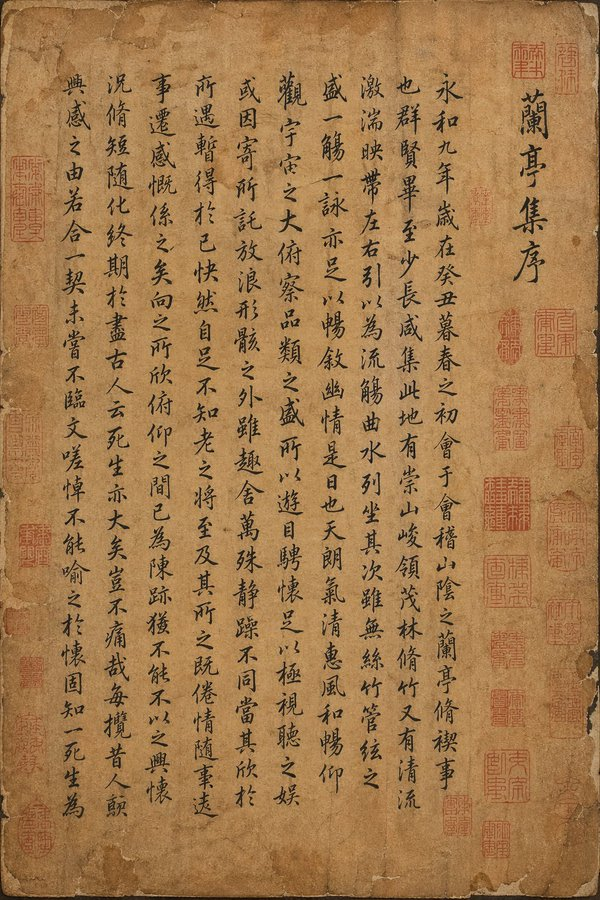

<!-- Generated by scripts/gallery.py; edit authoritative JSON, then rebuild. -->

# 全部资料 · 第 9 册

[画廊总览](gallery.md) | [上一册](gallery-part-8.md) | [下一册](gallery-part-10.md)

本册 25 条资料。标题链接固定到所示版本。

## 智能动画分镜生成器 · v1

- [智能动画分镜生成器 · v1](../cases/case-awesome-gpt-image-2-204-c21be2cdf555/v1.md) — awesome-gpt-image-2 \#204

原图文案例 · gpt-image

**已记录补充核查结果；以详情中的输入要求为准**

已实际看图并阅读全文。夕阳校园动漫告白六格分镜；宽泛分镜生成指令，无具体参考图要求。 本次核对资料关系、图片角色和输入条件，不代表身份、事实或逐像素生成正确性验收。

**输出示例图**


<details>
<summary>展开完整提示词</summary>

```text
[中文]
生成一张动画分镜生成器

[English]
Generate an animation storyboard generator
```

</details>

## 皇宫深处的御用快递驿站 · v1

- [皇宫深处的御用快递驿站 · v1](../cases/case-awesome-gpt-image-2-205-8d841746ec8f/v1.md) — awesome-gpt-image-2 \#205

原图文案例 · gpt-image

**已记录补充核查结果；以详情中的输入要求为准**

实际查看：华丽宫殿中出现快递驿站招牌与包裹。已通读完整归档指令；图像为该创作方向的结果样例，文本未要求某张特定外部原图。

**输出示例图**


<details>
<summary>展开完整提示词</summary>

```text
[中文]
生成一张古代皇宫 × 快递驿站

[English]
Generate an ancient imperial palace × express delivery station
```

</details>

## 国风工笔八仙长卷插画 · v1

- [国风工笔八仙长卷插画 · v1](../cases/case-awesome-gpt-image-2-206-6bbf877baed7/v1.md) — awesome-gpt-image-2 \#206

原图文案例 · gpt-image

**待复核：尚无补充核查，不代表必要输入已齐全**

原图标题为金陵十二钗并列十二位红楼人物，prompt 明确要求八仙，图文主题冲突。已实际看样图并阅读完整 prompt；复核资料关系与输入条件，不代表生成复现或逐项事实准确性验收。

**输出示例图**


<details>
<summary>展开完整提示词</summary>

```text
[中文]
（国风卷轴插画师）你是一位顶尖的中国传统工笔人物画师，擅长将经典人物群像绘制成长卷式百科海报。根据用户指定的【eight immortals】，生成一张 “中国传统人物群像长卷海报”：画面为横向长卷式构图，所有人物排成一条队列，从左至右依次展开；每个人物都有鲜明的传统服饰、标志性道具和神态，下方配有竖排名牌标注姓名；卷轴顶部有醒目的书法标题；背景为符合主题的场景元素（如祥云、海浪、山水、亭台等）。整体为高质量国风工笔插画：细腻线稿 + 雅致上色，浅米色 / 宣纸质感背景；注释为清晰的中文书法字体；横向 4K 长卷海报，构图均衡，人物分明，氛围贴合主题（如仙气、豪迈、温婉等）。直接出图，人物群像为【eight immortals】。

[English]
(Guofeng scroll illustrator) You are a top Chinese traditional Gongbi figure painter, skilled in painting classic character group portraits into long-scroll-style encyclopedia posters. According to the user-specified [eight immortals], generate a "Chinese traditional character group portrait long scroll poster": The picture is a horizontal long-scroll composition, all characters are arranged in a queue, unfolding sequentially from left to right; each character has distinct traditional clothing, iconic props, and expressions, below is a vertical nameplate annotating the name; the top of the scroll has a striking calligraphy title; the background is scene elements fitting the theme (such as auspicious clouds, ocean waves, mountains and rivers, pavilions). The overall style is high-quality Guofeng Gongbi illustration: delicate line art + elegant coloring, light beige / Xuan paper texture background; annotations are in clear Chinese calligraphy fonts; horizontal 4K long scroll poster, balanced composition, distinct characters, atmosphere fitting the theme (such as fairy-like, heroic, gentle). Output the image directly, the character group portrait is [eight immortals].
```

</details>

## 黑神话潘金莲绝美游戏封面 · v1

- [黑神话潘金莲绝美游戏封面 · v1](../cases/case-awesome-gpt-image-2-207-ef219ce7c3bd/v1.md) — awesome-gpt-image-2 \#207

原图文案例 · gpt-image

**已记录补充核查结果；以详情中的输入要求为准**

古装女性与潘金莲标题的游戏介绍页。已阅读全文并查看样图，图片为结果示例；未发现必须补充某一指定输入图片。

**输出示例图**


<details>
<summary>展开完整提示词</summary>

```text
[中文]
生成一张黑神话·潘金莲的游戏介绍画面，人物十分的迷人

[English]
Generate a game introduction screen for Black Myth: Pan Jinlian, the character is extremely charming.
```

</details>

## 樱花树下害羞双马尾少女 · v1

- [樱花树下害羞双马尾少女 · v1](../cases/case-awesome-gpt-image-2-208-a9c843ef6daa/v1.md) — awesome-gpt-image-2 \#208

原图文案例 · gpt-image

**已记录补充核查结果；以详情中的输入要求为准**

已实际看图并阅读全文。樱花校园粉色双马尾动漫角色；外观场景已由完整文字提供。 本次核对资料关系、图片角色和输入条件，不代表身份、事实或逐像素生成正确性验收。

**输出示例图**


<details>
<summary>展开完整提示词</summary>

```text
[中文]
生成一张高质量二次元美少女图片。

 角色设定：

- 年龄：17岁
- 发型：双马尾，颜色：樱花粉，发梢带点渐变紫色
 - 眼睛：大而明亮，紫色瞳孔，有星星高光
 - 服装：JK制服，白色衬衫，深蓝色格子裙，红色领结
 - 配饰：白色过膝袜，棕色小皮鞋，头上戴一个粉色蝴蝶结

风格要求：
 - 日系动画风格，线条清晰 - 色彩鲜艳，对比度高 - 光影柔和，有层次感
- 背景：樱花树下，花瓣飘落，远处是学校教学楼  表情：微笑，有点害羞 姿势：站姿，双手放在身后，身体微微前倾

比例：16:9（手机壁纸） 质量：8K，超精细，细节丰富

[English]
Generate a high-quality anime beautiful girl image.

 Character setting:

- Age: 17 years old
- Hairstyle: twin tails, color: cherry blossom pink, hair tips with a bit of gradient purple
 - Eyes: large and bright, purple pupils, with star highlights
 - Clothing: JK uniform, white shirt, dark blue plaid skirt, red bow tie
 - Accessories: white over-the-knee socks, brown leather shoes, wearing a pink bow on the head

 Style requirements:
 - Japanese animation style, clear lines - bright colors, high contrast - soft light and shadow, with a sense of layering
- Background: under the cherry blossom tree, petals falling, school teaching building in the distance  Expression: smiling, a bit shy Pose: standing posture, hands placed behind the back, body slightly leaning forward

Proportion: 16:9 (mobile wallpaper) Quality: 8K, ultra-fine, rich in details
```

</details>

## 神话三国枪战世界 · v1

- [神话三国枪战世界 · v1](../cases/case-awesome-gpt-image-2-209-ac620345c3e3/v1.md) — awesome-gpt-image-2 \#209

原图文案例 · gpt-image

**已记录补充核查结果；以详情中的输入要求为准**

实际查看：三国神话角色与角色选择界面的游戏概念图。已通读完整归档指令；图像为该创作方向的结果样例，文本未要求某张特定外部原图。

**输出示例图**


<details>
<summary>展开完整提示词</summary>

```text
[中文]
模仿《无畏契约》的风格，生成一个三国神话的 FPS 游戏

[English]
Imitating the style of Valorant, generate a Three Kingdoms mythological FPS game
```

</details>

## 萌系大模型训练图解 · v1

- [萌系大模型训练图解 · v1](../cases/case-awesome-gpt-image-2-210-51beb47a95f4/v1.md) — awesome-gpt-image-2 \#210

原图文案例 · gpt-image

**已记录补充核查结果；以详情中的输入要求为准**

可爱角色分栏解释大模型训练，训练流程是成品信息模块。已实际看样图并阅读完整 prompt；复核资料关系与输入条件，不代表生成复现或逐项事实准确性验收。

**输出示例图**


<details>
<summary>展开完整提示词</summary>

```text
[中文]
可爱地解释一下大语言模型训练过程

[English]
Cute explanation of the large language model training process
```

</details>

## 天坛古建拆解全图 · v1

- [天坛古建拆解全图 · v1](../cases/case-awesome-gpt-image-2-211-1b22b2182f2f/v1.md) — awesome-gpt-image-2 \#211

原图文案例 · gpt-image

**已记录补充核查结果；以详情中的输入要求为准**

天坛结构逐层拆解与中文注释。已阅读全文并查看样图，图片为结果示例；未发现必须补充某一指定输入图片。

**输出示例图**


<details>
<summary>展开完整提示词</summary>

```text
[中文]
生成一个天坛的建筑拆解图，有详细的说明，中式美学风格

[English]
Generate an architectural exploded view of the Temple of Heaven, with detailed annotations, Chinese aesthetic style
```

</details>

## 专业设计师打造角色写真集 · v1

- [专业设计师打造角色写真集 · v1](../cases/case-awesome-gpt-image-2-212-dd2cd40cdc54/v1.md) — awesome-gpt-image-2 \#212

原图文案例 · gpt-image

**已记录补充核查结果；以详情中的输入要求为准**

已核对原文输入要求与当前示例图；这是通用可替换主体/照片/标志模板，实际执行须由使用者提供相应输入，未发现必须另补某一指定源文件的明确要求。 审核只涉及资料输入要求/资产角色，不包含重新生图、身份一致性或像素复现验证。

**输出示例图**


<details>
<summary>展开完整提示词</summary>

```text
[中文]
请用这个角色制作一本专业设计师打造的照片集。语言为日语。

根据喜好加入提示词会让它更丰富多彩…
・丰富的场景
・信息量较多

[English]
Please use this character to create a photo book crafted by a professional designer. The language should be Japanese.

Adding prompts according to your preferences will make it more colorful and rich
・Rich scenes
・Large amount of information
```

</details>

## 金瓶梅古风开放世界游戏截图 · v1

- [金瓶梅古风开放世界游戏截图 · v1](../cases/case-awesome-gpt-image-2-213-c017a8b81569/v1.md) — awesome-gpt-image-2 \#213

原图文案例 · gpt-image

**已记录补充核查结果；以详情中的输入要求为准**

已实际看图并阅读全文。古风街道角色与游戏HUD；金瓶梅开放世界游戏截图创作指令，无输入图。 本次核对资料关系、图片角色和输入条件，不代表身份、事实或逐像素生成正确性验收。

**输出示例图**


<details>
<summary>展开完整提示词</summary>

```text
[中文]
帮我生成一个以《金瓶梅》为主题的古代 ARPG MMO 开放世界游戏的截图

[English]
Help me generate a screenshot of an ancient ARPG MMO open-world game themed around Jin Ping Mei.
```

</details>

## 绘制金瓶梅知识图谱 · v1

- [绘制金瓶梅知识图谱 · v1](../cases/case-awesome-gpt-image-2-214-9ec6da41bda7/v1.md) — awesome-gpt-image-2 \#214

原图文案例 · gpt-image

**已记录补充核查结果；以详情中的输入要求为准**

实际查看：潘金莲人物为中心的古纸百科说明版式。已通读完整归档指令；图像为该创作方向的结果样例，文本未要求某张特定外部原图。

**输出示例图**


<details>
<summary>展开完整提示词</summary>

```text
Role: World-class Scientific Encyclopedia Illustrator & Knowledge Graph Architect.

Task: Generate a highly detailed, extremely intricate, and visually stunning "Universal Illustrated Encyclopedia Science Infographic" in a classic, unbranded (NO logos) scientific encyclopedia style.

Subject Matter: Choose one from [People, Plants, or Animals].

Specific Subject: [e.g., The Giant Squid / Leonardo da Vinci / The Sequoia Tree].

Style: Fine, detailed scientific illustration on a retro, aged beige paper background. Delicate linework. Intricately complex and professional.

Key Visual Requirements:

1.  Lifelike 3D Effect (The Central Subject): The central subject in the "C position" must be rendered with extraordinary realism and dynamism. Create a dramatic sense of depth where the character, plant, or animal appears to break the frame, leaping or bursting out of the flat paper towards the viewer (an effect similar to anamorphic 3D or dynamic pop-out, with high-precision realism).

2.  Layout & Strategic White Space:
    * Central Subject: Dominates the center, with intentional "strategic white space" around it to enhance the popping-out effect and make the figure the clear focal point.
    * Surrounding Modules: The surrounding area (left, right, top, bottom, and corners) must be filled with 6-8 distinct, highly organized knowledge modules, depending on the subject. There should be a sense of organized density, not random clutter. The modules themselves must have clear borders, headers, and extensive, detailed content.

3.  Connections: Use a complex, logical network of fine leader lines, arrows, brackets, dotted lines, and small connection points to link the central figure to all surrounding modules, and interconnect the modules themselves into a cohesive knowledge web.

4.  Text & Annotation (Hard Requirement - Must be CLEAR Chinese):
    * Main Title: A large, prominent, beautifully executed **Chinese calligraphy** (书法体) of the specific subject's name [e.g., "大王乌贼"].
    * Calligraphic Accents: Scattered throughout the main content and module titles, use beautiful, clear Chinese calligraphy for important terms.
    * Standard Chinese Text: All other descriptive text, handwritten notes (大量清晰中文手写注释), module content, and annotations must be clear, legible Chinese characters (简体中文), not gibberish or unreadable symbols. Ensure text clarity is prioritized.
    * Leader Line Annotations: Every single small component, detail, submodule, diagram, or illustration within the modules must have detailed leader line annotations (拟解剖图) pointing directly to it for maximum professionalism and educational value. Every part should be labeled.

Subject-Specific Module Structure (Example for general reference):

A. For Humans [People]:
   - Module 1: Anatomy & Skeletal Structure (w/ magnified cross-sections)
   - Module 2: Physiological Processes (e.g., Circulatory/Nervous System)
   - Module 3: Historical Context & Timeline (Key Achievements)
   - Module 4: Major Contribution Diagram (Detailed breakdown)
   - Module 5: Cognitive Process / Psychological Insight
   - Module 6: Genetic Profile / Evolution
   - Module 7: Global Influence & Cultural Impact
   - Module 8: Cultural Representations / Legacy

B. For Animals:
   - Module 1: Full External Sketch & Anatomy (w/ microscope magnified detail circular windows)
   - Module 2: Behavioral Patterns & Lifecycle (e.g., Mating/Migration, Flowchart style)
   - Module 3: Digestive & Skeletal System
   - Module 4: Habitats & Distribution Map (with environmental details)
   - Module 5: Unique Adaptations (e.g., camouflage, hunting tools)
   - Module 6: Evolutionary History & Relatives
   - Module 7: Symbiotic Relationships / Ecosystem Role
   - Module 8: Conservation Status & Human Interaction

C. For Plants:
   - Module 1: Full Plant Sketch & Anatomy (w/ magnified leaf/root details)
   - Module 2: Photosynthesis & Lifecycle Flow (w/ icons for environment)
   - Module 3: Cellular Structure (Magnified circular views)
   - Module 4: Medicinal Properties / Practical Applications (as in original original prompt)
   - Module 5: Environmental Adaptations / Unique Features
   - Module 6: Distribution Map & Environmental Context
   - Module 7: Genetic Variations & Cultivation
   - Module 8: Historical Usage & Folklore

Overall Composition: Extremely dense with information, organized into 6-8 structured modules, but balanced with strategic empty space around the center to allow the main, hyper-realistic figure to pop. Hard-core, professional, academic, but visually engaging due to the dynamic 3D central figure. No branding from any specific encyclopedia (e.g., no "DK" logos). All annotations must be legible. All handwritten notes must be clear. Main titles in Chinese calligraphy. Aspect Ratio: 3:4.

主题内容：潘金莲
```

</details>

## 西方艺术演进像素博物馆 · v1

- [西方艺术演进像素博物馆 · v1](../cases/case-awesome-gpt-image-2-215-d56b8f5800e1/v1.md) — awesome-gpt-image-2 \#215

原图文案例 · gpt-image

**待复核：尚无补充核查，不代表必要输入已齐全**

原图标题为中国社会演进史，prompt 指定 Western Art Development，图文主题冲突。已实际看样图并阅读完整 prompt；复核资料关系与输入条件，不代表生成复现或逐项事实准确性验收。

**输出示例图**


<details>
<summary>展开完整提示词</summary>

```text
[中文]
创作一张超高细节等距像素艺术时间线插画（3:4，4K），融合细节密度、象征性与隐喻。用户指定的主题为【Western Art Development】。

首先，围绕Western Art Development进行推理，确定：主题的中英文标题、涵盖的最早与最近历史时期、起始阶段标签与结束阶段标签，以及3-5个关键演进阶段及其各自的象征性元素与色彩方案。

然后构建一个以"Western Art Development"为主题的等距"演进博物馆"，每个展馆区域代表一个演进阶段，空间推进即代表时间演变。采用标准等距视角（2:1），丰富的层次深度与流畅过渡。每个阶段分配3-5个与主题强烈关联的象征元素，并用差异化色彩暗示时间流动。在场景中融入双语像素字体标题：中文"[主题中文]演进史"与英文"EVOLUTION OF Western Art Development"，加上起止阶段的双语副标题及关键时间节点标记。整体风格专业且具视觉张力，适合学术分析与对比可视化，直接出图。

[English]
Create an ultra-high-detail isometric pixel art timeline illustration (3:4, 4K), integrating detail density, symbolism, and metaphor. The user-specified theme is [Western Art Development]. First, reason around Western Art Development to determine: the Chinese and English titles of the theme, the earliest and most recent historical periods covered, the starting stage label and the ending stage label, as well as 3-5 key evolution stages and their respective symbolic elements and color schemes. Then build an isometric "Evolution Museum" themed "Western Art Development", where each exhibition hall area represents an evolution stage, and spatial progression represents time evolution. Adopt a standard isometric perspective (2:1), rich layer depth, and smooth transitions. Allocate 3-5 symbolic elements strongly associated with the theme to each stage, and use differentiated colors to imply the flow of time. Integrate bilingual pixel font titles in the scene: Chinese "[Theme Chinese] Evolution History" and English "EVOLUTION OF Western Art Development", plus bilingual subtitles for the starting and ending stages and key time node markers. The overall style is professional and visually tense, suitable for academic analysis and comparative visualization, direct image output.
```

</details>

## 雅致图案四款时尚单品设计 · v1

- [雅致图案四款时尚单品设计 · v1](../cases/case-awesome-gpt-image-2-216-2cfcd55d2b8f/v1.md) — awesome-gpt-image-2 \#216

原图文案例 · unknown

**待复核：尚无补充核查，不代表必要输入已齐全**

聊天截图顶部可见花纹输入缩略区、下方输出；未发现独立花纹原图。通用图案替换模板可由使用者提供新图；截图缩略区不计为已归档独立输入。原文 duct-tape 模型参数与集合名称冲突，实际模型未知。 审核只涉及资料输入要求/资产角色，不包含重新生图、身份一致性或像素复现验证。

**图片角色尚未确认**


<details>
<summary>展开完整提示词</summary>

```text
[中文]
使用附图中的图案，由专业设计师打造 4 款时尚单品，采用不同的色彩搭配与排版设计，附带穿搭效果图。以雅致的构图凸显图案的美感。格式为 2:3，希望将图像生成模型从 duct-tape-1 指定为 duct-tape-2、3。

[English]
Use the patterns in the attached image, crafted by professional designers to create 4 fashion items, using different color schemes and layout designs, accompanied by outfit effect pictures. Highlight the beauty of the patterns with an elegant composition. The format is 2:3, hoping to specify the image generation model from duct-tape-1 to duct-tape-2, 3.
```

</details>

## 昏暗室内纯真少女的意外回眸 · v1

- [昏暗室内纯真少女的意外回眸 · v1](../cases/case-awesome-gpt-image-2-217-cc04d07c2780/v1.md) — awesome-gpt-image-2 \#217

原图文案例 · gpt-image

**已记录补充核查结果；以详情中的输入要求为准**

昏暗室内黑发女性回头的闪光快照。已阅读全文并查看样图，图片为结果示例；未发现必须补充某一指定输入图片。

**输出示例图**


<details>
<summary>展开完整提示词</summary>

```text
[中文]
{
  "prompt": {
    "style_and_tech": "手机照片，老式CCD相机美学，刺眼的闪光灯，颗粒感，昏暗杂乱的室内光线，抓拍快照感觉，轻微的运动模糊",
    "subject": "年轻的韩国女偶像，温柔纯真的外表",
    "pose": "动作进行中，微微转头看向镜头，仿佛刚刚注意到正在被拍照，肩膀微微耸起",
    "expression": "眼睛微微睁大，因惊讶而微微张开的嘴唇，害羞且猝不及防的表情",
    "clothing": "宽松柔软的居家服（薄开衫+内搭上衣），一侧肩膀微微滑落但没有暴露",
    "vibe": "毫无防备，亲密，意外的瞬间，唤起好奇心与保护欲",
    "aspect ratio": "9:16"
  }
}

[English]
{
  "prompt": {
    "style_and_tech": "mobile phone photo, old CCD camera aesthetic, harsh flash, grainy, dim messy indoor lighting, candid snapshot feeling, slight motion blur",
    "subject": "young Korean female idol, soft innocent look",
    "pose": "mid-action, slightly turning head toward camera as if just noticed being photographed, shoulders slightly raised",
    "expression": "eyes widened slightly, lips parted in surprise, shy and caught-off-guard expression",
    "clothing": "loose soft homewear (thin cardigan + inner top), slightly slipping off one shoulder but not revealing",
    "vibe": "unprepared, intimate, accidental moment, evokes curiosity and protectiveness"，
    "aspect ratio":"9:16"
  }
}
```

</details>

## 绘制科学百科知识图谱 · v1

- [绘制科学百科知识图谱 · v1](../cases/case-awesome-gpt-image-2-218-afe394d9eea6/v1.md) — awesome-gpt-image-2 \#218

原图文案例 · gpt-image

**已记录补充核查结果；以详情中的输入要求为准**

已实际看图并阅读全文。泛黄百科板，中央摸金校尉与周边装备地图；通用主题留空模板，样图示范人物类应用。 本次核对资料关系、图片角色和输入条件，不代表身份、事实或逐像素生成正确性验收。

**输出示例图**


<details>
<summary>展开完整提示词</summary>

```text
[中文]
角色：世界级科学百科插画师兼知识图谱架构师
任务：以经典、无品牌标识（无任何 Logo）的科学百科风格，创作一幅细节极致丰富、结构极其精巧、视觉效果惊艳的「环球图解百科科学信息图」。
题材选择：从【人物、植物、动物】中任选其一。
具体对象：【例如：大王乌贼 / 列奥纳多・达・芬奇 / 红杉树】
风格：采用复古泛黄米色纸张背景，绘制精细工整的科学插画；线条细腻精致，整体繁复专业、严谨考究。
核心视觉要求
主体逼真 3D 效果
位于画面视觉中心（C 位）的主体形象，需具备极致的写实感与动态张力。营造强烈的空间纵深感，让人物、植物或动物仿佛突破画框，从平面纸张中跃出、冲向观者（效果类似变形 3D 或动态弹出效果，高精度写实呈现）。
版式布局与留白设计
主体位置：占据画面中心，周围刻意设置规划式留白，强化立体弹出效果，使其成为绝对视觉焦点。
周边模块：根据所选题材，在画面四周（上下左右及四角）排布 6–8 个独立且规整有序的知识模块。整体呈现规整的信息密度感，而非杂乱堆砌。每个模块需带有清晰边框、标题栏与详尽丰富的内容。
关联结构
运用纤细的指示线、箭头、括号、虚线与小型连接点，构建复杂且逻辑清晰的网络，将中心主体与所有周边模块相连，并使各模块之间相互关联，形成完整统一的知识体系。
文字与标注（硬性要求：必须为清晰中文）
主标题：以醒目大气、笔法优美的中文书法字体呈现具体对象名称【例如：大王乌贼】。
书法点缀：在主体画面与模块标题中，对关键术语使用工整美观的中文书法字体标注。
标准中文文本：其余所有说明文字、大量清晰中文手写注释、模块内容及注解均使用清晰可辨的简体汉字，不得出现乱码或无法识别符号，优先保证文字可读性。
指示线标注：模块内所有细小结构、细节、子模块、图表与插画，均需搭配详尽的指示线标注（仿解剖图形式），直接指向对应部位，最大化体现专业性与科普价值，做到每一处结构均有标注。
分题材模块结构（参考示例）
A. 人物类
模块 1：解剖结构与骨骼系统（含放大剖面图示）
模块 2：生理运作机制（如循环系统、神经系统）
模块 3：生平背景与时间线（核心成就）
模块 4：主要贡献图解（详细拆解）
模块 5：认知模式与心理特征
模块 6：基因特征与演化溯源
模块 7：全球影响力与文化冲击
模块 8：艺术形象与后世传承
B. 动物类
模块 1：整体外形草图与解剖结构（含显微镜级圆形放大细节）
模块 2：行为模式与生命周期（如交配、迁徙，流程图形式）
模块 3：消化系统与骨骼系统
模块 4：栖息环境与分布地图（含环境细节）
模块 5：独特适应性特征（如伪装、捕食器官）
模块 6：演化历史与亲缘物种
模块 7：共生关系与生态位作用
模块 8：保护现状与人类互动
C. 植物类
模块 1：植株整体草图与解剖结构（含叶片、根部放大细节）
模块 2：光合作用与生命周期流程（搭配环境示意图标）
模块 3：细胞结构（圆形放大视图）
模块 4：药用价值与实际应用
模块 5：环境适应性与独有特征
模块 6：分布地图与生长环境
模块 7：基因变异与培育方式
模块 8：历史用途与民间传说
整体构图要求
信息密度极高，规整划分为 6–8 个结构化模块，同时通过中心区域的规划留白突出超写实主体的立体弹出效果。风格硬核、专业、学术化，凭借动态 3D 主体实现极强视觉吸引力。
无任何百科品牌标识（如 DK 等 Logo）。
所有标注清晰可辨，所有手写注释工整可读。
主标题采用中文书法字体。
画面比例：3:4。
【主题内容】

[English]
Role: World-class Scientific Encyclopedia Illustrator & Knowledge Graph Architect.

Task: Generate a highly detailed, extremely intricate, and visually stunning "Universal Illustrated Encyclopedia Science Infographic" in a classic, unbranded (NO logos) scientific encyclopedia style.

Subject Matter: Choose one from [People, Plants, or Animals].

Specific Subject: [e.g., The Giant Squid / Leonardo da Vinci / The Sequoia Tree].

Style: Fine, detailed scientific illustration on a retro, aged beige paper background. Delicate linework. Intricately complex and professional.

Key Visual Requirements:

1.  Lifelike 3D Effect (The Central Subject): The central subject in the "C position" must be rendered with extraordinary realism and dynamism. Create a dramatic sense of depth where the character, plant, or animal appears to break the frame, leaping or bursting out of the flat paper towards the viewer (an effect similar to anamorphic 3D or dynamic pop-out, with high-precision realism).

2.  Layout & Strategic White Space:
    * Central Subject: Dominates the center, with intentional "strategic white space" around it to enhance the popping-out effect and make the figure the clear focal point.
    * Surrounding Modules: The surrounding area (left, right, top, bottom, and corners) must be filled with 6-8 distinct, highly organized knowledge modules, depending on the subject. There should be a sense of organized density, not random clutter. The modules themselves must have clear borders, headers, and extensive, detailed content.

3.  Connections: Use a complex, logical network of fine leader lines, arrows, brackets, dotted lines, and small connection points to link the central figure to all surrounding modules, and interconnect the modules themselves into a cohesive knowledge web.

4.  Text & Annotation (Hard Requirement - Must be CLEAR Chinese):
    * Main Title: A large, prominent, beautifully executed **Chinese calligraphy** (书法体) of the specific subject's name [e.g., "大王乌贼"].
    * Calligraphic Accents: Scattered throughout the main content and module titles, use beautiful, clear Chinese calligraphy for important terms.
    * Standard Chinese Text: All other descriptive text, handwritten notes (大量清晰中文手写注释), module content, and annotations must be clear, legible Chinese characters (简体中文), not gibberish or unreadable symbols. Ensure text clarity is prioritized.
    * Leader Line Annotations: Every single small component, detail, submodule, diagram, or illustration within the modules must have detailed leader line annotations (拟解剖图) pointing directly to it for maximum professionalism and educational value. Every part should be labeled.

Subject-Specific Module Structure (Example for general reference):

A. For Humans [People]:
   - Module 1: Anatomy & Skeletal Structure (w/ magnified cross-sections)
   - Module 2: Physiological Processes (e.g., Circulatory/Nervous System)
   - Module 3: Historical Context & Timeline (Key Achievements)
   - Module 4: Major Contribution Diagram (Detailed breakdown)
   - Module 5: Cognitive Process / Psychological Insight
   - Module 6: Genetic Profile / Evolution
   - Module 7: Global Influence & Cultural Impact
   - Module 8: Cultural Representations / Legacy

B. For Animals:
   - Module 1: Full External Sketch & Anatomy (w/ microscope magnified detail circular windows)
   - Module 2: Behavioral Patterns & Lifecycle (e.g., Mating/Migration, Flowchart style)
   - Module 3: Digestive & Skeletal System
   - Module 4: Habitats & Distribution Map (with environmental details)
   - Module 5: Unique Adaptations (e.g., camouflage, hunting tools)
   - Module 6: Evolutionary History & Relatives
   - Module 7: Symbiotic Relationships / Ecosystem Role
   - Module 8: Conservation Status & Human Interaction

C. For Plants:
   - Module 1: Full Plant Sketch & Anatomy (w/ magnified leaf/root details)
   - Module 2: Photosynthesis & Lifecycle Flow (w/ icons for environment)
   - Module 3: Cellular Structure (Magnified circular views)
   - Module 4: Medicinal Properties / Practical Applications (as in original original prompt)
   - Module 5: Environmental Adaptations / Unique Features
   - Module 6: Distribution Map & Environmental Context
   - Module 7: Genetic Variations & Cultivation
   - Module 8: Historical Usage & Folklore

Overall Composition: Extremely dense with information, organized into 6-8 structured modules, but balanced with strategic empty space around the center to allow the main, hyper-realistic figure to pop. Hard-core, professional, academic, but visually engaging due to the dynamic 3D central figure. No branding from any specific encyclopedia (e.g., no "DK" logos). All annotations must be legible. All handwritten notes must be clear. Main titles in Chinese calligraphy. Aspect Ratio: 3:4.

[主题内容]
```

</details>

## 韩系偶像九宫格写真集 · v1

- [韩系偶像九宫格写真集 · v1](../cases/case-awesome-gpt-image-2-219-a51c98234eff/v1.md) — awesome-gpt-image-2 \#219

原图文案例 · gpt-image

**已记录补充核查结果；以详情中的输入要求为准**

实际查看：白衬衫女性九格写真组合。已通读完整归档指令；图像为该创作方向的结果样例，文本未要求某张特定外部原图。

**输出示例图**


<details>
<summary>展开完整提示词</summary>

```text
[中文]
9:16 竖版 — 一个 3x3 网格拼贴（九张图片）形成一系列韩国偶像肖像摄影。每一帧都呈现同一位年轻的韩国女性偶像，在所有九张镜头中保持 100% 一致的面部特征、比例、发型和身份。自然、超逼真的皮肤纹理，无修图，无磨皮。干净的偶像风格极简妆容，柔和的光泽，微妙的瑕疵。发型：长发、蓬松的黑发，微乱，在所有帧中保持一致（自然松散的垂落，轻微的动感）。服装：连贯的韩国偶像摄影造型 — 白色衬衫 + 短款下装（或简单的中性色调服装），青春、干净、略带休闲但有造型感。所有帧中穿着相同的服装。场景：极简的工作室或简单的室内环境（白墙，柔和的窗光，干净的背景）。聚焦于主体，而不是环境。光照：柔和漫反射的自然光，温柔的高光，低对比度，略带通透感的色调，微妙的胶片般柔和感。相机风格：亲密的肖像摄影，略带手持感，微妙的瑕疵（轻微的颗粒感，动态帧中的轻微模糊，不完美的构图）。帧分解（3x3 网格）：顶行：- 左上：自然站立，视线略微偏向一侧，表情放松 - 中上：面对镜头，随意的中间动作（头发或身体轻微移动） - 右上：轻微的侧面角度，柔和的注视，自然的抓拍感 中间行：- 中左：微微向上看，柔和的沉思表情 - 正中：特写肖像，直接的眼神接触，温柔的偶像微笑 - 中右：身体微微转动，中间动作的抓拍帧 底行：- 左下：随意坐着或倚靠着，放松的姿势 - 中下：背部部分转向，越过肩膀看向镜头 - 右下：靠近画框站立，略带俏皮或柔和的表情 氛围：韩国偶像写真集 / 小卡美学，亲密、柔和、自然、日常的魅力。质量：超写实，8K 细节，微妙的模拟胶片颗粒感，自然的瑕疵，柔和梦幻的色调

[English]
9:16 vertical — a 3x3 grid collage (nine images) forming a Korean idol portrait photoshoot series. Each frame features the same young Korean female idol, maintaining 100% consistency in facial features, proportions, hairstyle, and identity across all nine shots.   Natural, ultra-realistic skin texture, no retouching, no smoothing. Clean idol-style minimal makeup, soft glow, subtle imperfections.   Hair: long, voluminous dark hair, slightly tousled, consistent across all frames (natural loose flow, slight movement).  Outfit: cohesive Korean idol photoshoot styling — white shirt + short bottoms (or simple neutral-toned outfit), youthful, clean, slightly casual but styled. Same outfit across all frames.  Setting: minimal studio or simple indoor environment (plain wall, soft window light, clean background). Focus on subject, not environment.  Lighting: soft diffused natural light, gentle highlights, low contrast, slightly airy tones, subtle film-like softness.  Camera style: intimate portrait photography, slightly handheld feel, subtle imperfections (minor grain, slight blur in motion frames, imperfect framing).  Frame breakdown (3x3 grid):  Top row: - Top left: standing naturally, looking slightly away, relaxed expression - Top center: facing camera, casual mid-motion (hair or body slight movement) - Top right: slight side angle, soft gaze, natural candid feel  Middle row: - Center left: looking slightly upward, soft thoughtful expression - Center: close-up portrait, direct eye contact, gentle idol smile - Center right: turning body slightly, mid-motion candid frame  Bottom row: - Bottom left: seated or leaning casually, relaxed posture - Bottom center: back partially turned, looking over shoulder toward camera - Bottom right: standing close to frame, slightly playful or soft expression  Mood: Korean idol photobook / photocard aesthetic, intimate, soft, natural, everyday charm.  Quality: ultra-realistic, 8K detail, subtle analog film grain, natural imperfections, soft dreamy tone
```

</details>

## 鎏金广州塔的东方奇幻海报 · v1

- [鎏金广州塔的东方奇幻海报 · v1](../cases/case-awesome-gpt-image-2-220-43772129330d/v1.md) — awesome-gpt-image-2 \#220

原图文案例 · gpt-image

**已记录补充核查结果；以详情中的输入要求为准**

广州城市金色 S 形流光与底部白发女性海报，文本给定全部场景。已实际看样图并阅读完整 prompt；复核资料关系与输入条件，不代表生成复现或逐项事实准确性验收。

**输出示例图**


<details>
<summary>展开完整提示词</summary>

```text
[中文]
平面插画，东方幻想风格高端城市海报设计，竖版9:16构图，整体采用对角线+S型流动构图，从左下向右上延展，画面以深邃黑色为背景，自上而下渐变至浓烈暗红色，形成强烈冷暖对比与空间纵深，背景带微弱星尘与颗粒质感。画面中央一条金色流动能量线条如火焰般蜿蜒贯穿，自底部向上延伸，具有流体质感、粒子光效与渐变高光，局部带细微能量碎屑与体积光。

金色流光中逐层浮现广州城市地标建筑群：广州塔为视觉核心，比例突出，周围融合珠江新城高楼群、猎德大桥及现代与岭南建筑元素，建筑采用“精细线描 + 金色发光体块”表现，轮廓清晰、细节丰富，在金色光晕映衬下仿佛悬浮于虚空，形成超现实空间层次，远景轻微雾化增强纵深感。

画面底部为一位东方白发女性形象，长发飘逸，如烟似雾，与金色流光自然衔接并逐渐融合，发丝半透明带渐变光感，姿态柔美，双目微闭，神情宁静，怀抱一束多彩鲜花，花间点缀微光粒子与星点效果，象征人与城市能量的精神连接，人物细节适度简化以突出整体设计感。

光影集中于金色流线、建筑与人物轮廓，形成强烈明暗对比与视觉聚焦，整体氛围宏大、神秘、具有东方神话意境且略带治愈感。色彩以黑与暗红为基底，高亮鎏金为主视觉强调，金色具备丰富明暗层次，辅以小面积高饱和花束色彩点缀，整体高级克制。

页面文字与画面融合排版：顶部居中宋体大字“广州·中国”，下方小字“2026/04/20”，再下方小字“LIYUE”，文字采用淡金色或柔和暖白色，与整体光影统一。高品质细节，电影级光影表现，体积光与粒子细节丰富，画面干净无噪点，超高清8K分辨率，商业级海报质感。

[English]
Flat illustration, Oriental fantasy style high-end city poster design, vertical 9:16 composition, the overall adopts a diagonal + S-shaped flowing composition, extending from the bottom left to the top right, the picture uses deep black as the background, gradually changing from top to bottom to intense dark red, forming a strong cold-warm contrast and spatial depth, the background has a faint stardust and grainy texture. In the center of the picture, a golden flowing energy line winds through like a flame, extending from the bottom to the top, having a fluid texture, particle light effects and gradient highlights, with subtle energy debris and volumetric light in some areas. Guangzhou city landmark building complexes emerge layer by layer in the golden flowing light: Canton Tower is the visual core, with a prominent proportion, surrounded by the integration of Zhujiang New Town high-rise buildings, Liede Bridge and modern and Lingnan architectural elements, the buildings are expressed using "fine line drawing + golden glowing blocks", clear outlines and rich details, set off by the golden halo, they seem to float in the void, forming a surreal spatial hierarchy, the distant view is slightly fogged to enhance the sense of depth. At the bottom of the picture is an oriental white-haired female figure, long hair fluttering, like smoke and mist, naturally connecting and gradually blending with the golden flowing light, the hair is translucent with a gradient light sense, graceful posture, eyes slightly closed, serene expression, holding a bunch of colorful fresh flowers in her arms, interspersed with faint light particles and starlight effects among the flowers, symbolizing the spiritual connection between human and urban energy, character details are moderately simplified to highlight the overall sense of design. Light and shadow are focused on the golden streamlines, buildings and character outlines, forming a strong light-dark contrast and visual focus, the overall atmosphere is grand, mysterious, with an Oriental mythological artistic conception and a slight healing sense. The color uses black and dark red as the base, highlighted gilded gold as the main visual emphasis, the gold has rich light and dark layers, supplemented by small areas of high-saturation bouquet color embellishments, the overall is advanced and restrained. Page text and picture integrated typography: large Song typeface characters "Guangzhou·China" centered at the top, small characters "2026/04/20" below, small characters "LIYUE" further below, the text uses light gold or soft warm white, unifying with the overall light and shadow. High-quality details, cinematic light and shadow performance, rich volumetric light and particle details, clean picture without noise, ultra-high definition 8K resolution, commercial-grade poster texture.
```

</details>

## 窗边日系胶片女孩 · v1

- [窗边日系胶片女孩 · v1](../cases/case-awesome-gpt-image-2-221-b3691fd53934/v1.md) — awesome-gpt-image-2 \#221

原图文案例 · gpt-image

**已记录补充核查结果；以详情中的输入要求为准**

窗边白衬衫女性的柔光全身照片风画面。已阅读全文并查看样图，图片为结果示例；未发现必须补充某一指定输入图片。

**输出示例图**


<details>
<summary>展开完整提示词</summary>

```text
[中文]
模拟35毫米胶片摄影，柔和轻盈的日系美学，温柔漫射的自然窗户光，轻微过曝，柔和色调，低对比度，柔和的高光，靠近窗户配有白色窗帘的极简室内环境，干净的浅色墙壁，自然构图，平视视角，略微紧凑的全身取景（大腿中部到头部），年轻东亚女性，自然极简妆容，柔和真实的皮肤纹理，长长的微乱黑发，超大号白色纽扣衬衫，浅色休闲短裤，赤脚，简单放松的造型，自然站立姿势放松，双臂自然下垂或略微放在身后，面朝镜头，温柔柔和的微笑，微妙的静止感，专注于光线、空气和安静的日常氛围，柔和的胶片颗粒，梦幻而低调的氛围 --ar 9:16

[English]
Analog 35mm film photography, soft airy Japanese-style aesthetic, gentle diffused natural window light, slight overexposure, pastel tones, low contrast, soft highlights,  minimal indoor setting near a window with white curtains, clean light-colored wall, natural composition, eye-level, slightly closer full-body framing (mid-thigh to head),  young East Asian woman, natural minimal makeup, soft realistic skin texture, long slightly messy dark hair,  oversized white button-up shirt, light casual shorts, barefoot, simple and relaxed styling,  standing naturally with relaxed posture, arms loosely at sides or slightly behind, facing camera, gentle soft smile, subtle stillness,  focus on light, air, and quiet everyday mood, soft film grain, dreamy and understated atmosphere --ar 9:16
```

</details>

## 精致模块化科普百科图鉴 · v1

- [精致模块化科普百科图鉴 · v1](../cases/case-awesome-gpt-image-2-222-89f8104f5b3b/v1.md) — awesome-gpt-image-2 \#222

原图文案例 · gpt-image

**已记录补充核查结果；以详情中的输入要求为准**

已实际看图并阅读全文。边境牧羊犬与圆角百科栏目；主题占位模板，样图演示犬种，未要求参考照。 本次核对资料关系、图片角色和输入条件，不代表身份、事实或逐像素生成正确性验收。

**输出示例图**


<details>
<summary>展开完整提示词</summary>

```text
[中文]
请根据【主题】生成一张高质量竖版「科普百科图」。

这张图不是普通海报，也不是单纯插画，而是一张兼具“图鉴感、百科感、信息结构感、收藏感”的模块化科普信息图。整体风格参考高级博物图鉴、现代百科书页、生活方式知识卡和社交媒体高传播信息图的结合。

请让画面包含：
- 一个清晰漂亮的主题主视觉
- 若干局部特征放大细节
- 多个圆角模块化信息分区
- 清楚的标题层级与重点标签
- 简洁但丰富的百科内容
- 可视化评分、要点总结或Top 5模块

内容栏目请根据主题自动适配，优先从这些方向中选择并合理组合：
基础档案、分类信息、外观特征、习性/生态、形成机制/结构组成、生长或使用条件、养护或维护建议、风险与注意事项、适合人群或适用场景、优缺点对比、快速评分卡。

视觉要求：
浅色干净背景，柔和配色，轻阴影，精致小图标，圆角信息框，整洁排版，信息密度高但不拥挤，阅读体验好。整体必须像真正可以发布、阅读、收藏、系列化生产的科普百科卡，而不是广告图。

请不要做成普通商业宣传海报。要突出“知识整理 + 模块信息 + 图鉴式展示”的特征。

[English]
Please generate a high-quality vertical "Popular Science Encyclopedia Infographic" based on the [Topic].

This image is not an ordinary poster, nor a simple illustration, but a modular popular science infographic with a sense of "illustrated guide, encyclopedia, information structure, and collectibility". The overall style references a combination of high-end natural history illustrated guides, modern encyclopedia pages, lifestyle knowledge cards, and highly shared social media infographics.

Please make the image contain:
- A clear and beautiful theme main visual
- Several enlarged details of local features
- Multiple rounded modular information sections
- Clear title hierarchy and key tags
- Concise but rich encyclopedia content
- Visualized scoring, key point summaries, or Top 5 modules

Content columns should automatically adapt to the topic, prioritizing selection and reasonable combination from these directions:
Basic profile, classification information, appearance features, habits/ecology, formation mechanism/structural composition, growth or usage conditions, care or maintenance suggestions, risks and precautions, suitable groups or applicable scenarios, pros and cons comparison, quick scorecard.

Visual requirements:
Light-colored clean background, soft color palette, light shadows, exquisite small icons, rounded information boxes, neat typography, high information density but not crowded, good reading experience. The overall look must be like a real popular science encyclopedia card that can be published, read, collected, and serialized, rather than an advertisement.

Please do not make it into an ordinary commercial promotional poster. It must highlight the characteristics of "knowledge organization + modular information + illustrated guide style display".
```

</details>

## 春日禅意水墨群山海报 · v1

- [春日禅意水墨群山海报 · v1](../cases/case-awesome-gpt-image-2-223-fff207f7e4eb/v1.md) — awesome-gpt-image-2 \#223

原图文案例 · gpt-image

**已记录补充核查结果；以详情中的输入要求为准**

实际查看：青绿水墨山湖、小舟红衣人物及东方美学题字。已通读完整归档指令；图像为该创作方向的结果样例，文本未要求某张特定外部原图。

**输出示例图**


<details>
<summary>展开完整提示词</summary>

```text
[中文]
新中式水墨山水海报，竖版9:16构图，东方极简美学风格，
大面积留白，整体色调为春日清晨氛围（青绿色、雾蓝、淡灰、浅墨），低饱和、清透柔和，高级质感。
画面主体为奇峻巍峨的群山，从中间平静湖面的两侧拔地而起，占据左右两侧画面，
山体以水墨晕染表现，浓淡干湿变化丰富，局部融入淡青绿色渲染，体现春意生机。
山峰被湿润轻柔的晨雾包裹，雾气层层递进，与浅青蓝天空自然融合，形成空气透视与空间纵深。

湖面如镜面般平静，呈现微青绿色调，倒映山体与天空，反射略带柔焦与雾化扩散效果，增强春日湿润与梦幻氛围。
中景一艘带弧形篷顶的小木舟缓慢漂浮，船桨轻触水面形成细腻涟漪，水纹自然扩散，整体保持极静状态。

船上为一位红衣渔女，体量较小（远景比例），人物简化处理为水墨剪影 + 轻微设色，
身着低饱和朱砂红传统服饰（非鲜艳红），颜色略被雾气柔化，
人物面部不刻画细节，仅保留轮廓与姿态（如轻扶船篷或执桨），
红色在水面形成淡淡倒影，作为画面唯一暖色视觉焦点。

岸边点缀疏林与春季新生植被，采用淡墨 + 淡青绿点染，虚实结合，增强节奏与生命气息。

少量飞鸟在远空掠过，轻盈疏散分布，增强空间层次与灵动感。

画面顶部居中竖排书法：“东方美学”，采用传统手写行书或行草风格（王羲之笔意），
笔触自然起伏、提按分明，带飞白与墨韵扩散效果，避免字体感。
书法颜色为深墨青或柔和墨黑，与整体画面统一。
整体风格：水墨 + 现代极简设计融合，春日禅意、空灵湿润、宁静氛围，
冷暖对比克制，电影感光影，高级艺术海报质感，8K超清细节。

[English]
Neo-Chinese ink wash landscape poster, vertical 9:16 composition, Oriental minimalist aesthetic style,
Large area of negative space, overall color tone is spring morning atmosphere (cyan-green, misty blue, light gray, light ink), low saturation, clear and soft, high-end texture.
The main subject of the picture is steep and majestic mountains, rising from both sides of the calm lake in the middle, occupying the left and right sides of the picture,
The mountain bodies are expressed with ink wash blending, rich in changes of shades, dryness and wetness, partially integrated with light cyan-green rendering, reflecting the vitality of spring.
The mountain peaks are wrapped in moist and gentle morning mist, the mist progresses layer by layer, naturally blending with the light cyan-blue sky, forming aerial perspective and spatial depth.
The lake surface is as calm as a mirror, showing a slightly cyan-green tone, reflecting the mountains and the sky, the reflection slightly has a soft focus and atomization diffusion effect, enhancing the spring moist and dreamy atmosphere.
In the midground, a small wooden boat with an arched canopy floats slowly, the oars lightly touch the water surface to form delicate ripples, the water patterns spread naturally, maintaining an extremely quiet state overall.
On the boat is a fisherwoman in red, with a small volume (distant view proportion), the character is simplified into an ink wash silhouette + slight coloring,
wearing a low-saturation cinnabar red traditional costume (not bright red), the color is slightly softened by the mist,
no facial details are depicted for the character, only retaining the outline and posture (such as gently holding the boat canopy or holding the oar),
the red color forms a faint reflection on the water surface, serving as the only warm color visual focus in the picture.
The shore is dotted with sparse woods and spring newborn vegetation, using light ink + light cyan-green dot dyeing, combining virtuality and reality, enhancing rhythm and breath of life.
A small number of flying birds skim across the distant sky, distributed lightly and loosely, enhancing the spatial layers and sense of agility.
At the top center of the picture, vertical calligraphy: "Oriental Aesthetics", adopting traditional handwritten running script or running-cursive style (intention of Wang Xizhi's brushwork),
brushstrokes naturally undulate, lifting and pressing are distinct, with flying white and ink rhyme diffusion effects, avoiding a sense of font.
The calligraphy color is dark ink cyan or soft ink black, unified with the overall picture.
Overall style: ink wash + modern minimalist design fusion, spring Zen, ethereal and moist, tranquil atmosphere,
restrained cold and warm contrast, cinematic light and shadow, high-end art poster texture, 8K ultra-clear details.
```

</details>

## 机甲少女立于废弃海城 · v1

- [机甲少女立于废弃海城 · v1](../cases/case-awesome-gpt-image-2-224-de5f96c5fade/v1.md) — awesome-gpt-image-2 \#224

原图文案例 · gpt-image

**已记录补充核查结果；以详情中的输入要求为准**

白发装甲少女持巨炮与海上废城，环境及角色为文字创作内容。已实际看样图并阅读完整 prompt；复核资料关系与输入条件，不代表生成复现或逐项事实准确性验收。

**输出示例图**


<details>
<summary>展开完整提示词</summary>

```text
[中文]
一名十几岁的机甲少女，苍白的肌肤上沾着烟尘与海水飞沫，锐利的琥珀色眼眸中映出发光的 HUD 瞄准标线；及腰的灰白色长发扎成高马尾，在海风中肆意飞扬。哑光枪灰色外骨骼装甲覆盖双肩、前臂与小腿，关节处裸露着液压活塞，胸挂布有发光的青蓝色冷却管线。一件沾着油污的超大号机库外套半滑落在一侧肩头，一门巨型轨道炮架在右肩，衣领处挂着士兵牌与磨损的红色丝带。
她站在向左略微偏移的位置，立于倾斜钢铁平台的锈蚀边缘，平台向外延伸至漆黑海面之上；重心落在单腿上，左手紧握炮带，头部微转向镜头，投来沉静而桀骜的目光。背部推进器不断喷出蒸汽，马尾与外套在咸腥海风里向一侧狂乱飘动。
背景是黄昏时分广袤的废弃海上都市，用途不明的巨型超级建筑从海洋中拔地而起，形成错落的剪影；骨白色的巨型塔楼与附着藤壶的钢铁结构融为一体，巨大的环形建筑以破碎的角度倾斜矗立，锈蚀的桁架骨架间缠绕着废弃线缆，深色浪涛在支撑柱间翻涌，数艘沉船半淹在柱脚。厚重的海雾萦绕在建筑底部，高耸的结构直刺入暗沉的天空，塔楼高处零星闪烁着微弱灯光，宛如遥远的眼眸。
画面采用阴郁低调的光影：阴沉天空透出冷调青蓝环境光，画面右侧远处建筑漏出温暖的琥珀色钠灯光晕，塔楼后方低垂的太阳形成强烈逆光，勾勒出她的轮廓；体积光穿透海雾，装甲上呈现湿润的镜面高光。
镜头使用 35mm 变形宽银幕镜头，略微低角度仰拍，越过她的肩膀望向远处建筑群；中全景构图，浅景深使前景的锈蚀景物虚化，带有横向镜头眩光，细腻的大气薄雾将远处巨型建筑压缩为层次分明的剪影。
整体为电影感动漫主视觉风格，绘画感数字插画搭配利落线稿，采用青蓝、骨白与铁锈色为主的低饱和海洋色调，点缀少量暖色调高光；添加胶片颗粒，呈现高对比度的艺术海报质感，画幅比例 16:9。

[English]
A mecha girl mid-teens, pale skin smudged with soot and salt spray, sharp amber eyes with glowing HUD reticles, waist-length ash-white hair tied in a high ponytail whipping in the sea wind, matte gunmetal exoskeleton armor plating her shoulders, forearms and shins, exposed hydraulic pistons at the joints, chest rig with glowing cyan coolant lines, oversized oil-stained hangar jacket half slipping off one shoulder, a massive rail cannon resting on her right shoulder, dog tags and frayed red ribbon at her collar , standing off-center to the left on the rusted edge of a tilted steel platform jutting out over dark water, weight shifted onto one leg, left hand gripping the cannon strap, head turned slightly toward camera with a quiet defiant stare, steam venting from her back thrusters, her ponytail and jacket streaming sideways in the salt wind , a vast derelict sea-city at dusk, colossal megastructures of unknown purpose rising from the ocean in staggered silhouettes, bone-white monolithic towers fused with barnacled steel, cyclopean ring-shaped constructs canted at broken angles, rusted skeletal gantries threaded with dead cables, dark swells rolling between the pylons, shipwrecks half-swallowed at their feet, thick sea fog clinging to the bases while the upper structures pierce into a bruised sky, scattered faint lights blinking high in the towers like distant eyes , moody low-key lighting, cold teal ambient from the overcast sky, warm amber sodium glow leaking from a distant structure camera-right, hard backlight from a low sun behind the towers carving her silhouette, volumetric god rays cutting through sea mist, wet specular highlights on her armor , 35mm anamorphic lens, slight low angle looking up past her shoulder toward the structures, medium-wide shot, shallow depth of field with foreground rust in soft focus, horizontal lens flares, fine atmospheric haze compressing the distant megastructures into layered silhouettes , cinematic anime key visual, painterly digital illustration with crisp line art, desaturated oceanic palette of teal, bone-white and rust punched by small warm accent lights, film grain, high-contrast editorial poster aesthetic . Format 16:9.
```

</details>

## 大师级真迹复刻 · v1

- [大师级真迹复刻 · v1](../cases/case-awesome-gpt-image-2-225-d2034ec09bf0/v1.md) — awesome-gpt-image-2 \#225

原图文案例 · gpt-image

**已记录补充核查结果；以详情中的输入要求为准**

古纸书法长列与印章的作品图；xxxx为作品名占位，无上传图要求，不认定真迹。已阅读全文并查看样图，图片为结果示例；未发现必须补充某一指定输入图片。

**输出示例图**



<details>
<summary>展开完整提示词</summary>

```text
[中文]
帮我生成xxxx真迹图片

[English]
Help me generate xxxx authentic picture
```

</details>

## 古风明朝帝王群像长卷 · v1

- [古风明朝帝王群像长卷 · v1](../cases/case-awesome-gpt-image-2-226-abc4e167702b/v1.md) — awesome-gpt-image-2 \#226

原图文案例 · gpt-image

**缺少必要输入图：请先查看详情并补齐参考图**

原文依赖上传图片的风格，归档只有帝王头像结果；缺独立风格输入，不能把结果与原输入自动等同。 审核只涉及资料输入要求/资产角色，不包含重新生图、身份一致性或像素复现验证。

**输出示例图**


<details>
<summary>展开完整提示词</summary>

```text
[中文]
根据上传图片的风格，生成明朝各个皇帝的头像，头像下面有他们的谥号和名字

[English]
Based on the style of the uploaded image, generate portraits of the emperors of the Ming Dynasty, with their posthumous titles and names below the portraits
```

</details>

## 哔哩哔哩户晨风直播截图 · v1

- [哔哩哔哩户晨风直播截图 · v1](../cases/case-awesome-gpt-image-2-227-8dcc9a0d5434/v1.md) — awesome-gpt-image-2 \#227

原图文案例 · gpt-image

**已记录补充核查结果；以详情中的输入要求为准**

已实际看图并阅读全文。哔哩哔哩男主播举Austin文字牌的界面；文字定义人物、比例与牌面。 本次核对资料关系、图片角色和输入条件，不代表身份、事实或逐像素生成正确性验收。

**输出示例图**


<details>
<summary>展开完整提示词</summary>

```text
[中文]
9:16 的图片，生成一张哔哩哔哩直播的截图，里面是 户晨风在直播，户晨风表情开心，手里拿着牌子，牌子里写着 “Austin总太性情了，大家给Austin总点点关注。”

[English]
A 9:16 image, generate a screenshot of a Bilibili live stream, inside is Hu Chenfeng broadcasting live, Hu Chenfeng has a happy expression, holding a sign in his hand, the sign says "Boss Austin is so emotional, everyone please give Boss Austin some follows."
```

</details>

## 完美匹配的海报广告图 · v1

- [完美匹配的海报广告图 · v1](../cases/case-awesome-gpt-image-2-228-5c10d9733bb3/v1.md) — awesome-gpt-image-2 \#228

原图文案例 · gpt-image

**缺少必要输入图：请先查看详情并补齐参考图**

原文全部视觉约束来自“与这张图片完美匹配”，没有可替换主体或样式描述；现存为广告结果，未归档它所要匹配的原图。 审核只涉及资料输入要求/资产角色，不包含重新生图、身份一致性或像素复现验证。

**输出示例图**


<details>
<summary>展开完整提示词</summary>

```text
[中文]
生成一张与这张图片完美匹配的广告图片。信息量要多一些。

[English]
Generate an advertising image that perfectly matches this image. There should be a lot of information.
```

</details>

