> [原始文本](README.md.original.txt) | [主画廊](../../../../docs/gallery.md)

# Starting a New Life with Midjourney: Secrets to Generating AI Images


Are you ready to start a new life with Midjourney?

It’s a milestone moment for me, and I want to share this opportunity with you. In this post, I’ll be revealing the secrets to generating AI images using Midjourney, so you can experience the full potential of this innovative platform.


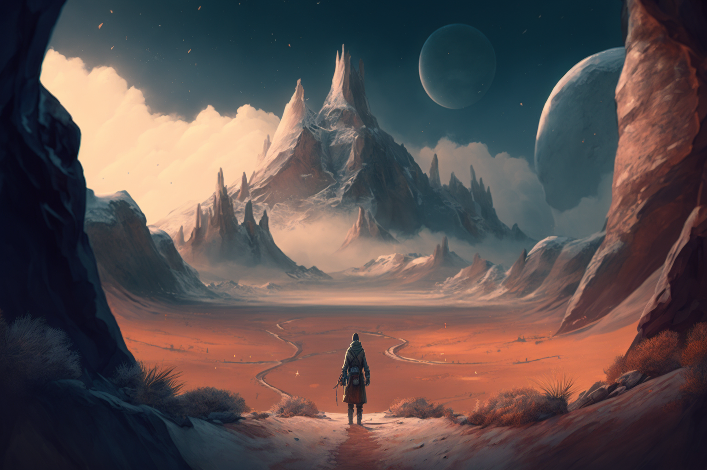


Have you ever heard of Midjourney? It’s an incredible tool that allows you to generate unique, high-quality AI images in just a few clicks. But, for many people, the idea of generating AI images can be intimidating. What should you write? What kind of image should you aim for? It’s natural to have questions, but don’t let that stop you from experiencing the magic of Midjourney.

That’s why I’m sharing my top secrets with you. First, don’t overthink it. Sometimes, the best way to generate a unique AI image is to simply let your creativity flow. Try typing in a few keywords that inspire you, and see what kind of image Midjourney generates. You might be surprised by what comes up.

Another tip is to take advantage of Midjourney’s showcase images. This is a great way to get inspired and see what others are generating with the platform. Plus, you might discover a new style or technique that you want to try out for yourself.


Join the [discord server](https://discord.gg/midjourney) and click to one of the newcomer rooms. Then write “/imagine” and press the enter..


## Who am I

First of all, I’m Ezagor :)

I’m a computer engineer and also full-stack developer. I worked on psychology, marketing and branding. I studied on censydiam, need list and the hook model.
I’m working on the Web3 ecosystem right now. I have a community who are running nodes in the blockchain. And also we are entering lots of testnets.
I have +7 years’ experience of the development. I can make app, dApp, web3 site, web site and especially chatbots. And I love using AI for creating assets and art.

* [Telegram](https://t.me/ezagor)
* [Twitter](https://twitter.com/ezagor_dev)
* [Medium](https://medium.com/@ezagor)
* [Mail](mailto:ezagor@icloud.com)
* Discord : Ezagor#9245

## Midjourney Showcase


* a wise old fire elf, hair made of fire, with a magical staff, resting on a log. Skottie Young comic artwork.
```
/imagine prompt:a wise old fire elf, hair made of fire, with a magical staff, resting on a log. Skottie Young comic artwork.
```


* 8-bit ascii-art
```
/imagine prompt:8-bit ascii-art
```


* indigenogoth Malachite
```
/imagine prompt:indigenogoth Malachite
```


* geisha malachite and yellow, bioluminescent filigree, beautiful, bloomcore indigenogoth
```
/imagine prompt:geisha malachite and yellow, bioluminescent filigree, beautiful, bloomcore indigenogoth
```
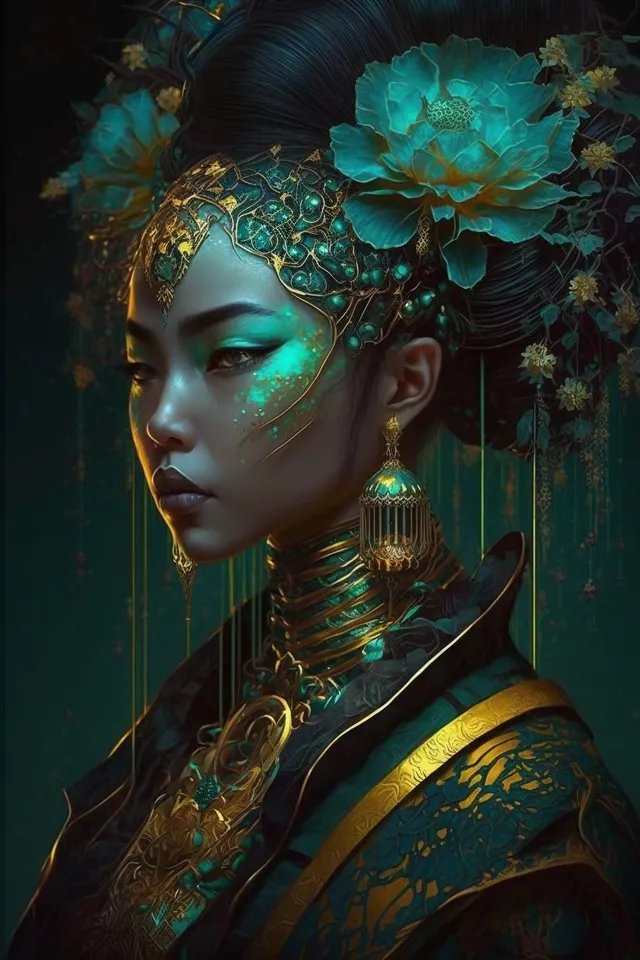

* angry face made of electronic components and PCB circuits
```
/imagine prompt:angry face made of electronic components and PCB circuits
```


* amazing shapes very abstract that look cool, colorful , 2D , pop style , modern, amazing, oh yes!
```
/imagine prompt:amazing shapes very abstract that look cool, colorful , 2D , pop style , modern, amazing, oh yes!
```

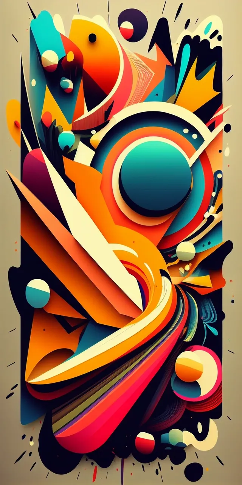

* VOGUE magazine cover, MALACHITE-punk inspired by a fusion of Gustave Klimt + Jean-Baptiste Monge
```
/imagine prompt:VOGUE magazine cover, MALACHITE-punk inspired by a fusion of Gustave Klimt + Jean-Baptiste Monge
```
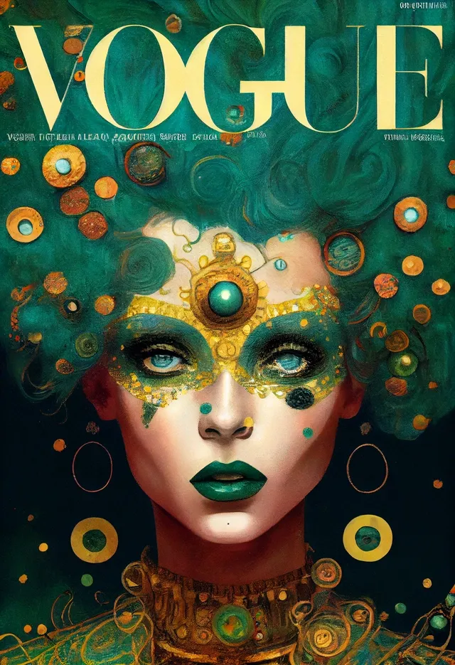


* amazing colorful stained-glass mozaic with front portrait of darth vaidor in star wars theme, back light, malachite, 32k
```
/imagine prompt:amazing colorful stained-glass mozaic with front portrait of darth vaidor in star wars theme, back light, malachite, 32k
```
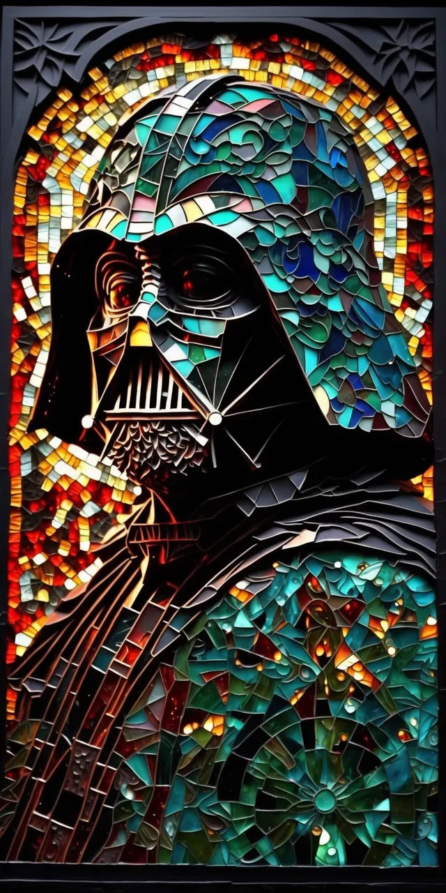

* dusty malachite endless see, child playing with a lobster, radioactive loneliness in teh mornig light, misty
```
/imagine prompt:dusty malachite endless see, child playing with a lobster, radioactive loneliness in teh mornig light, misty
```
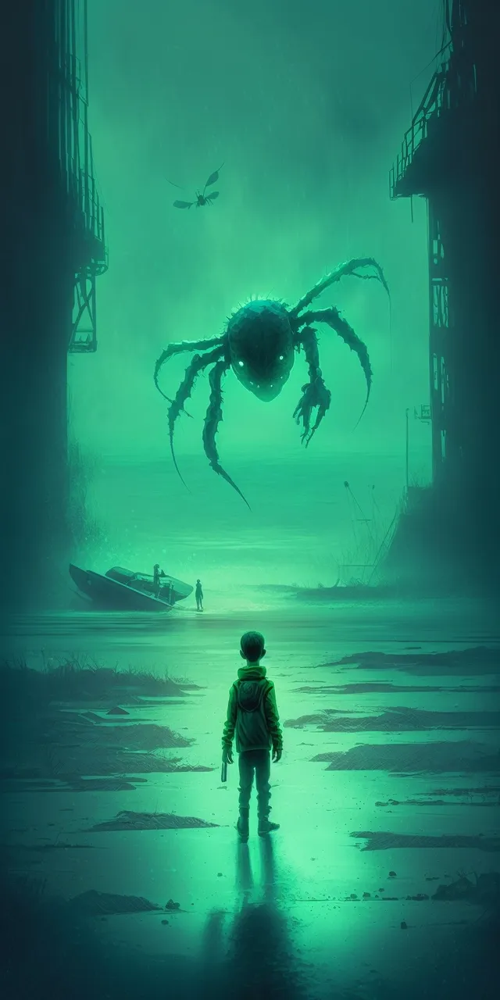

* black and white adult coloring book illustration, cute wolf cubs playing, nature
```
/imagine prompt:black and white adult coloring book illustration, cute wolf cubs playing, nature
```


* illustration in the style of Victor Mosquera, ultra-photorealistic, greens, blues, purples, golds, pinks
```
/imagine prompt:illustration in the style of Victor Mosquera, ultra-photorealistic, greens, blues, purples, golds, pinks
```


* macro photography of particles, realistic, 8k
```
/imagine prompt:macro photography of particles, realistic, 8k
```


* A malachite Fabergé egg
```
/imagine prompt:A malachite Fabergé egg
```
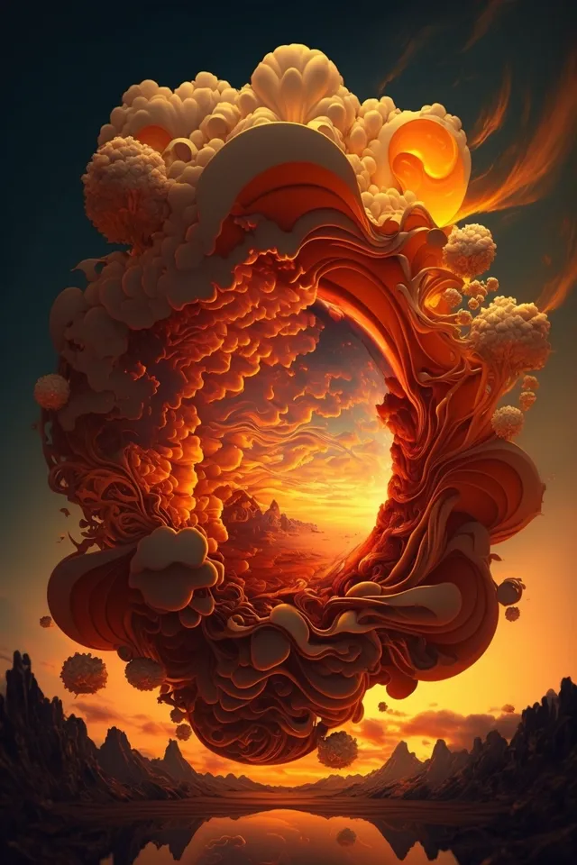

* cyborg fusion of vinyl record, atoms, nanotubes haute couture, motion capture, minimalistic, by Issey Miyake
```
/imagine prompt:cyborg fusion of vinyl record, atoms, nanotubes haute couture, motion capture, minimalistic, by Issey Miyake
```
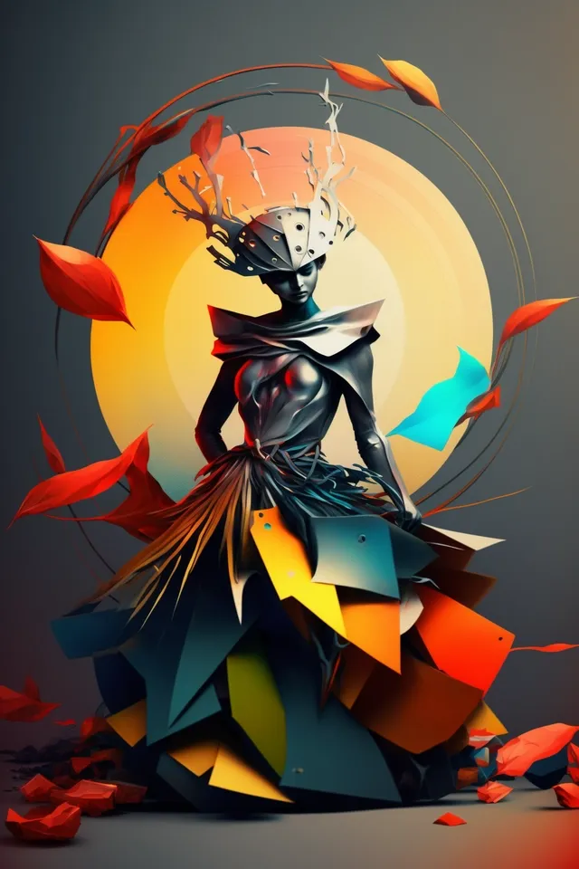

* digital collage of human lungs made of anormous amount of green garden and meadow leafs
```
/imagine prompt:digital collage of human lungs made of anormous amount of green garden and meadow leafs
```


* panda staying up at night
```
/imagine prompt:panda staying up at night
```
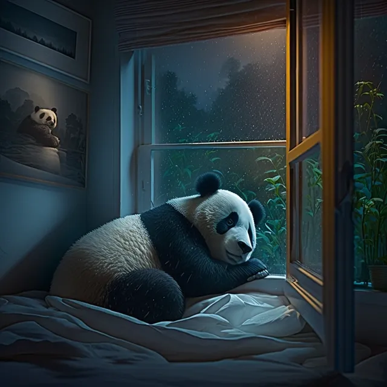

* ghost ship, foggy night with moon lighting up the sky
```
/imagine prompt:ghost ship, foggy night with moon lighting up the sky
```
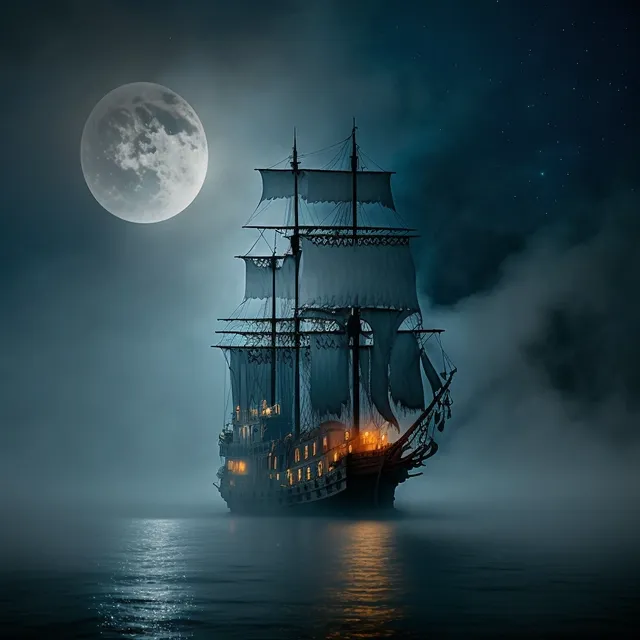

* “Pagan poetry”
```
/imagine prompt:“Pagan poetry”
```
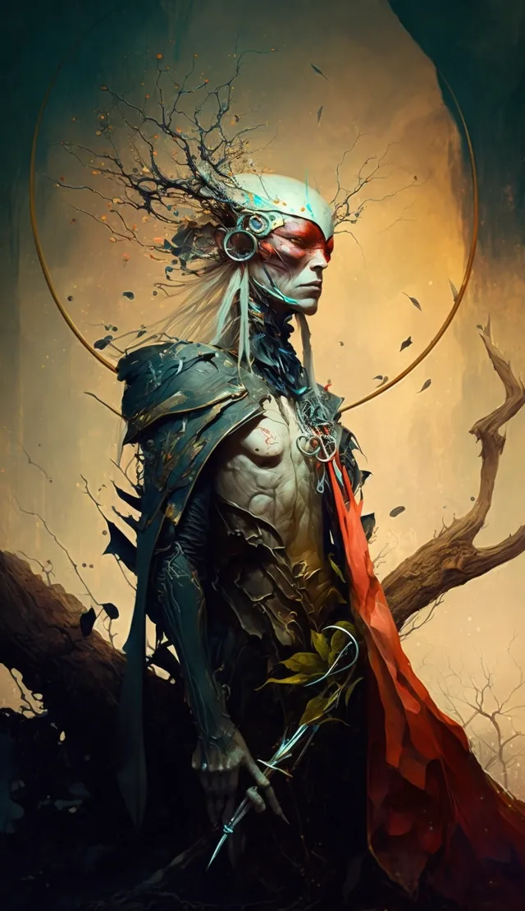

* Illustration of Winnie-the-Pooh like samurai by E.H. Shepard in pastel colors, dark background, malachite
```
/imagine prompt:Illustration of Winnie-the-Pooh like samurai by E.H. Shepard in pastel colors, dark background, malachite
```
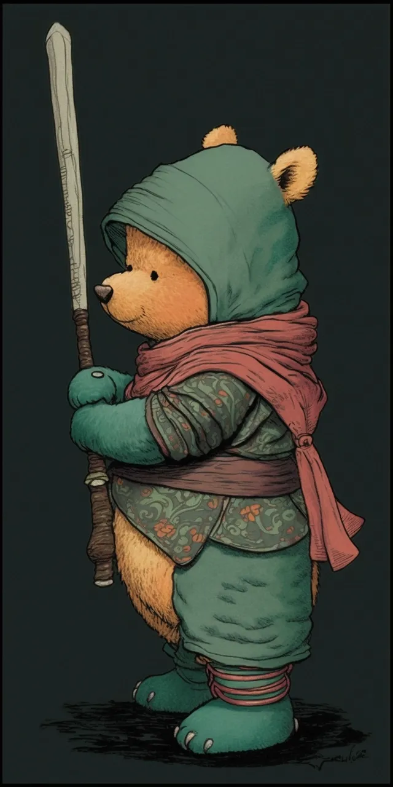

* cute samurai cat
```
/imagine prompt:cute samurai cat
```
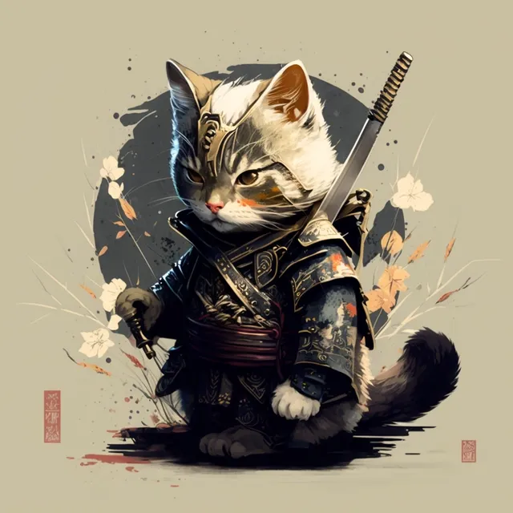

* volkswagen, transporter, futuristic, glow, light flare, camping
```
/imagine prompt:volkswagen, transporter, futuristic, glow, light flare, camping
```
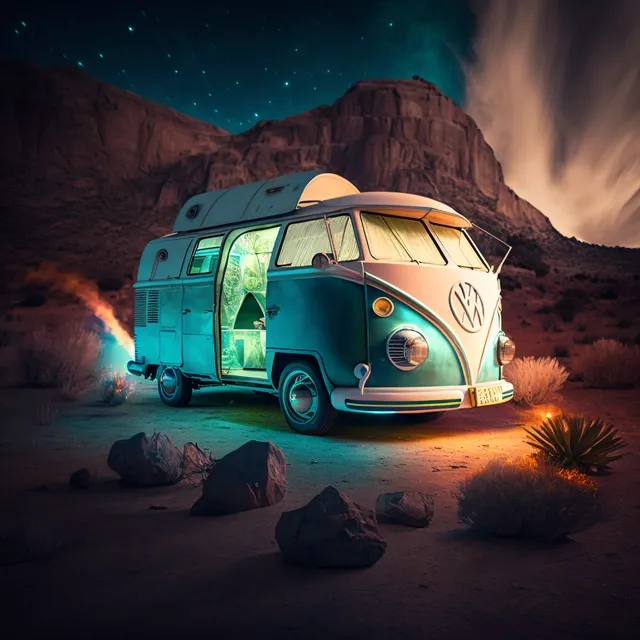

* demon of Midjourney
```
/imagine prompt:demon of Midjourney
```
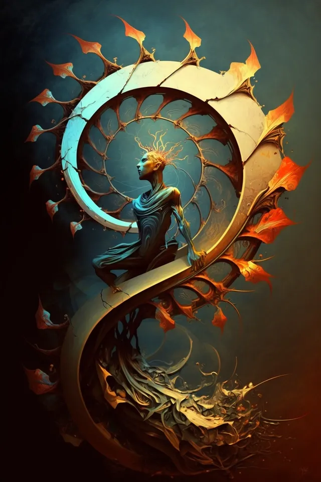


Starting a new life with Midjourney is an exciting opportunity. Don’t let fear hold you back from exploring the limitless potential of AI-generated images. With these tips and tricks, you can create stunning and unique images that are truly one-of-a-kind. So, what are you waiting for? Give it a try, and see where your creativity takes you. Thank you for reading, and I look forward to sharing more showcase images with you in the future.


## Contact: 

* [Telegram](https://t.me/ezagor)
* [Twitter](https://twitter.com/ezagor_dev)
* [Medium](https://medium.com/@ezagor)
* [Mail](mailto:ezagor@icloud.com)
* Discord : Ezagor#9245


