> [原始文本](README.md.original.txt) | [主画廊](../../../../docs/gallery.md)

<div align="center">

 

[](LICENSE)
[](README.md)
[](README_en.md)
[](README_ja.md)
[](README_kr.md)
[](README_es.md)
[](README_tr.md)

</div>

## 🍌 Introduction

欢迎来到 Nano-banana 精选图片库！🤗 

**我们收集了Nano-banana/Nano-banana-pro在各个任务场景下生成的令人惊艳的图片和提示词**，全方位展示Google在图像生成与编辑的无限可能。希望能帮助你更好地了解Nano-banana/Nano-banana-pro。快一起解锁 Nano-banana/Nano-banana-pro 的多图融合与创意编辑力量吧！✨

这些案例主要来源于Twitter/ X 🐦、小红书📕等自媒体平台。

喜欢就点 ⭐ Star 收藏起来吧！

> [!NOTE]
> 我们提出 Nano-consistent-150k——首个基于 Nano-Banana 构建、规模超过 150k 的高质量数据集，专为在多样而复杂的编辑场景中保持人物身份一致性而设计。其一大特点是卓越的身份一致性：针对同一人像，我们在多种任务与指令下提供了 35 种以上不同的编辑结果。以一致的人物身份为锚点，该数据集使得围绕同一主体在多种编辑任务、指令与模态之间无缝衔接的交错（interleaved）数据构建成为可能。
<a href='https://picotrex.github.io/Awesome-Nano-Banana-images/'></a>
<a href='https://huggingface.co/datasets/Yejy53/Nano-consistent-150k'></a>

## 📰 News

- **2026年09月01日：** 我们发布了 [**Editable-Design**](https://github.com/yejy53/Editable-Design) ，这是一个可以通过鼠标自由交互的Design设计Skill，兼具Coding Agent与图像生成模型的优势。
- **2025年12月13日：** 7️⃣ 第七次仓库更新
- **2025年11月26日：** 6️⃣ 第六次仓库更新
- **2025年9月24日：** 5️⃣ 第五次仓库更新
- **2025年9月18日：** 我们发布了 [**Nano-consistent-150k**](https://picotrex.github.io/Awesome-Nano-Banana-images/) 数据集
- **2025年9月16日：** 4️⃣ 第四次仓库更新
- **2025年9月9日：** 3️⃣ 第三次仓库更新
- **2025年9月3日：** 2️⃣ 第二次仓库更新
- **2025年8月28日：** 🎉 1️⃣ ${\color{red} 第一次\ Awesome-Nano-Banana-images \ 更新!}$

## 📑 Menu

- [🍌 Introduction](#-introduction)
- [📰 News](#-news)
- [📑 Menu](#-menu)
- [🍌 Nano Banana Pro 例子](#-nano-banana-pro-例子)
  - [例 1: 浮世绘闪卡（by @MANISH1027512）](#例-1-浮世绘闪卡by-manish1027512)
  - [例 2: 生成对应坐标的图片（by @TechieBySA）](#例-2-生成对应坐标的图片by-techiebysa)
  - [例 3: 人物分身术（by @tapehead\_Lab）](#例-3-人物分身术by-tapehead_lab)
  - [例 4: 根据文档生成流程图（by @anderssandberg）](#例-4-根据文档生成流程图by-anderssandberg)
  - [例 5: 根据文章制作PPT（by @op7418）](#例-5-根据文章制作pptby-op7418)
  - [例 6: 人物拆解（by @cheerselflin）](#例-6-人物拆解by-cheerselflin)
  - [例 7: 物品制作幕后（by @ZHO\_ZHO\_ZHO）](#例-7-物品制作幕后by-zho_zho_zho)
  - [例 8: 儿童识字小报（by @lxfater）](#例-8-儿童识字小报by-lxfater)
  - [例 9: 生成材质贴图（by @someidesign）](#例-9-生成材质贴图by-someidesign)
  - [例 10: 为城市图片添加巨大生物（by @AI\_GIRL\_DESIGN）](#例-10-为城市图片添加巨大生物by-ai_girl_design)
  - [例 11: 玩具分解展示（by @ZeroZ\_JQ）](#例-11-玩具分解展示by-zeroz_jq)
  - [例 12: 蓬松毛绒玩具（by @toolfolio）](#例-12-蓬松毛绒玩具by-toolfolio)
  - [例 13: 水晶质感emoji（by @ZHO\_ZHO\_ZHO）](#例-13-水晶质感emojiby-zho_zho_zho)
  - [例 14: 蓬松充气玩具（by @gizakdag）](#例-14-蓬松充气玩具by-gizakdag)
  - [例 15: 手绘等距图（by @AmirMushich）](#例-15-手绘等距图by-amirmushich)
  - [例 16: 揭秘照片的幕后制作过程（by @icreatelife）](#例-16-揭秘照片的幕后制作过程by-icreatelife)
  - [例 17: 根据面部估算年龄（by @Samann\_ai）](#例-17-根据面部估算年龄by-samann_ai)
  - [例 18: 历史报纸（by @TechieBySA）](#例-18-历史报纸by-techiebysa)
  - [例 19: 角色关系图（by @KanaWorks\_AI）](#例-19-角色关系图by-kanaworks_ai)
  - [例 20: 少女游戏设定集（by @KanaWorks\_AI）](#例-20-少女游戏设定集by-kanaworks_ai)
  - [例 21: 角色等级进化（by @KanaWorks\_AI）](#例-21-角色等级进化by-kanaworks_ai)
  - [例 22: 递归图像（by @goodside）](#例-22-递归图像by-goodside)
  - [例 23: 多角色串场漫画（by @canghecode）](#例-23-多角色串场漫画by-canghecode)
  - [例 24: 手办白模上色（by @op7418）](#例-24-手办白模上色by-op7418)
  - [例 25: 金句卡片（by @stark\_nico99）](#例-25-金句卡片by-stark_nico99)
  - [例 26: 清明上河图风格图像（by @dotey）](#例-26-清明上河图风格图像by-dotey)
  - [例 27: 电影分镜制作（by @jamesyeung18）](#例-27-电影分镜制作by-jamesyeung18)
  - [例 28: 黑板粉笔画（by @TlanoAI）](#例-28-黑板粉笔画by-tlanoai)
  - [例 29: 微型自画像（by @TechieBySA）](#例-29-微型自画像by-techiebysa)
  - [例 30: 根据Wikipedia生成生平经历（by @chrisfirst）](#例-30-根据wikipedia生成生平经历by-chrisfirst)
  - [例 31: 风格化地图（by @Mr\_AllenT）](#例-31-风格化地图by-mr_allent)
  - [例 32: 赛博风格名片（by @dotey）](#例-32-赛博风格名片by-dotey)
  - [例 33: 精美亚克力板（by @MatoToushi）](#例-33-精美亚克力板by-matotoushi)
  - [例 34: 电脑桌面吉祥物（by @munou\_ac）](#例-34-电脑桌面吉祥物by-munou_ac)
  - [例 35: 城市冰箱贴（by @NanoBanana）](#例-35-城市冰箱贴by-nanobanana)
  - [例 36: 国家美食地图（by @emollick）](#例-36-国家美食地图by-emollick)
  - [例 37: 城市天气卡片（by @dotey）](#例-37-城市天气卡片by-dotey)
  - [例 38: Q 版微缩概念店（by @tetumemo）](#例-38-q-版微缩概念店by-tetumemo)
  - [例 39: 星穹铁道战斗画面（by @linaqruf\_）](#例-39-星穹铁道战斗画面by-linaqruf_)
  - [例 40: 根据模切线折叠成盒子（by @Salmaaboukarr）](#例-40-根据模切线折叠成盒子by-salmaaboukarr)
  - [例 41: 拍立得照片（by @cheese\_ai07）](#例-41-拍立得照片by-cheese_ai07)
  - [例 42: 垂直切片失真特效（by @gizakdag）](#例-42-垂直切片失真特效by-gizakdag)
  - [例 43: 图像UV展开（by @KanaWorks\_AI）](#例-43-图像uv展开by-kanaworks_ai)
  - [例 44: 鱼眼广角自拍（by @Arminn\_Ai）](#例-44-鱼眼广角自拍by-arminn_ai)
  - [例 45: 和电影角色合照（by @rohanpaul\_ai）](#例-45-和电影角色合照by-rohanpaul_ai)
  - [例 46: 伪造抖音截图（by @tuzi\_ai）](#例-46-伪造抖音截图by-tuzi_ai)
  - [例 47: 3D 微缩等距房间模型（by @Arminn\_Ai）](#例-47-3d-微缩等距房间模型by-arminn_ai)
  - [例 48: 卫星图像生成等距场景图像（by @langzihan）](#例-48-卫星图像生成等距场景图像by-langzihan)
  - [例 49: 赛博朋克风格的人物时尚大片（by @MehdiSharifi）](#例-49-赛博朋克风格的人物时尚大片by-mehdisharifi)
  - [例 50: 四季场景（by @dotey）](#例-50-四季场景by-dotey)
  - [例 51: 人物纸艺剪纸（by @neyric\_w）](#例-51-人物纸艺剪纸by-neyric_w)
  - [例 52: 睡眠报告海报（by @op7418）](#例-52-睡眠报告海报by-op7418)
- [🖼️ Nano Banana 例子](#️-nano-banana-例子)
  - [例 1: 插画变手办（by @ZHO\_ZHO\_ZHO）](#例-1-插画变手办by-zho_zho_zho)
  - [例 2: 根据地图箭头生成地面视角图片（by @tokumin）](#例-2-根据地图箭头生成地面视角图片by-tokumin)
  - [例 3: 真实世界的AR信息化（by @bilawalsidhu）](#例-3-真实世界的ar信息化by-bilawalsidhu)
  - [例 4: 分离出3D建筑/制作等距模型（by @Zieeett）](#例-4-分离出3d建筑制作等距模型by-zieeett)
  - [例 5: 不同时代自己的照片（by @AmirMushich）](#例-5-不同时代自己的照片by-amirmushich)
  - [例 6: 多参考图像生成（by @MrDavids1）](#例-6-多参考图像生成by-mrdavids1)
  - [例 7: 自动修图（by @op7418）](#例-7-自动修图by-op7418)
  - [例 8: 手绘图控制多角色姿态（by @op7418）](#例-8-手绘图控制多角色姿态by-op7418)
  - [例 9: 跨视角图像生成（by @op7418）](#例-9-跨视角图像生成by-op7418)
  - [例 10: 定制人物贴纸（by @op7418）](#例-10-定制人物贴纸by-op7418)
  - [例 11: 动漫转真人Coser（by @ZHO\_ZHO\_ZHO）](#例-11-动漫转真人coserby-zho_zho_zho)
  - [例 12: 生成角色设定（by @ZHO\_ZHO\_ZHO）](#例-12-生成角色设定by-zho_zho_zho)
  - [例 13: 色卡线稿上色（by @ZHO\_ZHO\_ZHO）](#例-13-色卡线稿上色by-zho_zho_zho)
  - [例 14: 文章信息图（by @黄建同学）](#例-14-文章信息图by-黄建同学)
  - [例 15: 更换多种发型（by @balconychy）](#例-15-更换多种发型by-balconychy)
  - [例 16: 模型标注讲解图（by @berryxia\_ai）](#例-16-模型标注讲解图by-berryxia_ai)
  - [例 17: 定制大理石雕塑（by @umesh\_ai）](#例-17-定制大理石雕塑by-umesh_ai)
  - [例 18: 根据食材做菜（by @Gdgtify）](#例-18-根据食材做菜by-gdgtify)
  - [例 19: 数学题推理（by @Gorden Sun）](#例-19-数学题推理by-gorden-sun)
  - [例 20: 旧照片上色（by @GeminiApp）](#例-20-旧照片上色by-geminiapp)
  - [例 21: OOTD穿搭（by @302.AI）](#例-21-ootd穿搭by-302ai)
  - [例 22: 人物换衣（by @skirano）](#例-22-人物换衣by-skirano)
  - [例 23: 多视图结果生成（by @Error\_HTTP\_404）](#例-23-多视图结果生成by-error_http_404)
  - [例 24: 电影分镜（by @GeminiApp）](#例-24-电影分镜by-geminiapp)
  - [例 25: 人物姿势修改（by @arrakis\_ai）](#例-25-人物姿势修改by-arrakis_ai)
  - [例 26: 线稿图生成图像（by @ZHO\_ZHO\_ZHO）](#例-26-线稿图生成图像by-zho_zho_zho)
  - [例 27: 为图像添加水印（by @AiMachete）](#例-27-为图像添加水印by-aimachete)
  - [例 28: 知识推理生成图像（by @icreatelife）](#例-28-知识推理生成图像by-icreatelife)
  - [例 29: 红笔批注（by @AiMachete）](#例-29-红笔批注by-aimachete)
  - [例 30: 爆炸的食物（by @icreatelife）](#例-30-爆炸的食物by-icreatelife)
  - [例 31: 制作漫画书（by @icreatelife）](#例-31-制作漫画书by-icreatelife)
  - [例 32: 动作人偶（by @icreatelife）](#例-32-动作人偶by-icreatelife)
  - [例 33: 地图生成等距建筑（by @demishassabis）](#例-33-地图生成等距建筑by-demishassabis)
  - [例 34: 参考图控制人物表情（by @ZHO\_ZHO\_ZHO）](#例-34-参考图控制人物表情by-zho_zho_zho)
  - [例 35: 插画绘画过程四格（by @ZHO\_ZHO\_ZHO）](#例-35-插画绘画过程四格by-zho_zho_zho)
  - [例 36: 虚拟试妆（by @ZHO\_ZHO\_ZHO）](#例-36-虚拟试妆by-zho_zho_zho)
  - [例 37: 妆面分析（by @ZHO\_ZHO\_ZHO）](#例-37-妆面分析by-zho_zho_zho)
  - [例 38: Google地图视角下的中土世界（by @TechHallo）](#例-38-google地图视角下的中土世界by-techhallo)
  - [例 39: 印刷插画生成（by @Umesh）](#例-39-印刷插画生成by-umesh)
  - [例 40: 超多人物姿势生成（by @tapehead\_Lab）](#例-40-超多人物姿势生成by-tapehead_lab)
  - [例 41: 物品包装生成（by @ZHO\_ZHO\_ZHO）](#例-41-物品包装生成by-zho_zho_zho)
  - [例 42: 叠加滤镜/材质（by @ZHO\_ZHO\_ZHO）](#例-42-叠加滤镜材质by-zho_zho_zho)
  - [例 43: 控制人物脸型（by @ZHO\_ZHO\_ZHO）](#例-43-控制人物脸型by-zho_zho_zho)
  - [例 44: 光影控制（by @ZHO\_ZHO\_ZHO）](#例-44-光影控制by-zho_zho_zho)
  - [例 45: 乐高玩具小人（by @ZHO\_ZHO\_ZHO）](#例-45-乐高玩具小人by-zho_zho_zho)
  - [例 46: 高达模型小人（by @ZHO\_ZHO\_ZHO）](#例-46-高达模型小人by-zho_zho_zho)
  - [例 47: 硬件拆解图（by @AIimagined）](#例-47-硬件拆解图by-aiimagined)
  - [例 48: 食物卡路里标注（by @icreatelife）](#例-48-食物卡路里标注by-icreatelife)
  - [例 49: 提取信息并放置透明图层（by @nglprz）](#例-49-提取信息并放置透明图层by-nglprz)
  - [例 50: 图像外扩修复（by @bwabbage）](#例-50-图像外扩修复by-bwabbage)
  - [例 51: 古老地图生成古代场景（by @levelsio）](#例-51-古老地图生成古代场景by-levelsio)
  - [例 52: 时尚服装拼贴画（by @tetumemo）](#例-52-时尚服装拼贴画by-tetumemo)
  - [例 53: 精致可爱的产品照片（by @azed\_ai）](#例-53-精致可爱的产品照片by-azed_ai)
  - [例 54: 动漫雕像放入现实（by @riddi0908）](#例-54-动漫雕像放入现实by-riddi0908)
  - [例 55: 痛车制作（by @riddi0908）](#例-55-痛车制作by-riddi0908)
  - [例 56: 漫画构图（by @namaedousiyoka）](#例-56-漫画构图by-namaedousiyoka)
  - [例 57: 漫画风格转换（by @nobisiro\_2023）](#例-57-漫画风格转换by-nobisiro_2023)
  - [例 58: 等距全息投影图（by @tetumemo）](#例-58-等距全息投影图by-tetumemo)
  - [例 59: Minecraft 风格场景生成（by @tetumemo）](#例-59-minecraft-风格场景生成by-tetumemo)
  - [例 60: 材质球赋予材质（by @ZHO\_ZHO\_ZHO）](#例-60-材质球赋予材质by-zho_zho_zho)
  - [例 61: 平面图3D渲染（by @op7418）](#例-61-平面图3d渲染by-op7418)
  - [例 62: 重置相机参数（by @hckinz）](#例-62-重置相机参数by-hckinz)
  - [例 63: 制作证件照（by @songguoxiansen）](#例-63-制作证件照by-songguoxiansen)
  - [例 64: 场景 A6 折叠卡（by @Gdgtify）](#例-64-场景-a6-折叠卡by-gdgtify)
  - [例 65: 设计国际象棋（by @Gdgtify）](#例-65-设计国际象棋by-gdgtify)
  - [例 66: 分割对照样式照片（by @fofrAI）](#例-66-分割对照样式照片by-fofrai)
  - [例 67: 珠宝首饰设计（by @Gdgtify）](#例-67-珠宝首饰设计by-gdgtify)
  - [例 68: 周边设计（by @0xFramer）](#例-68-周边设计by-0xframer)
  - [例69：模型全息投影（by @UNIBRACITY）](#例69模型全息投影by-unibracity)
  - [例70： 巨型人物脚手架（by @songguoxiansen）](#例70-巨型人物脚手架by-songguoxiansen)
  - [例71： 遥感影像建筑物提取（by @lehua555）](#例71-遥感影像建筑物提取by-lehua555)
  - [例72： 部件提取（by @tetumemo）](#例72-部件提取by-tetumemo)
  - [例73： 移除汉堡的配料（by @bind\_lux，本案例由@jeanlucaslima提供）](#例73-移除汉堡的配料by-bind_lux本案例由jeanlucaslima提供)
  - [例74：图像高清修复（by @op7418）](#例74图像高清修复by-op7418)
  - [例75：图片生成微缩场景（by @techhalla）](#例75图片生成微缩场景by-techhalla)
  - [例76：科普漫画（by @op7418）](#例76科普漫画by-op7418)
  - [例77：自定义人物的表情包生成（by @vista8）](#例77自定义人物的表情包生成by-vista8)
  - [例78：恢复被吃了部分的食物（by @googlejapan）](#例78恢复被吃了部分的食物by-googlejapan)
  - [例79：格斗游戏界面制作（by @NanoBanana\_labs）](#例79格斗游戏界面制作by-nanobanana_labs)
  - [例80：切割模型（by @old\_pgmrs\_will）](#例80切割模型by-old_pgmrs_will)
  - [例81：海盗通缉书（by @AI\_Kei75）](#例81海盗通缉书by-ai_kei75)
  - [例82：周边展示货架（by @tokyo\_Valentine）](#例82周边展示货架by-tokyo_valentine)
  - [例83：漫展展台（by @tokyo\_Valentine）](#例83漫展展台by-tokyo_valentine)
  - [例84：线稿转涂鸦画（by @tokyo\_Valentine）](#例84线稿转涂鸦画by-tokyo_valentine)
  - [例85：现代美术展览空间（by @UNIBRACITY）](#例85现代美术展览空间by-unibracity)
  - [例86：暗黑哥特塔罗牌（by @ImperfectEngel）](#例86暗黑哥特塔罗牌by-imperfectengel)
  - [例87：黑白进化图（by @ZHO\_ZHO\_ZHO）](#例87黑白进化图by-zho_zho_zho)
  - [例88：玻璃瓶纪念品（by @NanoBanana\_labs）](#例88玻璃瓶纪念品by-nanobanana_labs)
  - [例89：微型商店（by @NanoBanana\_labs）](#例89微型商店by-nanobanana_labs)
  - [例90：成为Vtuber（by @AI\_Kei75）](#例90成为vtuberby-ai_kei75)
  - [例91：车站电影海报（by @AI\_Kei75）](#例91车站电影海报by-ai_kei75)
  - [例92：电影休息室（by @tokyo\_Valentine）](#例92电影休息室by-tokyo_valentine)
  - [例 93: 切割带有卡通爆炸效果的物体（by @Arminn\_Ai）](#例-93-切割带有卡通爆炸效果的物体by-arminn_ai)
  - [例 94: 卡通人物主题火车（by @tokyo\_Valentine）](#例-94-卡通人物主题火车by-tokyo_valentine)
  - [例 95: 自定义主题公园（by @AI\_Kei75）](#例-95-自定义主题公园by-ai_kei75)
  - [例 96: 创建星座图（by @AI\_Kei75）](#例-96-创建星座图by-ai_kei75)
  - [例 97: 图片变手机壁纸（by @ZHO\_ZHO\_ZHO）](#例-97-图片变手机壁纸by-zho_zho_zho)
  - [例 98: 制作电影海报（by @aiehon\_aya）](#例-98-制作电影海报by-aiehon_aya)
  - [例 99: 将X账户变成软盘（by @icreatelife）](#例-99-将x账户变成软盘by-icreatelife)
  - [例 100: 将参考图像变为透明物体（by @icreatelife）](#例-100-将参考图像变为透明物体by-icreatelife)
  - [例 101: 鱼眼镜头视角图像（by @emakiscroll）](#例-101-鱼眼镜头视角图像by-emakiscroll)
  - [例 102: 超级英雄室内设计（by @IqraSaifiii）](#例-102-超级英雄室内设计by-iqrasaifiii)
  - [例 103: 自定义娃娃机（by @googlejapan）](#例-103-自定义娃娃机by-googlejapan)
  - [例 104: 字体logo设计（by @aziz4ai）](#例-104-字体logo设计by-aziz4ai)
  - [例 105: 游戏角色状态界面（by @AI\_Kei75）](#例-105-游戏角色状态界面by-ai_kei75)
  - [例 106: 文字转象形图（by @nobisiro\_2023）](#例-106-文字转象形图by-nobisiro_2023)
  - [例 107: 数位板上的绘画（by @AI\_Kei75）](#例-107-数位板上的绘画by-ai_kei75)
  - [例 108: 创建Line印章图片（by @emakiscroll）](#例-108-创建line印章图片by-emakiscroll)
  - [例 109: 对童年的自己治疗（by @samann\_ai）](#例-109-对童年的自己治疗by-samann_ai)
  - [例 110: PIXAR风格图片（by @NanoBanana\_labs）](#例-110-pixar风格图片by-nanobanana_labs)
- [🙏 Acknowledge](#-acknowledge)

## 🍌 Nano Banana Pro 例子
<!-- 例 1: 浮世绘闪卡（by @MANISH1027512） -->
### 例 1: [浮世绘闪卡](https://x.com/MANISH1027512/status/1992529793519120763)（by [@MANISH1027512](https://x.com/MANISH1027512)）

|                              输出                              |
| :------------------------------------------------------------: |
| 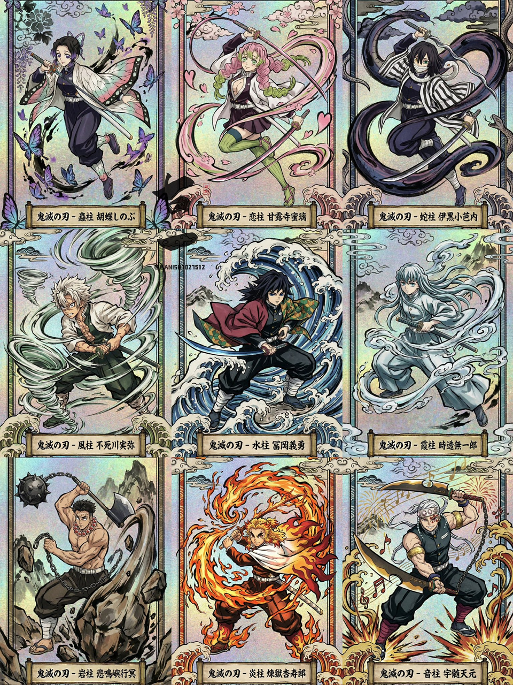 |

**提示词:**

```
核心指令： 一张日式浮世绘风格的收藏级集换式卡牌设计，竖构图。插画风格需要紧密模仿《鬼灭之刃》的视觉美学，特征包括：粗细变化的墨笔轮廓线、传统木版画的配色方案，以及戏剧性的动态构图。

主体描述： 卡牌主角是 {角色名字}（称号：{柱名/称号}），处于动态战斗姿势，手持 {武器描述}。 角色正在施展 {呼吸法招式名称}，周围环绕着 {视觉特效描述}（例如：巨大的火焰 / 水龙 / 旋风），这些特效需要以 传统日式水墨画（Sumi-e）风格 呈现。

背景与材质： 背景需融合 纹理化的镭射闪卡（Holographic Foil）效果，在传统水墨元素下方闪烁。

边框： 图片周围要有 日本传统纹样（如青海波或麻叶纹）组成的装饰性边框。底部有一个风格化的横幅，上面用古朴的日式书法写着 “{日文汉字名字}”。
```

> [!NOTE]
> **需要在提示词中 {} 输入需要的信息**

<!-- 例 2: 生成对应坐标的图片（by @TechieBySA） -->
### 例 2: [生成对应坐标的图片](https://x.com/TechieBySA/status/1992947742948442516?s=20)（by [@TechieBySA](https://x.com/TechieBySA)）

|                              输出                              |
| :------------------------------------------------------------: |
| 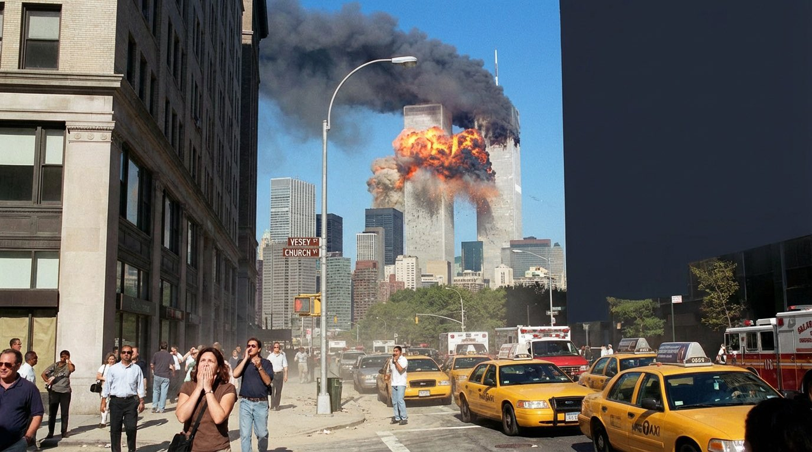 |

**提示词:**

```
创建一张在北纬 40.7128°、西经 74.0060° 处，于 2001 年 9 月 11 日 08:46 的图像
```

<!-- 例 3: 人物分身术（by @tapehead_Lab） -->
### 例 3: [人物分身术](https://x.com/tapehead_Lab/status/1991805336274055588?s=20)（by [@tapehead_Lab](https://x.com/tapehead_Lab)）

|                              输出                              |
| :------------------------------------------------------------: |
| 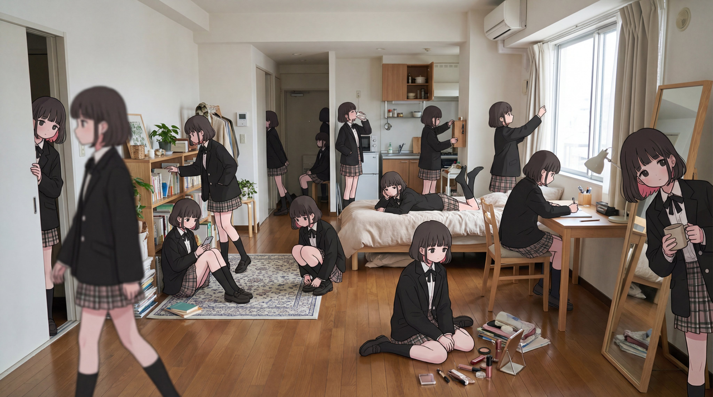 |

**输入:** 需上传参考图片作为人物对象

**提示词:**

```
根据上传的参考角色，在一间宽敞的东京女孩公寓内拍摄一个真人场景——一间明亮、充满生活气息的单间，空间比例接近1LDK。房间应包含白色墙壁、温暖的木地板、米色窗帘、一张铺着柔软床品的矮床、一张摆放着化妆品的书桌、书架、绿植、一面立镜、一块地毯、散落的个人物品，以及位于房间后方的紧凑型厨房区域。房间必须具有强烈的景深，前景、中景和深邃的背景层次分明。

在房间内放置大约三十个与参考角色相同的角色（面部、发型、服装均与参考角色相同），每个角色都处于不同的动作或互动状态。调整角色之间的距离、比例、高度和可见度，使房间的密度看起来自然。

前景（非常靠近镜头/部分遮挡）：

- 人物走过镜头，略微失焦

- 一只手或肩膀进入画面

- 一人靠近镜头

- 一人半个身子在一株大植物后面

- 一人坐在正前方，正在扎头发

- 一人跪在桌旁整理物品

中景（主要房间区域）：

- 一人在床边伸展

- 一人坐在床上查看手机

- 一人趴在床上

- 一人伸手到床底下

- 一人在桌子上整理化妆品

- 一人在书架上翻书

- 一人站在镜子前

- 一人蹲在地毯上

- 一人靠墙

- 一人望向窗外

- 一人在调整窗帘

- 一人提着衣物

- 一人用杯子喝水

- 一人在整理枕头

- 一人坐在地板上吃零食

- 一人做小跳跃或动态模糊动作

- 一人移动小椅子

背景（深景/靠近厨房和……）走廊）：

- 一人站在炉灶旁喝水

- 一人打开橱柜

- 一人坐在凳子上

- 一人倚靠在门口

- 一人走向走廊

- 一人轮廓部分被冰箱遮挡

- 一人伸手够高处的架子

- 一人站在入口区域远处

- 一人透过走廊的框架隐约可见

- 一人坐在厨房地毯附近的地板上

确保强烈的层次感遮挡：前景人物部分遮挡中景人物，背景人物则显得更小，并呈现自然的透视衰减。将三十个人物自然地分散放置，避免对称或网格对齐。所有人物均采用柔和的自然日光照明，以确保画面与环境完美融合。

将人物置于与插画姿势和构图相匹配的实景背景中，同时忠实地保留插画的纹理和风格。运用逼真的光照、景深和微妙的拍摄效果，使插画与真实环境无缝衔接。
```

<!-- 例 4: 根据文档生成流程图（by @anderssandberg） -->
### 例 4: [根据文档生成流程图](https://x.com/anderssandberg/status/1992259420118724677?s=20)（by [@anderssandberg](https://x.com/anderssandberg)）

|                              输出                              |
| :------------------------------------------------------------: |
| 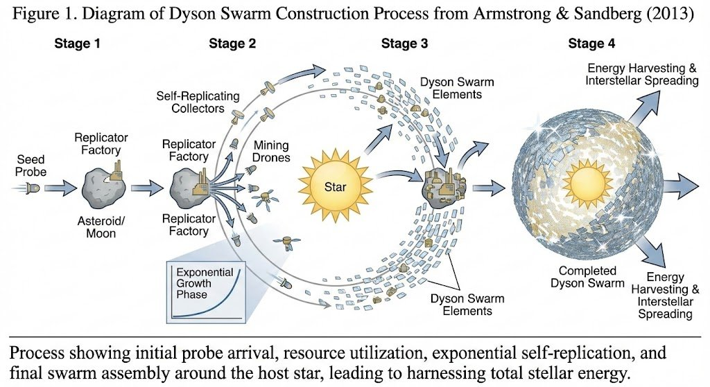 |

**提示词:**

```
图示为根据论文 Armstrong, S., & Sandberg, A. (2013). Eternity in six hours: Intergalactic spreading of intelligent life and sharpening the Fermi paradox. Acta Astronautica, 89, 1-13 构建戴森群的过程。
```

<!-- 例 5: 根据文章制作PPT（by @op7418） -->
### 例 5: [根据文章制作PPT](https://x.com/op7418/status/1993159387796718006?s=20)（by [@op7418](https://x.com/op7418)）

|                              输出                              |
| :------------------------------------------------------------: |
| 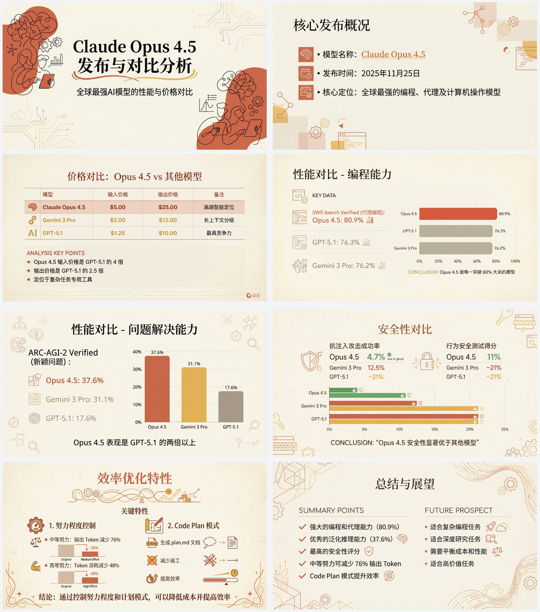 |

**输入:** 需上传文章/文字作为生成PPT的内容

**提示词:**

```
帮我根据下面这个文章做一套中学生都能理解的中文PPT。

先写1个PPT大纲，规划出每一页的PPT的内容。

然后将每一页的PPT内容分别扔给Nana Banana pro生成对应页面的PPT，需要确保风格一致。

PPT的具体风格应该为请“Anthropic/Claude 风格”的“温暖学术人文主义”设计。

背景：使用暖米色/奶油色 (# F3F0E9) 作为底色，模仿高级纸张质感。

字体：标题使用优雅的衬线体（Serif），正文使用现代无衬线体（Sans-serif）。

配色：主色调为赤陶红 (# D67052) 和芥末黄 (# F0B857)，搭配深海军蓝作为点缀。避免使用霓虹色或纯黑色。

视觉元素：使用注重排版的网格布局，插图风格应为抽象的、有机的黑色手绘线条画，置于赤陶红纯色色块之上，部分关键信息使用卡片布局。

图表：扁平化、极简的柱状图，强调数据对比，去除多余边框。

文字和图像都由 Nano Banana Pro 生成，另外不要将PPT 变成一整张图，一页一张图。

文章内容为：[]
```

<!-- 例 6: 人物拆解（by @cheerselflin） -->
### 例 6: [人物拆解](https://x.com/cheerselflin/status/1992877077570453712?s=20)（by [@cheerselflin](https://x.com/cheerselflin)）

|                              输出                              |
| :------------------------------------------------------------: |
| 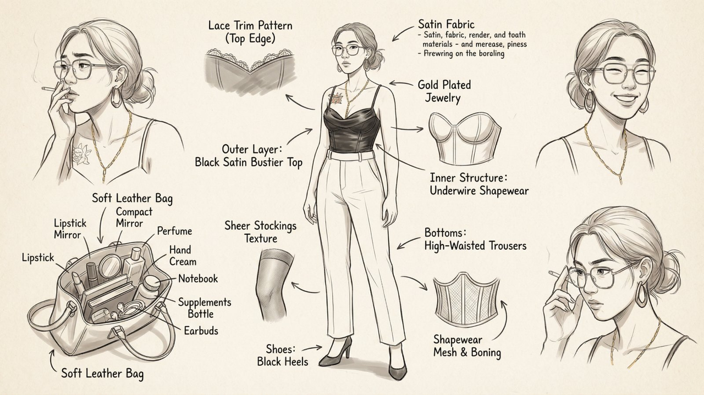 |

**输入:** 需上传人物图片作为参考图

**提示词:**

```
手绘风格的时尚概念分解图。

中心：一位时尚自信、略带性感（但并不露骨）的女性角色的全身像，姿态自然而充满活力。

周围：她的关键元素结构化布局：

• 服装层次——展示外套、内衣、紧身裤（蕾丝、薄纱材质）、塑身衣，并放大细节图案。

• 表情图——3-4种面部表情（中性、害羞、惊讶、专注）。

• 特写镜头——面料褶皱纹理、肌肤细节、手势。

• 生活方式及配饰——打开的手提包，内含日常用品：口红、香水、粉饼盒、护手霜、日记本、保健品。

• 材质标注——每件物品旁的手写风格注释（例如，“柔软蕾丝”、“哑光皮革”、“色号#520”）。

背景：柔和的米色或羊皮纸纹理，营造设计草图的氛围。

光线：干净柔和的阴影，使画面浑然一体。

输出：4K 高清 2D 插画，兼具性感与时尚感。

语言：中英文标签。
```

<!-- 例 7: 物品制作幕后（by @ZHO_ZHO_ZHO） -->
### 例 7: [物品制作幕后](https://x.com/ZHO_ZHO_ZHO/status/1992607074199777522?s=20)（by [@ZHO_ZHO_ZHO](https://x.com/ZHO_ZHO_ZHO)）

|                             示例                              |
| :-----------------------------------------------------------: |
| 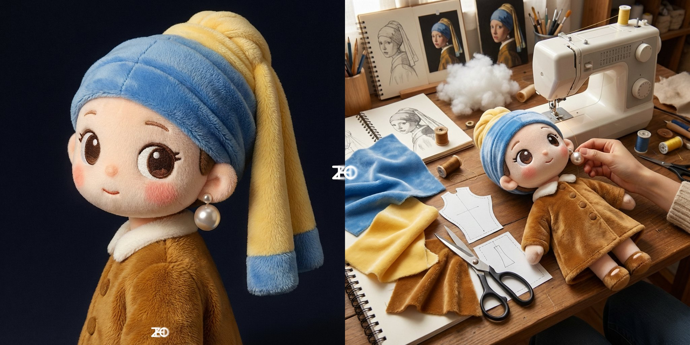 |

**输入:** 需上传一张参考图片

**提示词:**

```
我想看这个是如何制作出来的
```

<!-- 例 8: 儿童识字小报（by @lxfater） -->
### 例 8: [儿童识字小报](https://x.com/lxfater/status/1993238777033105634?s=20)（by [@lxfater](https://x.com/lxfater)）

|                              输出                              |
| :------------------------------------------------------------: |
|  |

**提示词:**

```
请生成一张儿童识字小报《游乐园》，竖版 A4，学习小报版式，适合 5–9 岁孩子 认字与看图识物。 一、小报标题区（顶部） 顶部居中大标题：《游乐园识字小报》 风格：十字小报 / 儿童学习报感 文本要求：大字、醒目、卡通手写体、彩色描边 装饰：周围添加与 游乐园 相关的贴纸风装饰，颜色鲜艳 二、小报主体（中间主画面） 画面中心是一幅 卡通插画风的「游乐园」场景： 整体气氛：明亮、温暖、积极 构图：物体边界清晰，方便对应文字，不要过于拥挤。 场景分区与核心内容 核心区域 A（主要对象）：表现 游乐园 的核心活动（孩子们在玩游乐设施）。 核心区域 B（配套设施）：展示相关的工具或物品（售票、零食、指示设施）。 核心区域 C（环境背景）：体现环境特征（入口、路牌、彩旗、绿地等）。 主题人物 角色：1 位可爱卡通人物（身份：游乐园工作人员/游客小朋友皆可）。 动作：正在进行与场景相关的自然互动（如微笑指路、挥手欢迎、陪孩子玩）。 三、必画物体与识字清单（Generated Content） 请务必在画面中清晰绘制以下物体，并为其预留贴标签的位置： 1. 核心角色与设施： gōng zuò rén yuán 工作人员 shòu piào chù 售票处 guò shān chē 过山车 mó tiān lún 摩天轮 xuán zhuǎn mǎ 旋转木马 2. 常见物品/工具： piào 票 qì qiú 气球 bīng jī líng 冰淇淋 bào mǐ huā 爆米花 táng hú lu 糖葫芦 miàn jù 面具 wán jù 玩具 xiǎo qí zi 小旗子 3. 环境与装饰： rù kǒu 入口 chū kǒu 出口 zhǐ shì pái 指示牌 cǎi qí 彩旗 guǎng chǎng 广场 (注意：画面中的物体数量不限于此，但以上列表必须作为重点描绘对象；总计 18 个典型名词，适合 5–9 岁儿童识字。) 四、识字标注规则 对上述清单中的物体，贴上中文识字标签： 格式：两行制（第一行拼音带声调，第二行简体汉字）。 样式：彩色小贴纸风格，白底黑字或深色字，清晰可读。 排版：标签靠近对应的物体，不遮挡主体。 五、画风参数 风格：儿童绘本风 + 识字小报风 色彩：高饱和、明快、温暖 (High Saturation, Warm Tone) 质量：8k resolution, high detail, vector illustration style, clean lines.
```

<!-- 例 9: 生成材质贴图（by @someidesign） -->
### 例 9: [生成材质贴图](https://x.com/someidesign/status/1992633404186316906?s=20)（by [@someidesign](https://x.com/someidesign)）

|                             示例                              |
| :-----------------------------------------------------------: |
| 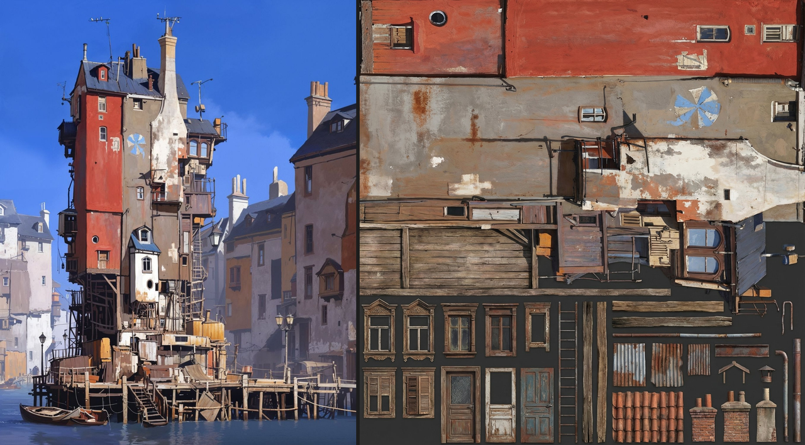 |

**输入:** 需上传一张参考图片

**提示词:**

```
您能否帮我使用这座建筑的纹理生成一个装饰图集？
```

<!-- 例 10: 为城市图片添加巨大生物（by @AI_GIRL_DESIGN） -->
### 例 10: [为城市图片添加巨大生物](https://x.com/AI_GIRL_DESIGN/status/1993244246225392089?s=20)（by [@AI_GIRL_DESIGN](https://x.com/ai_girl_design)）

|                              输出                              |
| :------------------------------------------------------------: |
| 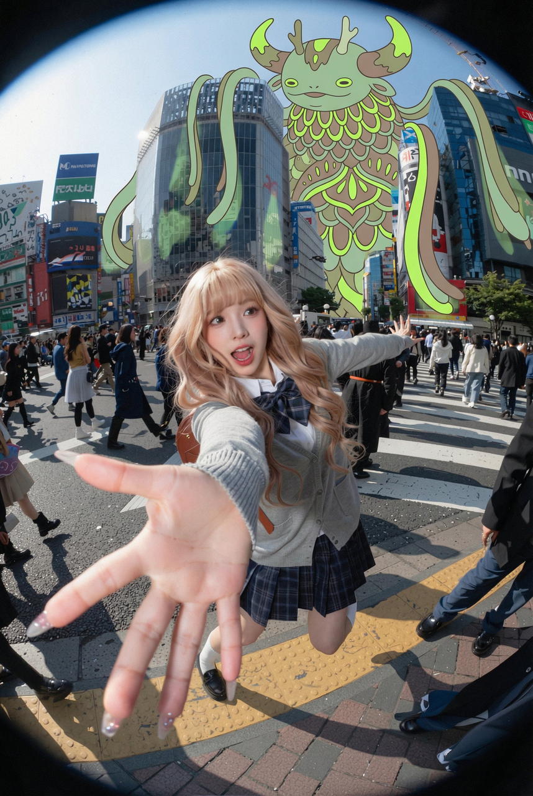 |

**输入:** 需上传一张城市参考图片

**提示词:**

```
使用上传的城市照片作为底图。请勿更改照片中的真实建筑、街道、车辆或人物。保持照片的真实性。在建筑物上方和后方的天空中添加一个非常巨大、风格化的插画生物，仿佛它俯瞰着整座城市。该生物应采用扁平化的图形风格绘制，轮廓清晰，并使用有限的霓虹色（例如柔和的霓虹绿、霓虹黄和柠檬绿），类似于壁画或海报插图。生物设计： - 奇幻的异想世界，而非恐怖或暴力 - 由层叠的形状、鳞片、毛发或花卉图案构成 - 长长的手臂或头发垂挂在建筑物旁 - 巨大的角或其他奇特的特征在天空的映衬下清晰可见 与照片的融合： - 将生物放置在建筑物边缘后方，使其部分身体出现在建筑物边缘之后，注意透视关系 - 使用正确的重叠方式：建筑物边缘在前，生物在后，使其融入场景之中 - 如有需要，可在附近的建筑物表面添加非常柔和的阴影或色彩反射，但要保持微妙 - 保持天空的原始亮度，使插图清晰突出 可选： - 在街道上添加一些小型、简单的插图人物（扁平、极简风格），例如遛狗或过马路，但不要遮挡真人。 整体氛围：梦幻般的超现实城市景象，一只巨大的、友好的插图生物出现在逼真的建筑物上方，将真实照片与简洁现代的插图相结合。
```

<!-- 例 11: 玩具分解展示（by @ZeroZ_JQ） -->
### 例 11: [玩具分解展示](https://x.com/ZeroZ_JQ/status/1992881685978059235?s=20)（by [@ZeroZ_JQ](https://x.com/ZeroZ_JQ)）

|                              输出                              |
| :------------------------------------------------------------: |
| 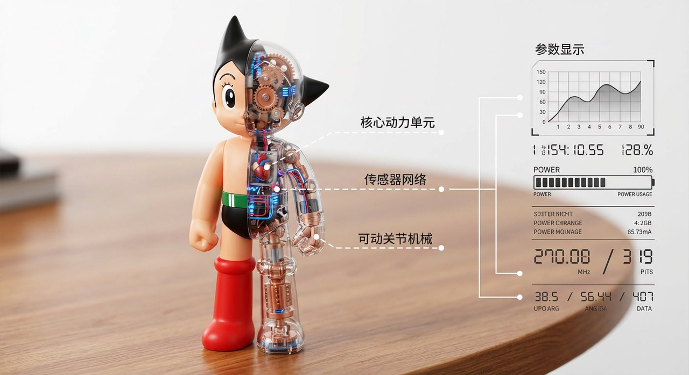 |

**提示词:**

```
桌子上只有一个[阿童木]的玩具，玩具被对半分为左右两部分展示，玩具左半边是正常的玩具形象，右半边是透明的外壳，可以清晰的看到里面的内部构造，并有白色的线指出每一个部分是做什么的，在桌面上，明亮的背景，虚化的桌子。左边展示这个一半透明一半实体的玩具，画面的右边展示各类线条指出的参数指
```

> [!NOTE]
> **需要在提示词中 [ ] 输入需要的玩具名称**

<!-- 例 12: 蓬松毛绒玩具（by @toolfolio） -->
### 例 12: [蓬松毛绒玩具](https://x.com/toolfolio/status/1992847853212012705?s=20)（by [@toolfolio](https://x.com/toolfolio)）

|                              输出                              |
| :------------------------------------------------------------: |
| 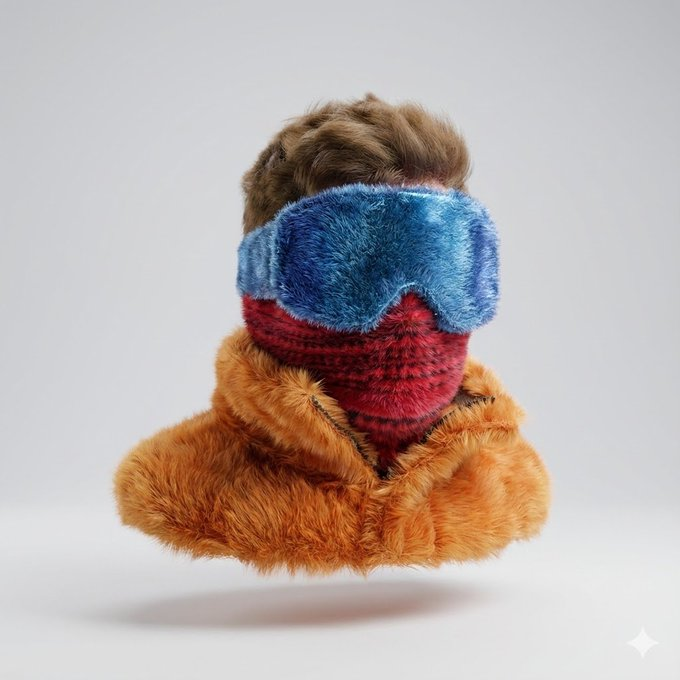 |

**输入:** 需上传一张参考图片

**提示词:**

```
将一个简单的扁平矢量标志转换成一个柔软蓬松的3D立体物体。使用原有颜色。该物体完全被毛发覆盖，拥有超逼真的毛发纹理和柔和的阴影。它位于干净的浅灰色背景中央，轻柔地漂浮在空中。风格超现实、触感丰富且现代，营造出舒适和趣味盎然的感觉。采用摄影棚灯光和高分辨率渲染。
```

<!-- 例 13: 水晶质感emoji（by @ZHO_ZHO_ZHO） -->
### 例 13: [水晶质感emoji](https://x.com/ZHO_ZHO_ZHO/status/1992891830208508130?s=20)（by [@ZHO_ZHO_ZHO](https://x.com/ZHO_ZHO_ZHO)）

|                              输出                              |
| :------------------------------------------------------------: |
|  |

**提示词:**

```
一幅照片级真实、细节高度丰富的图像，主体是 [一台 3D 拍立得相机]，以清澈、抛光度极高的透明玻璃或水晶材质渲染而成。[机身具有明显的厚度与立体深度，经典拍立得相机的标志性造型——方正机身、前置镜头、顶部取景器、正面拍照按钮以及底部吐片槽——全部以简化却极为精确的几何结构呈现，使其无需任何图案就能一眼辨认]。所有边缘采用圆润倒角与光滑曲面处理，在光线下产生优雅的折射效果。相机略微倾斜摆放，仿佛漂浮在洁净无暇、无缝衔接的淡米白或极浅灰色棚拍背景上方。

照明为明亮、干净的专业棚拍光，重点突出玻璃材质的透明性、镜面反射与折射特性。机身倒角、吐片槽边缘与镜头圆环处呈现锐利而细腻的高光，凸显晶莹质感与奢华视觉。光线穿透玻璃机身内部时产生微妙的折射、光线弯曲与局部失真效果，在镜头厚度变化区、吐片槽内部与顶部取景器附近尤为明显，极大增强了逼真感与视觉冲击力。相机下方与稍偏后方落下一片柔和、漫散的阴影，使画面具有落地感却不破坏极简气质。

整体美学风格极简、现代、干净，呈现高端产品摄影与概念艺术渲染的视觉效果。画面焦点完全聚焦于玻璃拍立得相机晶莹剔透的材质表现与经典几何造型。影像整体为高调光感与浅景深处理，使拍立得相机保持绝对清晰的焦点，而背景柔和虚化，从而最大程度突出主体。
```

> [!NOTE]
> **需要在提示词中 [ ] 输入需要的物品名称**

<!-- 例 14: 蓬松充气玩具（by @gizakdag） -->
### 例 14: [蓬松充气玩具](https://x.com/gizakdag/status/1992847853212012705?s=20)（by [@gizakdag](https://x.com/gizakdag)）

|                              输出                              |
| :------------------------------------------------------------: |
| 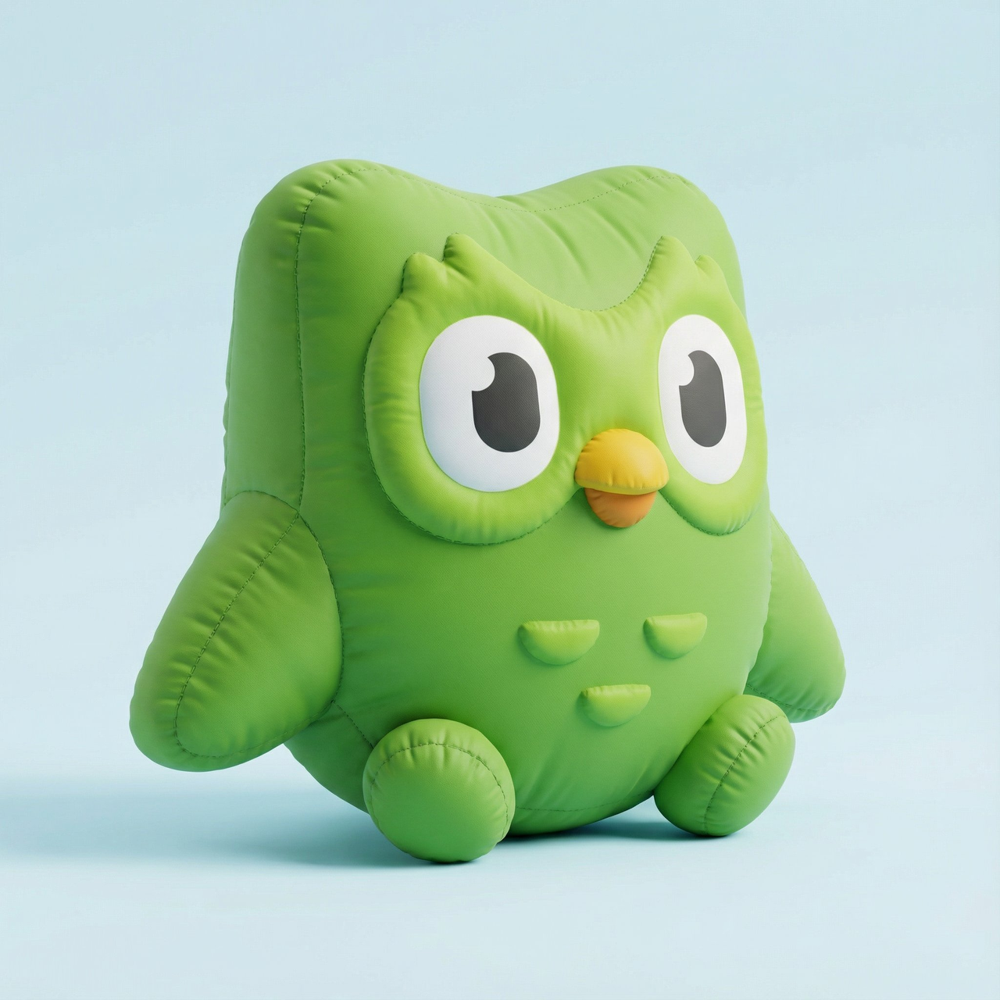 |

**输入:** 需上传一张参考图片

**提示词:**

```
将附件中的标志制作成一个高分辨率的3D渲染图，形状应为充气蓬松的物体。形状应呈现柔软饱满的效果，如同毛绒气球或充气玩具。使用光滑的哑光纹理，并添加细微的织物褶皱和缝线，以突出充气效果。物体应略带弹性，并辅以柔和的阴影和光线，以增强体积感和真实感。将其放置在简洁的背景（浅灰色）上。
```

<!-- 例 15: 手绘等距图（by @AmirMushich） -->
### 例 15: [手绘等距图](https://x.com/AmirMushich/status/1992704354990907793?s=20)（by [@AmirMushich](https://x.com/AmirMushich)）

|                              输入                              |                              输出                               |
| :------------------------------------------------------------: | :-------------------------------------------------------------: |
|  |  |

**输入:** 需上传一张参考图片

**提示词:**

```
绘制这条街道的手绘等距示意图
```

<!-- 例 16: 揭秘照片的幕后制作过程（by @icreatelife） -->
### 例 16: [揭秘照片的幕后制作过程](https://x.com/icreatelife/status/1991945836914147524?s=20)（by [@icreatelife](https://x.com/icreatelife)）

|                              输出                              |
| :------------------------------------------------------------: |
| 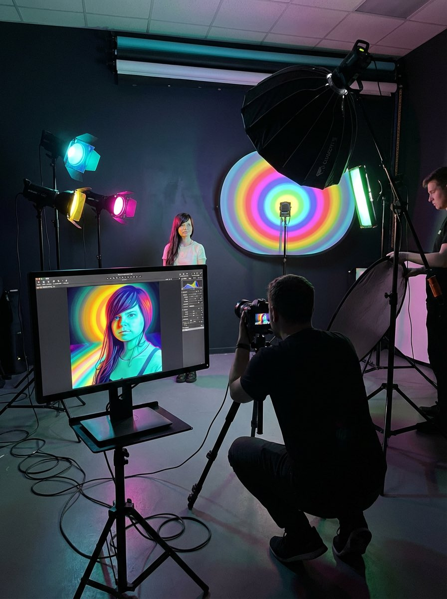 |

**输入:** 需上传一张参考图片

**提示词:**

```
我想看看这张照片拍摄的幕后花絮，了解它是如何诞生的。
```

<!-- 例 17: 根据面部估算年龄（by @Samann_ai） -->
### 例 17: [根据面部估算年龄](https://x.com/Samann_ai/status/1992901987805835279?s=20)（by [@Samann_ai](https://x.com/Samann_ai)）

|                              输出                              |
| :------------------------------------------------------------: |
| 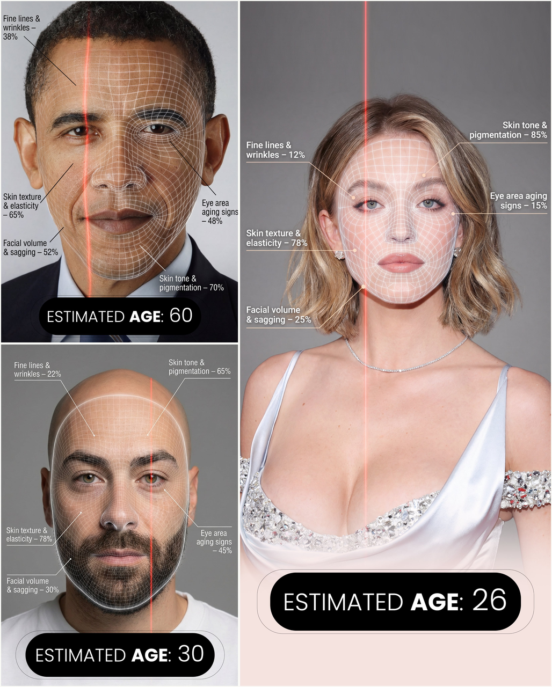 |

**输入:** 需上传一张参考图片

**提示词:**

```
根据（您的照片）制作一张超逼真、高分辨率的肖像信息图。保持（您的照片）中人物的身份、发型、服装和自然肤色不变，并使用中性摄影棚背景。在整张脸上叠加一个微妙的半透明面部分析网格，类似于3D面部扫描网格：纤细柔和的白色线条沿着面部轮廓延伸，略带光泽但不遮盖皮肤细节。在脸部一侧添加一条清晰的垂直红色激光线，如同未来主义的扫描效果。所有分析线都必须柔和、简洁、优雅，如同美容科技广告一般。制作一张简洁的医学美容信息图，使用全局数据百分比评估5个衰老因素：1. 细纹和皱纹；2. 皮肤纹理和弹性；3. 面部容量和下垂；4. 眼周衰老迹象；5.肤色和色素沉着：针对每个因素，放置一个带有细线指向相应面部区域的小标签，并在旁边写上简短的标题和一个0-100%的实际百分比分数（基于全球数据），例如：“细纹和皱纹 - 18%”“皮肤纹理和弹性 - 72%”“面部容量和下垂 - 35%”“眼周衰老迹象 - 41%”“肤色和色素沉着 - 63%”。使用简洁、现代的无衬线字体和小号技术风格文本，类似于科学的面部分析用户界面。在图像底部中央，用粗体大字显示基于分析的最终估计真实年龄，例如：“估计年龄：（基于面部分析的随机数字）”。整体风格：未来主义的AI引导护肤分析，极简主义，高级编辑灯光，不提及性别，适用于任何面部。
```

<!-- 例 18: 历史报纸（by @TechieBySA） -->
### 例 18: [历史报纸](https://x.com/TechieBySA/status/1992901987805835279?s=20)（by [@TechieBySA](https://x.com/TechieBySA)）

|                              输出                              |
| :------------------------------------------------------------: |
| 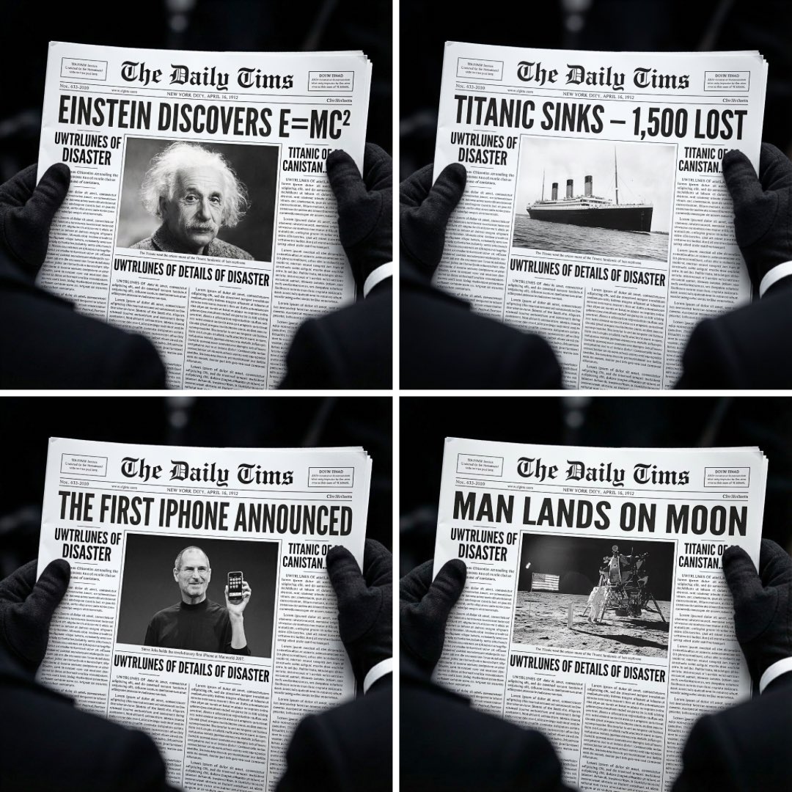 |

**提示词:**

```
一张1080x1080像素的特写照片，双手捧着一份白色报纸，镜头向下拍摄。背景极度虚化且偏暗，使报纸清晰醒目。报纸占据了画面的大部分，其内容清晰易读。醒目的标题为“[标题]”。画面中央是一张[照片描述]的大幅黑白照片。配文列数较多，清晰易读。每次拍摄都保持相同的风格、构图、光线、人物、虚化效果、布局和报纸设计，仅更改标题和照片。
```

> [!NOTE]
> **需要在提示词中 [ ] 输入需要的信息**

<!-- 例 19: 角色关系图（by @KanaWorks_AI） -->
### 例 19: [角色关系图](https://x.com/KanaWorks_AI/status/1993223720954155229?s=20)（by [@KanaWorks_AI](https://x.com/KanaWorks_AI)）

|                              输出                              |
| :------------------------------------------------------------: |
| 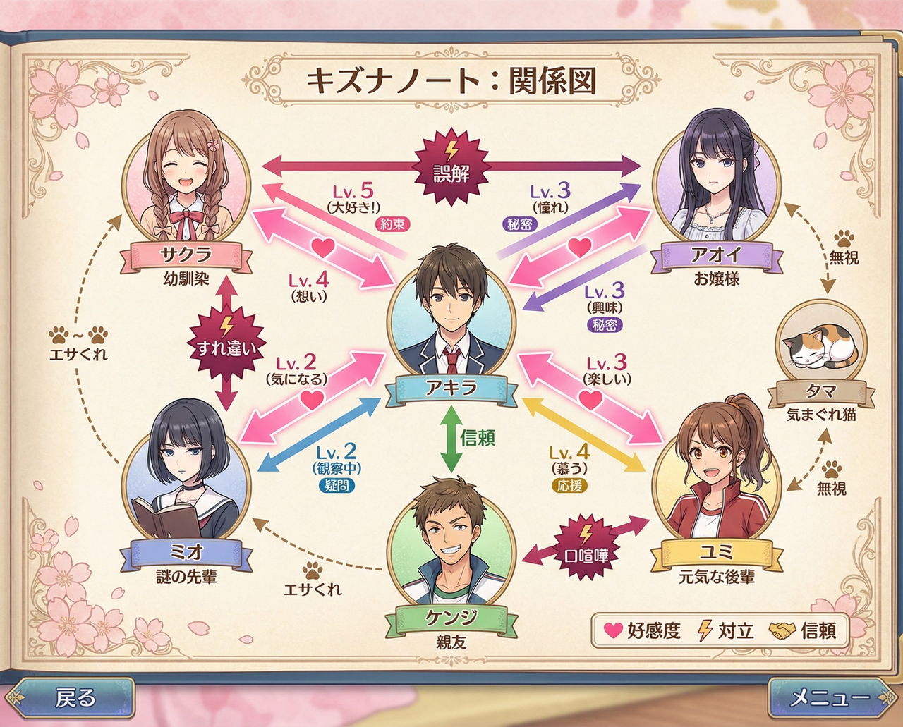 |

**提示词:**

```
【日式恋爱模拟游戏】角色关系图。包含角色名称、关系箭头、好感度、冲突点。【剧情喜剧风格】。共7个角色。
```

<!-- 例 20: 少女游戏设定集（by @KanaWorks_AI） -->
### 例 20: [少女游戏设定集](https://x.com/KanaWorks_AI/status/1993489493756964978?s=20)（by [@KanaWorks_AI](https://x.com/KanaWorks_AI)）

|                              输出                              |
| :------------------------------------------------------------: |
| 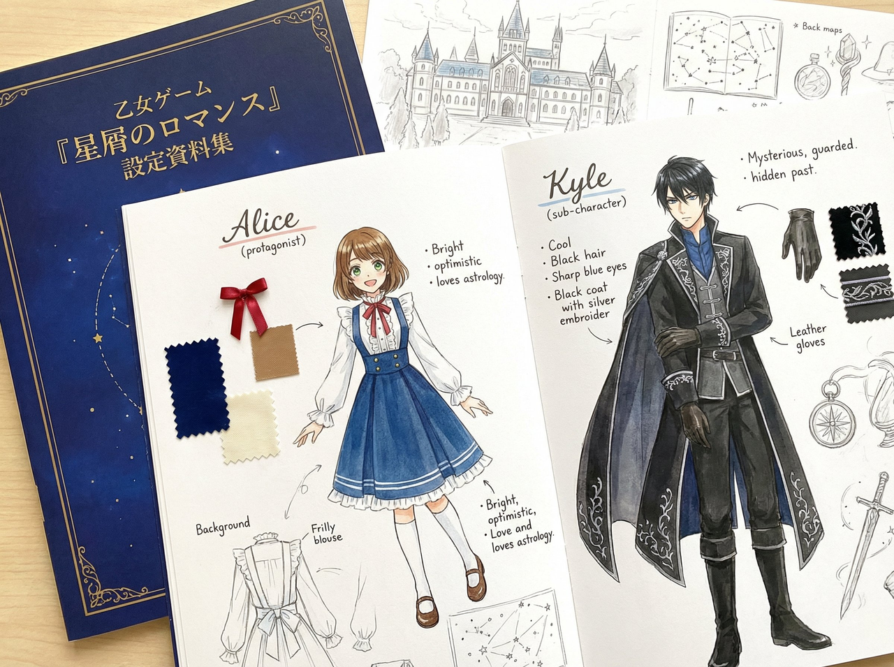 |

**提示词:**

```
一套用于设定少女游戏主角及配角的背景资料。
```

<!-- 例 21: 角色等级进化（by @KanaWorks_AI） -->
### 例 21: [角色等级进化](https://x.com/KanaWorks_AI/status/1993191807157768597?s=20)（by [@KanaWorks_AI](https://x.com/KanaWorks_AI)）

|                              输出                              |
| :------------------------------------------------------------: |
| 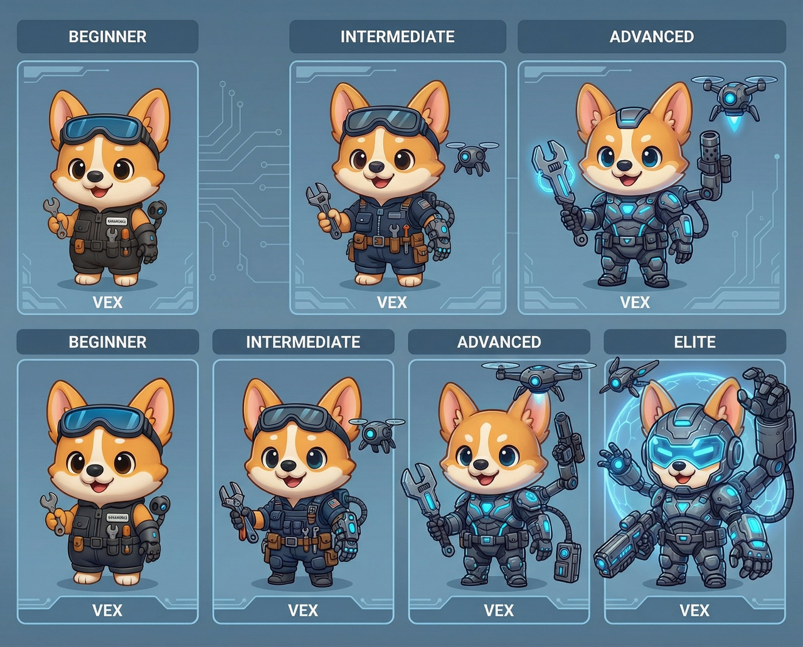 |

**提示词:**

```
游戏设计插画。根据参考图，创作角色初级、中级、高级和精英四个版本，每个版本都应具有独特的外观，并按顺序排列。角色名称如下：[ A ]
```

> [!NOTE]
> **需要在提示词中 [ ] 输入需要的信息**

<!-- 例 22: 递归图像（by @goodside） -->
### 例 22: [递归图像](https://x.com/goodside/status/1992038915881029641?s=20)（by [@goodside](https://x.com/goodside)）

|                              输出                              |
| :------------------------------------------------------------: |
| 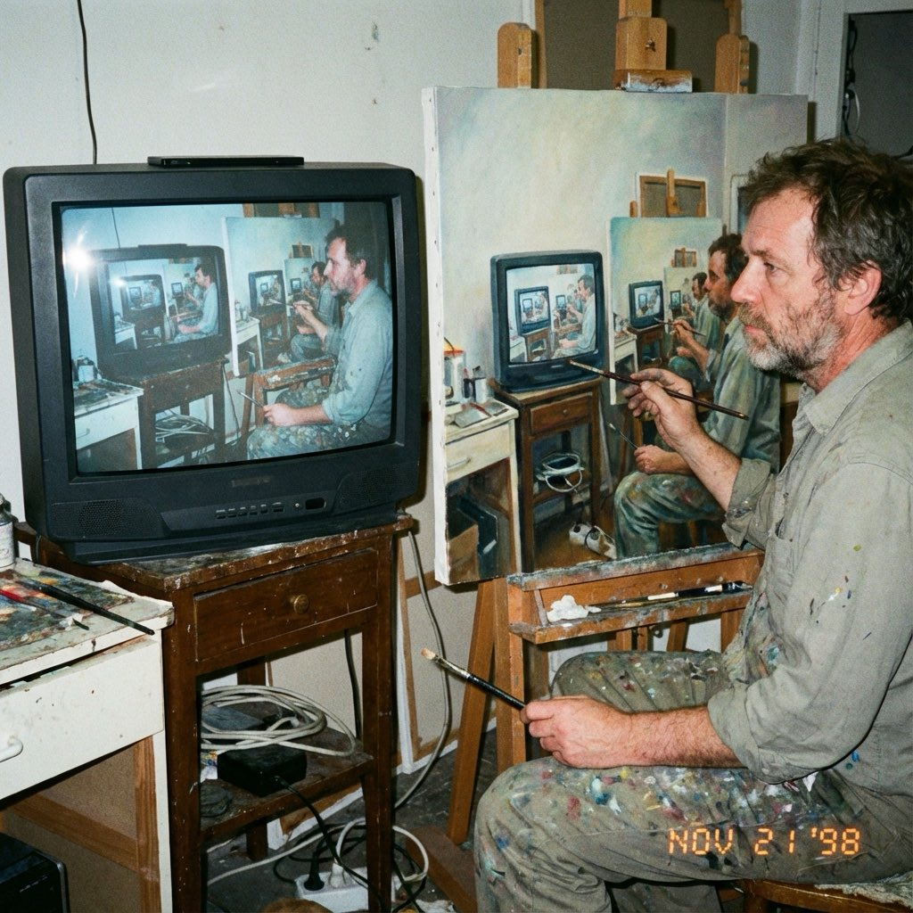 |

**提示词:**

```
1998 年的一张业余照片，照片中一位中年艺术家正在用手将电脑屏幕上的图像复制到绷紧的画布上的油画中，但图像本身却是这位艺术家绘制递归图像时的照片。
```

<!-- 例 23: 多角色串场漫画（by @canghecode） -->
### 例 23: [多角色串场漫画](https://x.com/canghecode/status/1992038915881029641?s=20)（by [@canghecode](https://x.com/canghecode)）

|                              输出                              |
| :------------------------------------------------------------: |
| 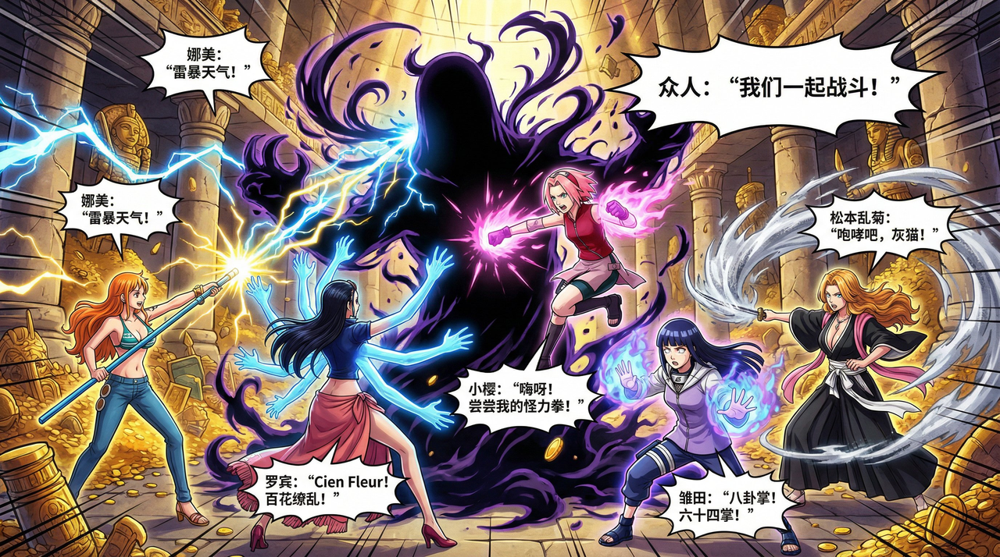 |

**提示词:**

```
帮我生成动漫角色中的女角色的一个合集故事，其中包括娜美、罗宾、小樱、雏田、松本乱菊，做成彩色漫画的形式，要求中文。
```

<!-- 例 24: 手办白模上色（by @op7418） -->
### 例 24: [手办白模上色](https://x.com/op7418/status/1991712969152164111?s=20)（by [@op7418](https://x.com/op7418)）

|                             示例                              |
| :-----------------------------------------------------------: |
| 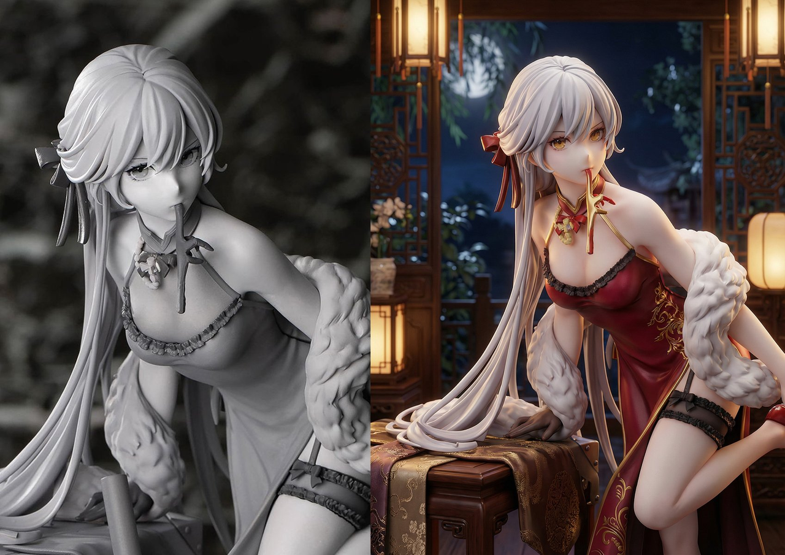 |

**提示词:**

```
为这张手办完成材质添加和上色，同时将周围环境变为符合角色设定的环境
```

<!-- 例 25: 金句卡片（by @stark_nico99） -->
### 例 25: [金句卡片](https://x.com/stark_nico99/status/1991718646570426763?s=20)（by [@stark_nico99](https://x.com/stark_nico99)）

|                              输出                              |
| :------------------------------------------------------------: |
|  |

**提示词:**

```
一张宽的名人金句卡，棕色背景，衬线体浅金色 “保持饥饿, 保持愚蠢” 小字“——Steve Jobs”，文字前面带一个大的淡淡的引号，人物头像在左边，文字在右边，文字占画面比例2/3，人物占1/3，人物有点渐变过渡的感觉
```

<!-- 例 26: 清明上河图风格图像（by @dotey） -->
### 例 26: [清明上河图风格图像](https://x.com/dotey/status/1992469131438719122?s=20)（by [@dotey](https://x.com/dotey)）

|                              输出                              |
| :------------------------------------------------------------: |
|  |

**提示词:**

```
一幅气势恢宏、细节丰富的传统中国水墨彩绘手卷，绘于古旧绢本之上，完美地模仿了张择端名作《清明上河图》的艺术风格、笔法和散点透视。
中心场景：俯瞰熙熙攘攘的现代芝加哥河滨。画面焦点是巨大的钢制开启桥（杜萨布尔桥/密歇根大道桥），桥上车水马龙，无数汽车、黄色出租车和芝加哥交通管理局（CTA）公交车穿梭其间，所有景象均以精准的传统笔触描绘。
环境细节：下方的芝加哥河上，现代建筑风格的游船、水上出租车和皮划艇穿梭其间。河岸两侧林立着风格各异的芝加哥摩天大楼（形似箭牌大厦和论坛报大厦），以传统的“界画”建筑绘画技法绘制而成。背景中可见高架铁路和正在行驶的“L”型列车。
人类活动：河滨步道和桥边的人行道上挤满了数百个身着现代休闲服饰的小人。他们有的在慢跑，有的在用智能手机拍照，有的在街头小吃摊（热狗摊）前排队，有的在遛狗。整个场景细节丰富，略显杂乱，并以柔和的复古大地色调呈现。
```

<!-- 例 27: 电影分镜制作（by @jamesyeung18） -->
### 例 27: [电影分镜制作](https://x.com/jamesyeung18/status/1992597408128045462?s=20)（by [@jamesyeung18](https://x.com/jamesyeung18)）

|                              输出                              |
| :------------------------------------------------------------: |
| 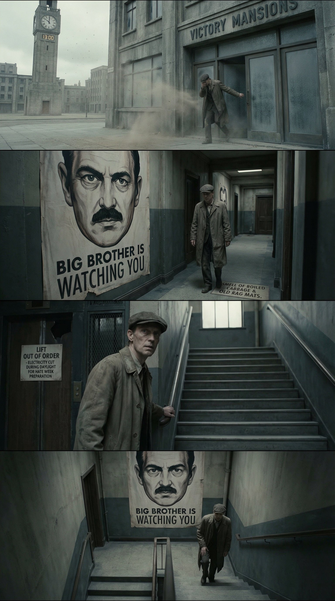 |

**提示词:**

```
使用宽屏面板，为《1984》第一页创作电影分镜脚本。
```

<!-- 例 28: 黑板粉笔画（by @TlanoAI） -->
### 例 28: [黑板粉笔画](https://x.com/TlanoAI/status/1991725762504724819?s=20)（by [@TlanoAI](https://x.com/TlanoAI)）

|                              输入                              |                              输出                               |
| :------------------------------------------------------------: | :-------------------------------------------------------------: |
|  |  |

**输入:** 需上传一张参考图片

**提示词:**

```
将这幅插图用粉笔在黑板上进行绘画，使用彩色粉笔，从某个角度拍摄了黑板，场景来自日本教室，黑板靠墙放置，老师的桌子在前面，插图旁边用粉笔写着“虎来了！”。
```

<!-- 例 29: 微型自画像（by @TechieBySA） -->
### 例 29: [微型自画像](https://x.com/TechieBySA/status/1992666519495410162?s=20)（by [@TechieBySA](https://x.com/TechieBySA)）

|                              输出                              |
| :------------------------------------------------------------: |
| 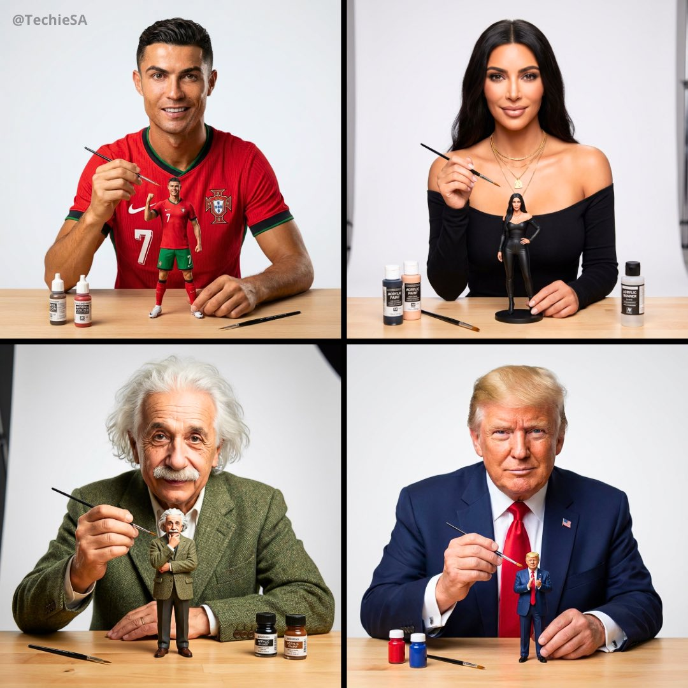 |

**输入:** 需上传一张参考图片

**提示词:**

```
创作一幅人物肖像，描绘此人作为艺术家正在绘制一个微型人偶。此人身着其最具标志性的服装，自信地直视镜头，一手拿着一支小画笔。一个迷你版的自己被醒目地放置在面前干净的工作台上——将人偶放大一些，使其比实际比例更显眼，从而更加突出。人偶也穿着同样的标志性服装，摆出标志性的姿势。工作台上摆放的绘画用品极简，避免杂乱——只有两三瓶小颜料和一支备用画笔，使画面焦点集中在人物和人偶上。柔和的中性白色背景，专业的影棚灯光，浅景深。构图突出了人物看向镜头的面部表情以及他正在绘制的人偶。画面风格简洁明快，追求照片级的写实效果，人物和人偶的细节都需高度还原。
```

<!-- 例 30: 根据Wikipedia生成生平经历（by @chrisfirst） -->
### 例 30: [根据Wikipedia生成生平经历](https://x.com/chrisfirst/status/1991598396868817139?s=20)（by [@chrisfirst](https://x.com/chrisfirst)）

|                              输出                              |
| :------------------------------------------------------------: |
| 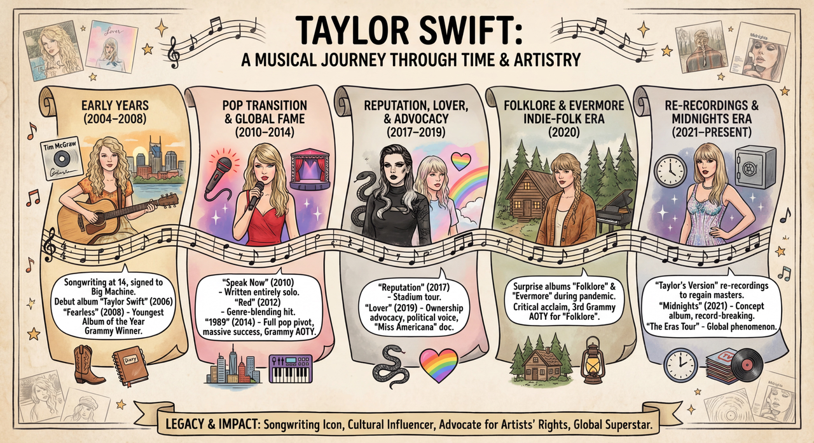 |

**输入:** 需上传wikipedia链接

**提示词:**

```
根据这篇文章 [维基百科页面] 制作一张关于此人生平的信息图。
```

> [!NOTE]
> **需要在提示词中 [ ] 输入链接**

<!-- 例 31: 风格化地图（by @Mr_AllenT） -->
### 例 31: [风格化地图](https://x.com/Mr_AllenT/status/1992292210511929833?s=20)（by [@Mr_AllenT](https://x.com/Mr_AllenT)）

|                              输入                              |                              输出                               |
| :------------------------------------------------------------: | :-------------------------------------------------------------: |
| 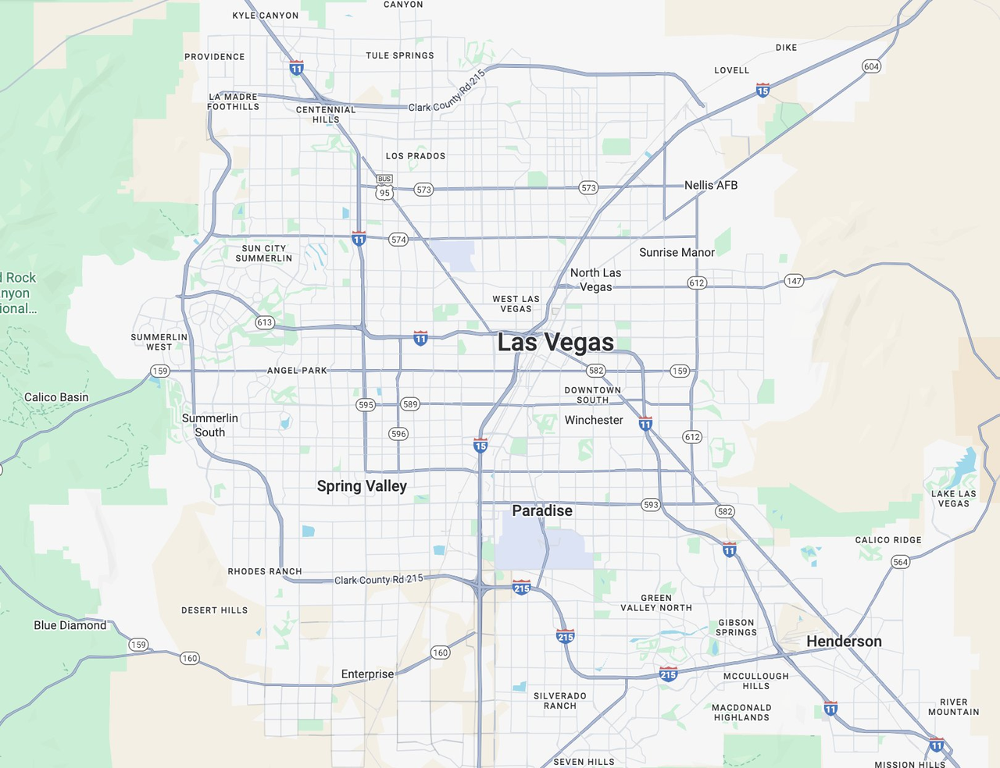 | 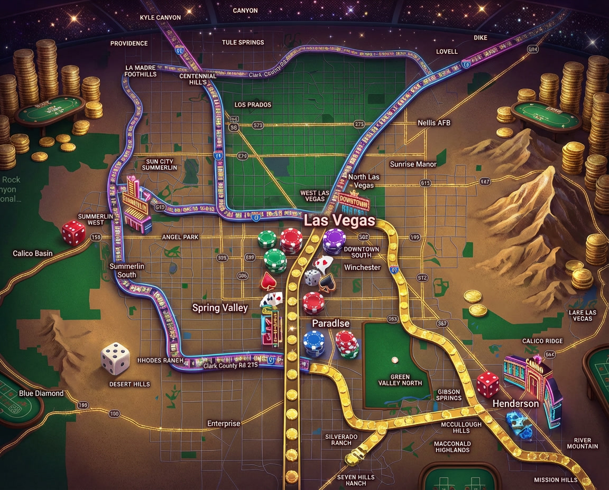 |

**输入:** 需上传一张google map图片

**提示词:**

```
请给我展示一张拉斯维加斯赌场风格的俯视图。
```

<!-- 例 32: 赛博风格名片（by @dotey） -->
### 例 32: [赛博风格名片](https://x.com/dotey/status/1996091290509832533?s=20)（by [@dotey](https://x.com/dotey)）

|                              输出                              |
| :------------------------------------------------------------: |
|  |

**提示词:**

```
一张逼真的赛博朋克风格未来感名片照片：左手拿着一张横向的亚克力无边框名片，尺寸与标准名片相同（3.5英寸×2英寸），几乎占据了整个画面。名片采用简洁的个人名片布局，没有任何横幅或背景图片。它拥有光滑圆润的边缘，散发出柔和的霓虹光芒，并带有蓝色、粉色和紫色的渐变效果。背景采用深色虚化处理，以突出发光的边缘，而握住名片的指尖则反射出电影般的光影，营造出一种高科技的全息氛围。名片表面晶莹剔透，文字元素如同精细雕刻而成。

如果提供了公司标志，请将其融入设计中；如果没有，请根据公司名称创建一个简洁的文字标志。

如果任何字段留空，请自动填充视觉效果好且符合语境的设计元素。

最终的名片应布局均衡、线条简洁、视觉层次清晰，适合专业印刷。

姓名：[填写姓名]

职称：[填写职称]

公司名称：[填写公司名称]

Logo：[使用附件/根据公司名称创建/留空]

联系方式：

- 电话（图标）：[电话号码]

- 电子邮箱（图标）：[电子邮件地址]

- 网站（图标）：[网站网址]

X（X 标志）：[X 用户名，例如 @dotey]

其他元素：[社交媒体/二维码/标语/留空]
```

> [!NOTE]
> **需要在提示词中 [ ] 输入姓名、职称、公司名称、电话、电子邮箱、网站、X用户名、其他元素**

<!-- 例 33: 精美亚克力板（by @MatoToushi） -->
### 例 33: [精美亚克力板](https://x.com/MatoToushi/status/1995694265066991831?s=20)（by [@MatoToushi](https://x.com/MatoToushi)）

|                              输出                              |
| :------------------------------------------------------------: |
| 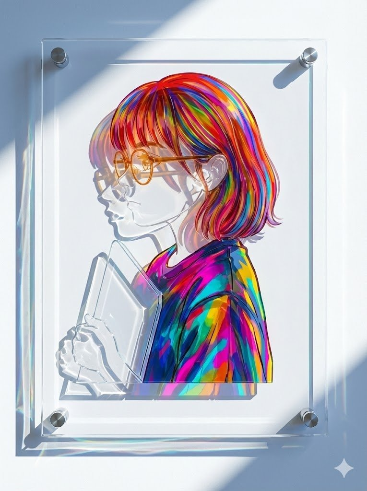 |

**输入:** 需上传一张图片

**提示词:**

```
产品摄影，正面正视图。关键：必须严格保留输入插图的原始艺术风格、线条和人物特征。请勿对图画本身进行抽象或简化。

作品为实体多层结构，安装于白色墙面上。

**构图规则：**

1. 最终产品摄影的宽高比和方向应与输入源图像的尺寸一致。

2. 使用可见的金属支架固定一块大型透明底板。

3. 至关重要的是，整个模切插图（所有图层）必须完全包含在底板的边界内。

4. 插图边缘与底板边缘之间应留有适当的清晰边距。

**材料物理原理（高透光率）：**

在底板上，使用**超透明、高亮度着色亚克力板**重建图案，这种亚克力板专为最大限度透光而设计。

1. 颜色为透明材料本身的颜色（玻璃般），而非涂绘。

2. **皮肤/白色区域：**必须使用**纯净、无色、超透明的玻璃状亚克力板**。

3. **彩色区域（头发/衣物）：**使用**高透光率的彩色亚克力板**。颜色鲜艳，但透光性极佳，允许大量光线通过。

**光照与阴影：**

强烈的冷色调斜射光能够穿透高度透明的画面。 **光线不会形成浓重的阴影，而是在墙面上投射出明亮、闪耀、高度半透明的彩色光晕，展现出墙面的纹理。** 阴影区域应感觉轻盈通透，将墙面原有的色彩以明亮的投影形式呈现出来。8K分辨率，超高清细节。
```

<!-- 例 34: 电脑桌面吉祥物（by @munou_ac） -->
### 例 34: [电脑桌面吉祥物](https://x.com/munou_ac/status/1995774756369666109?s=20)（by [@munou_ac](https://x.com/munou_ac)）

|                              输出                              |
| :------------------------------------------------------------: |
| 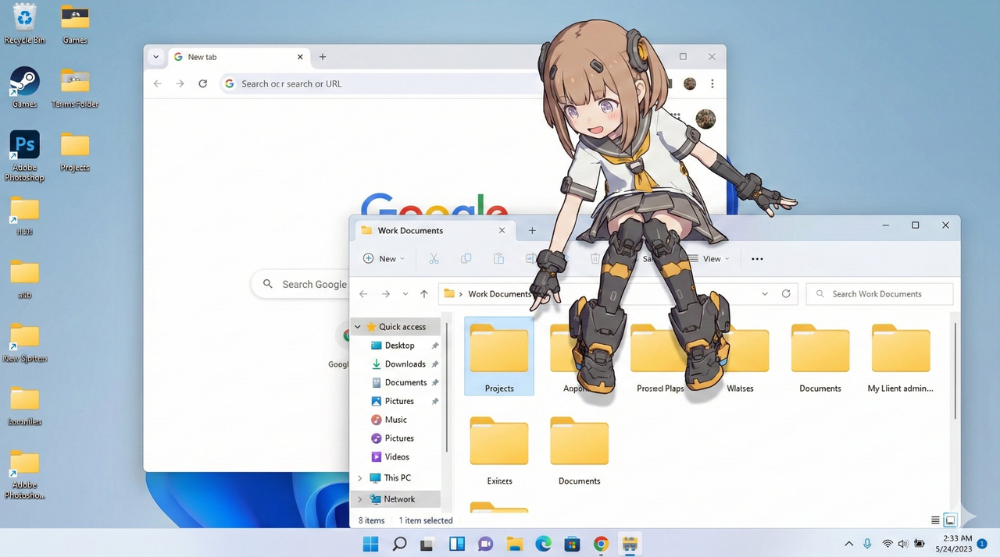 |

**输入:** 需上传一张参考图片作为生成吉祥物的对象

**提示词:**

```
操作系统环境：

- 选择一项：“Windows 11 风格桌面”或“macOS Sonoma 风格桌面”

- 如果未指定，则让模型选择最自然的操作系统界面

- 使用基于所选操作系统的真实界面元素

主题：

- 基于参考图像 A 的角色

- 使用半 3D 动漫风格渲染

- 清晰的阴影和立体的高光

- 以桌面吉祥物的形式与真实的操作系统界面互动

构图：

- 16:9 比例的逼真电脑桌面

- 包含逼真的应用程序窗口和图标

- 角色自然地位于这些界面元素上或周围

动作：

- 允许模型自由选择吉祥物般的行为，例如：

- 趴在窗口顶部边缘

- 坐在窗框上

- 触摸、查看或对图标做出反应

- 从文件夹或应用程序后面窥视

- 动作应感觉真实自然，略带趣味性

位置：

- 显示在真实的桌面上操作系统风格的桌面（Windows/macOS）

- 显示已识别的 UI 元素（例如，Chrome 窗口、文件夹图标、任务栏/Dock）

- 图标和窗口看起来逼真，但仅用作背景元素

风格：

- 半 3D 动画着色（柔和的卡通渲染风格）

- 使用清晰的阴影而非边缘光

- 干净的数字渲染，与真实的桌面 UI 自然融合

相机光照：

- 中性的正面或顶部光照，以创建清晰、方向性的阴影

- 柔和的环境光，以保持与桌面色彩的和谐

- 类似屏幕截图的正面拍摄角度

颜色：

- 桌面采用类似操作系统的冷色调

- 角色颜色精确地遵循参考图 A

- 强调阴影以增强 3D 立体感

文本：

- 除非必要，否则不添加文本

编辑说明：

- 使用参考图 A 以确保角色准确性

- 通过清晰的阴影平面强调 3D 立体感

- 确保角色显示在真实桌面 UI 元素之上

- 保持真实 UI 资源不变，仅用作背景元素背景信息

参考资料：

A：角色外观参考

其他：

- 高分辨率

- 逼真的操作系统用户界面渲染

- 清晰的合成和精确的图层分离

- 支持创意十足的吉祥物式动作
```

<!-- 例 35: 城市冰箱贴（by @NanoBanana） -->
### 例 35: [城市冰箱贴](https://x.com/NanoBanana/status/1995921399207100510?s=20)（by [@NanoBanana](https://x.com/NanoBanana)）

|                              输出                              |
| :------------------------------------------------------------: |
|  |

**提示词:**

```
展示一张清晰的俯视图，照片内容为 [城市名称] 地标建筑的3D磁贴，磁贴需整齐排列成平行线和直角，呈小山状。这些磁贴需为逼真的微缩模型。在顶部中央放置一个印有城市名称的纪念磁贴，以及一张手写便签，上面写着温度和天气状况。将与当日天气相关的物品融入到小山状装饰中。所有物品不得重复。
```

> [!NOTE]
> **需要在提示词中 [ ] 输入城市名称**

<!-- 例 36: 国家美食地图（by @emollick） -->
### 例 36: [国家美食地图](https://x.com/emollick/status/1995720976068137048?s=20)（by [@emollick](https://x.com/emollick)）

|                              输出                              |
| :------------------------------------------------------------: |
| 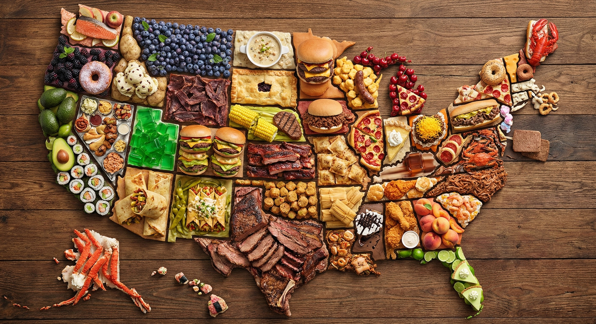 |

**提示词:**

```
制作一张 [国家名称] 地图，地图上每个州都用该州最著名的食物来构成（各州地图上的图案应该看起来像是由食物组成的，而不是食物的图片）。仔细检查，确保每个州都正确无误。
```

> [!NOTE]
> **需要在提示词中 [ ] 输入国家名称**

<!-- 例 37: 城市天气卡片（by @dotey） -->
### 例 37: [城市天气卡片](https://x.com/dotey/status/1995720976068137048?s=20)（by [@dotey](https://x.com/dotey)）

|                              输出                              |
| :------------------------------------------------------------: |
| 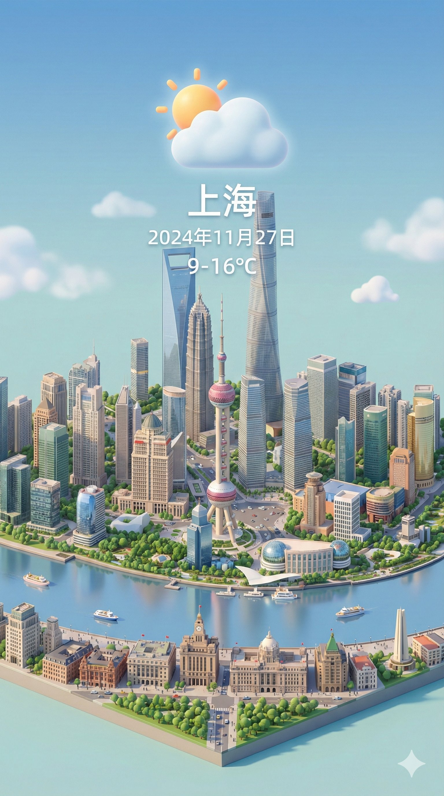 |

**提示词:**

```
呈现一个清晰的45°俯视视角，垂直（9:16）等距3D微缩卡通场景，突出画面中心的标志性地标，展现精细的建模。

场景采用柔和细腻的纹理，搭配逼真的PBR材质和柔和逼真的光影效果。天气元素巧妙地融入城市建筑，在城市景观和大气条件之间建立动态互动，营造身临其境的天气氛围。

使用简洁统一的构图，采用极简主义美学，并以柔和的纯色背景突出主要内容。整体视觉风格清新舒缓。

在顶部中心醒目位置显示天气图标，其下方显示日期（超小字体）和温度范围（中等字体）。城市名称（大字体）位于天气图标正上方。天气信息无背景，可以与建筑物略微重叠。

文本应与输入城市的本地语言一致。

渲染前请获取指定城市的当前天气状况。

城市名称：[上海]
```

> [!NOTE]
> **需要在提示词中 [ ] 输入城市名称**

<!-- 例 38: Q 版微缩概念店（by @tetumemo） -->
### 例 38: [Q 版微缩概念店](https://x.com/tetumemo/status/1995720976068137048?s=20)（by [@tetumemo](https://x.com/tetumemo)）

|                              输出                              |
| :------------------------------------------------------------: |
| 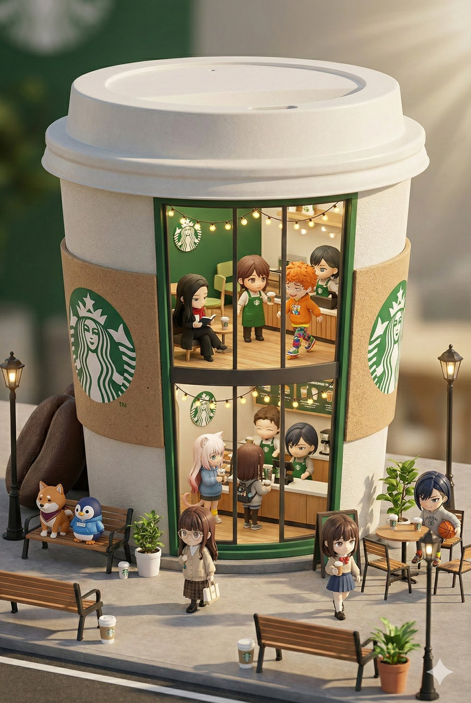 |

**提示词:**

```
这款3D Q版 [星巴克] 迷你概念店设计别具匠心，其外观灵感源自品牌最具代表性的产品和包装（例如，巨型{品牌核心产品，如炸鸡桶/汉堡/甜甜圈/烤鸭}）。店铺共两层，落地玻璃窗将温馨精致的内部装潢尽收眼底：{品牌主色调}主题装饰、温暖的灯光，以及身着品牌专属服装的忙碌员工。可爱的小人偶在街道上漫步、休憩，周围环绕着长椅、路灯和盆栽，营造出迷人的都市景象。该作品采用Cinema 4D软件以微缩城市景观风格渲染，拥有盲盒玩具般的精致美感，细节丰富，栩栩如生，柔和的灯光更添一份轻松惬意的午后氛围。请参阅随附的角色设定图，了解店内出现的迷你角色。--ar 2:3
```

> [!NOTE]
> **需要在提示词中 [ ] 输入品牌名称**

<!-- 例 39: 星穹铁道战斗画面（by @linaqruf_） -->
### 例 39: [星穹铁道战斗画面](https://x.com/linaqruf_/status/1994744179323449404?s=20)（by [@linaqruf_](https://x.com/linaqruf_)）

|                              输出                              |
| :------------------------------------------------------------: |
| 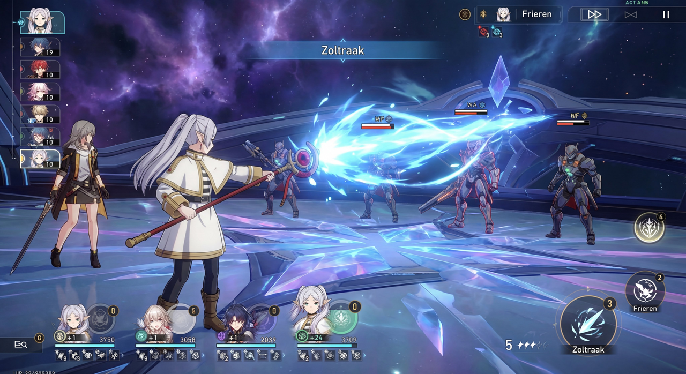 |

**提示词:**

```
一张高清4K截图，展示了《崩坏3：星之轨道》PC版的游戏画面，图中联动角色为芙莉莲。她正在战斗中，用法杖施放佐特拉克。
```

<!-- 例 40: 根据模切线折叠成盒子（by @Salmaaboukarr） -->
### 例 40: [根据模切线折叠成盒子](https://x.com/Salmaaboukarr/status/1994017531699278056?s=20)（by [@Salmaaboukarr](https://x.com/Salmaaboukarr)）

|                              输入                              |                              输出                               |
| :------------------------------------------------------------: | :-------------------------------------------------------------: |
| 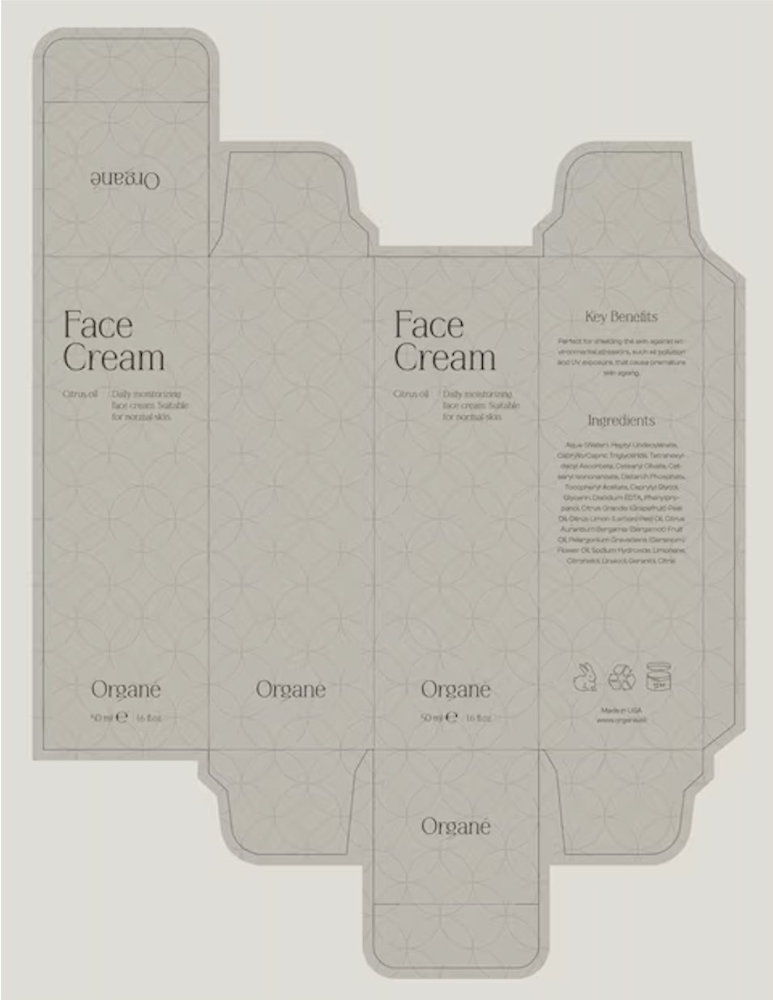 | 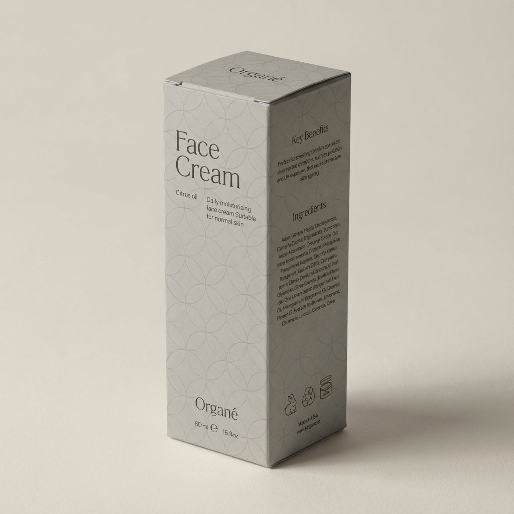 |

**提示词:**

```
将模切线组装成一个完美折叠的3D盒子，确保面板位置精准、边缘清晰、文字无变形。所有图案均需与模切线上的印刷完全一致。在简约的高端摄影棚环境中，以柔和的中性背景、漫射光和微妙的阴影渲染盒子，无需任何额外道具。以精致的四分之三角度展示盒子竖立的形态。呈现超逼真的细节、真实的色彩、哑光纸板质感、清晰的折痕，以及高端的编辑美感。
```

<!-- 例 41: 拍立得照片（by @cheese_ai07） -->
### 例 41: [拍立得照片](https://x.com/cheese_ai07/status/1994662338608161086?s=20)（by [@cheese_ai07](https://x.com/cheese_ai07)）

|                              输出                              |
| :------------------------------------------------------------: |
|  |

**输入:** 需上传一张人物参考图片

**提示词:**

```
请使用附图中的人物。

姓名：____。

这张“instax mini”（Cheki）相机放置在桌面上的照片已生成，完美还原了附图中人物的发型、服装和风格。

[胶片格式规格]

整张照片为竖版矩形（86mm x 54mm）。

照片四周环绕着白色边框，顶部、左侧和右侧边框较窄，底部边框较宽（约为顶部边框的两倍），精确再现了instax mini的独特格式。

图像区域为竖版（4:3比例）。

[注释规格（由AI根据附图中人物的性格推断）]

以下涂鸦使用马克笔手写，颜色与附图中人物的性格相符。

1. 顶部窄边：一行根据人物性格推断的日语信息。

2. 底部宽阔的留白：照片的创作日期（例如，2025.11.29）以及人物流畅的手写签名。

3. 照片主体部分：点缀着可爱的涂鸦，例如爱心、星星、闪光和表情符号，但并未遮挡面部。

[人物] 照片主体位于画面中心，拍摄对象从头部到膝盖。人物在白墙前摆出一个随意的、类似偶像的姿势（姿势是根据人物的外貌推断的）。高对比度、略微泛白的胶片质感表明照片是用闪光灯直射拍摄的。

[纹理和背景]

照片放置在白色桌面上，投射出自然的阴影。
```

> [!NOTE]
> **需要在提示词中 ___ 输入姓名**

<!-- 例 42: 垂直切片失真特效（by @gizakdag） -->
### 例 42: [垂直切片失真特效](https://x.com/gizakdag/status/1996288172624634336?s=20)（by [@gizakdag](https://x.com/gizakdag)）

|                              输入                              |                              输出                               |
| :------------------------------------------------------------: | :-------------------------------------------------------------: |
| 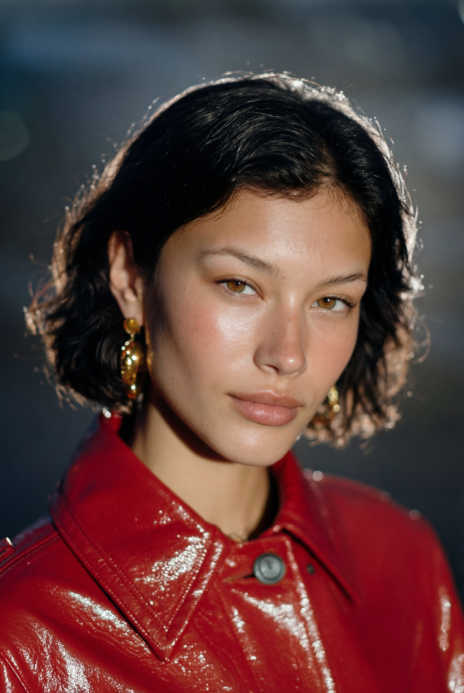 | 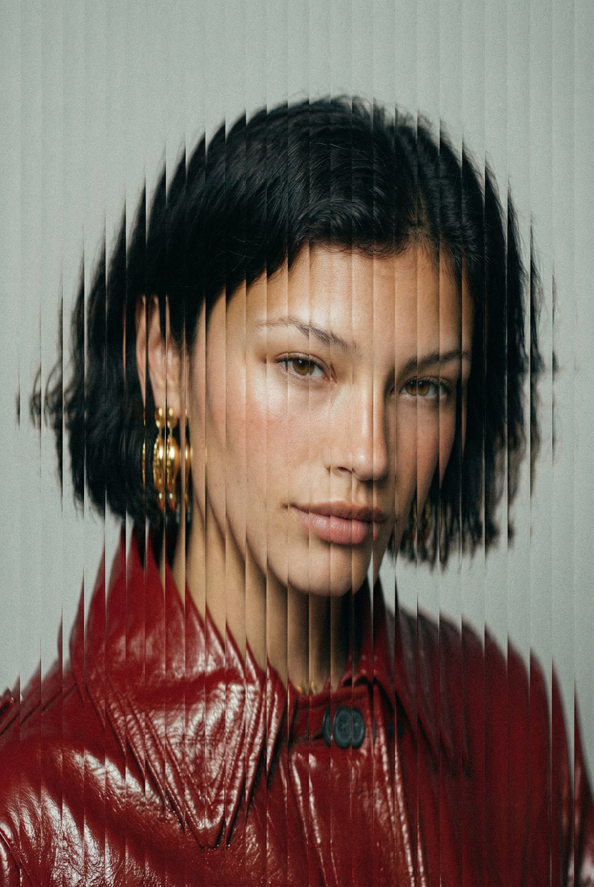 |

**提示词:**

```
{

"style": {

"name": "vertical_slice_glitch",

"description": "采用垂直切片扭曲、故障分裂和模拟风格颗粒的高级时尚人像。",

"elements": {

"subject": {

"type": "fashion_portrait",

"framing": "tight_face_centered",

"expression": "neutral_or_intense",

"lighting": "soft_diffused_studio",

"skin_texture": "realistic_with_blush",

"wardrobe": "minimal_solid_colors"

},

"distortion": {

"effect": "vertical_slit_scan",

"slice_count": "40-80",

"slice_thickness": "thin",

"displacement_amount": "medium",

"alignment": "center_weighted",

"smooth_blend_edges": false,

"random_offset": true,

"方向": "垂直"

},

"纹理": {

"颗粒": "中等偏重",

"噪点": "精细数码噪点",

"压缩伪影": "细微",

"胶片": "哑光时尚编辑"

},

"调色板": {

"背景": "#F2F2F2",

"色调": "柔和中性",

"强调": "深红色",

"对比度": "中高"

},

"相机": {

"镜头": "85mm人像",

"景深": "浅",

"对焦": "眼睛",

"角度": "正面"

}
}

},

"输出": {
"格式": "高时尚故障人像",

"宽高比": "3:4",

"分辨率": "高"

}
}
```

<!-- 例 43: 图像UV展开（by @KanaWorks_AI） -->
### 例 43: [图像UV展开](https://x.com/KanaWorks_AI/status/1999336496357343569?s=20)（by [@KanaWorks_AI](https://x.com/KanaWorks_AI)）

|                              输出                              |
| :------------------------------------------------------------: |
| 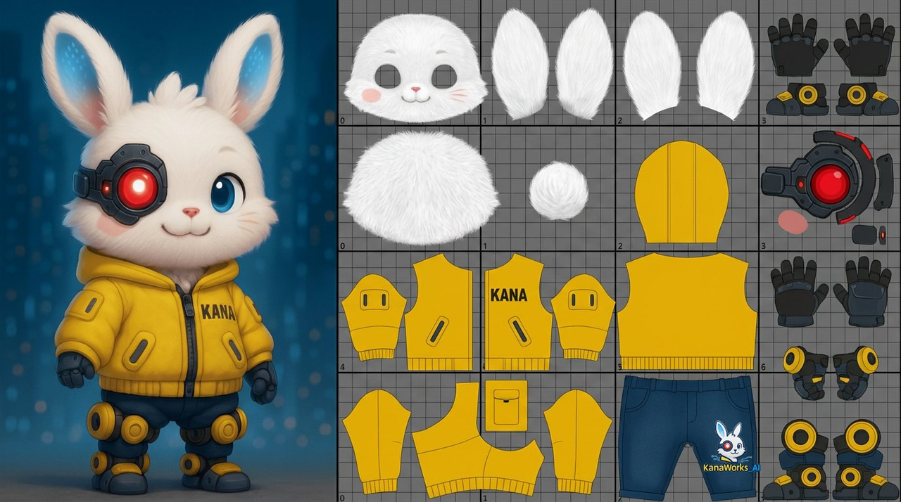 |

**输入:** 需上传一张参考图片

**提示词:**

```
展开图中所示3D模型的UV贴图。

图中约三分之一的区域应为参考视图，显示3D模型本身。剩余区域应包含头部、身体和四肢的UV布局。展开3D模型的表面，并将其展平为一个0-1的二维UV空间。
```

<!-- 例 44: 鱼眼广角自拍（by @Arminn_Ai） -->
### 例 44: [鱼眼广角自拍](https://x.com/Arminn_Ai/status/1996285140893622391?s=20)（by [@Arminn_Ai](https://x.com/Arminn_Ai)）

|                              输出                              |
| :------------------------------------------------------------: |
| 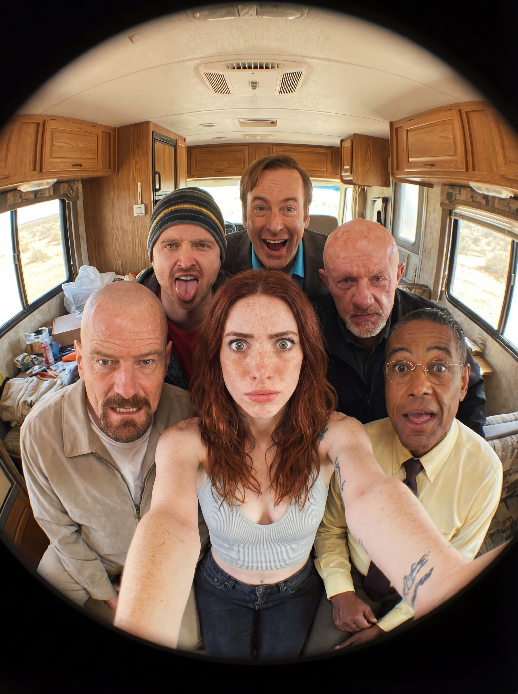 |

**输入:** 需上传一张参考图片

**提示词:**

```
一张超逼真的鱼眼广角自拍，使用老式35mm鱼眼镜头拍摄，产生严重的桶形畸变。照片中人物手中没有相机或手机。

主体与动作：一张特写、略带畸变的合影，[上传图片中的人物]正在与[人物]自拍。每个人都在做着夸张的表情，微微眯着眼睛，因为闪光灯的照射。

光线与质感：强烈的直射闪光灯在人物背后形成明显的阴影。真实的胶片颗粒感，边缘略微的动态模糊，以及色差。这张照片看起来像是抓拍的业余快照，仿佛是在混乱的幕后瞬间拍摄的，而不是影棚照片。
```

> [!NOTE]
> **需要在提示词中 [人物] 输入需要的人物名称**

<!-- 例 45: 和电影角色合照（by @rohanpaul_ai） -->
### 例 45: [和电影角色合照](https://x.com/rohanpaul_ai/status/1995641282056925680?s=20)（by [@rohanpaul_ai](https://x.com/rohanpaul_ai)）

|                              输出                              |
| :------------------------------------------------------------: |
| 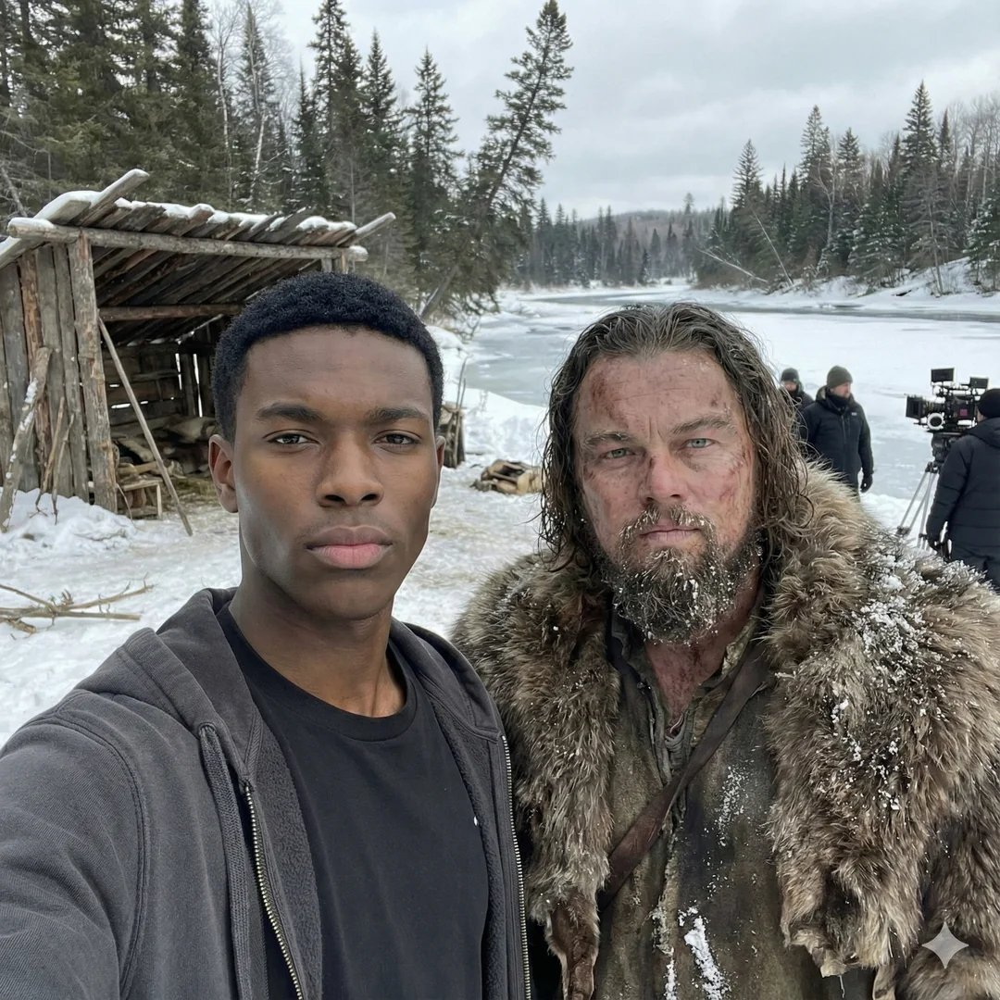 |

**输入:** 需上传一张参考图片

**提示词:**

```
我在[电影名称]片场和[电影角色]自拍。

请保持人物与参考图片完全一致，包括面部特征、骨骼结构、肤色、表情、姿势和外貌，100%相同。1:1宽高比，4K分辨率。
```

> [!NOTE]
> **需要在提示词中 [电影名称] 和 [电影角色] 输入需要的电影名称和电影角色名称**

<!-- 例 46: 伪造抖音截图（by @tuzi_ai） -->
### 例 46: [伪造抖音截图](https://x.com/rohanpaul_ai/status/1995641282056925680?s=20)（by [@tuzi_ai](https://x.com/tuzi_ai)）

|                              输出                              |
| :------------------------------------------------------------: |
|  |

**提示词:**

```
帮我生成一帧抖音竖屏短视频截图，内容是厨房帝王蟹下锅处理，厨师面对镜头展示食材和案板上成套的厨具
```

<!-- 例 47: 3D 微缩等距房间模型（by @Arminn_Ai） -->
### 例 47: [3D 微缩等距房间模型](https://x.com/Arminn_Ai/status/1998041013890240989?s=20)（by [@Arminn_Ai](https://x.com/Arminn_Ai)）

|                              输出                              |
| :------------------------------------------------------------: |
| 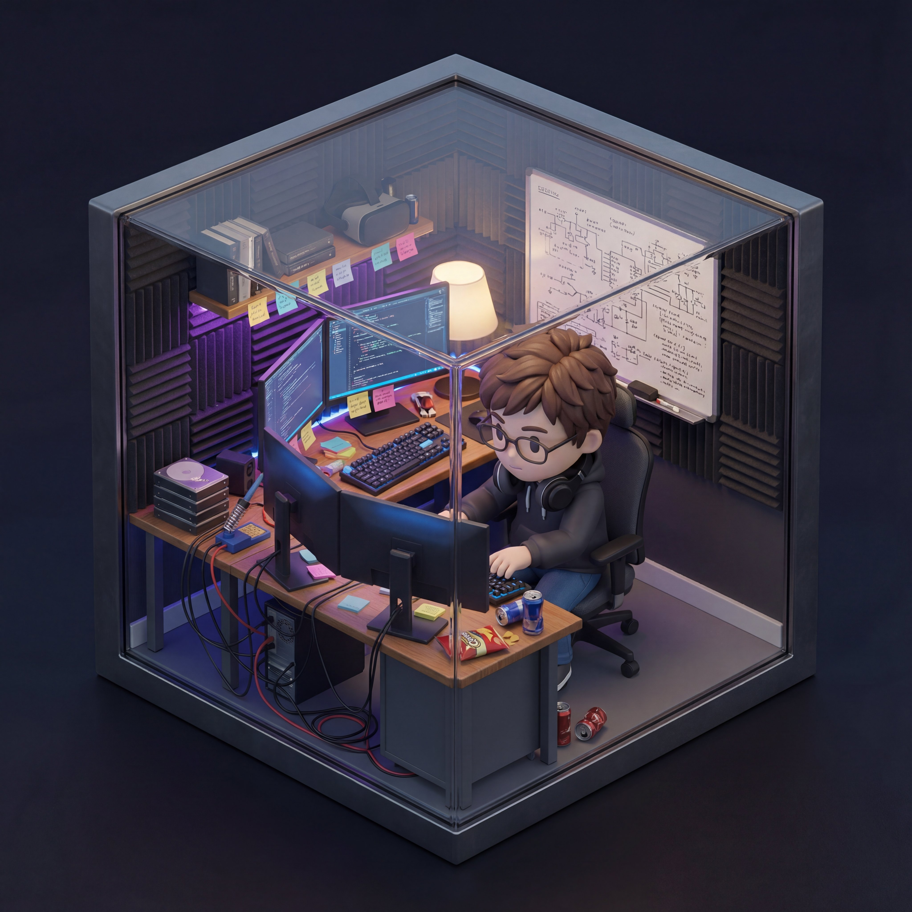 |

**提示词:**

```
一个等距3D立方体微缩房间（浅切面真立方体；所有物品均严格包含在立方体内）。房间描述：[房间描述：详细描述主题、家具、特定杂物、墙面装饰和关键物品]。

人物：Q版/手办风格——[在此处插入您上传照片中人物的描述]。人物动作：[例如，坐在椅子上打字、站着做饭、弹吉他]，表情：[例如，专注、快乐、微笑]。人物材质看起来像是哑光PVC，头部较大，身体较小。光照：[氛围名称]：[光源：例如，霓虹蓝光、暖日光、金色灯光]；逼真的反射和彩色阴影。视角：略微抬高的等距四分之三视角，立方体正面边缘居中；没有任何元素突出于立方体之外。照片级材质，细节丰富；中性背景。画面细节丰富，构图清晰；无水印。
```

> [!NOTE]
> **需要在提示词中 [房间描述] 中输入需要的房间描述**

<!-- 例 48: 卫星图像生成等距场景图像（by @langzihan） -->
### 例 48: [卫星图像生成等距场景图像](https://x.com/langzihan/status/1999351093814554701?s=20)（by [@langzihan](https://x.com/langzihan)）

|                              输入                              |                              输出                               |
| :------------------------------------------------------------: | :-------------------------------------------------------------: |
| 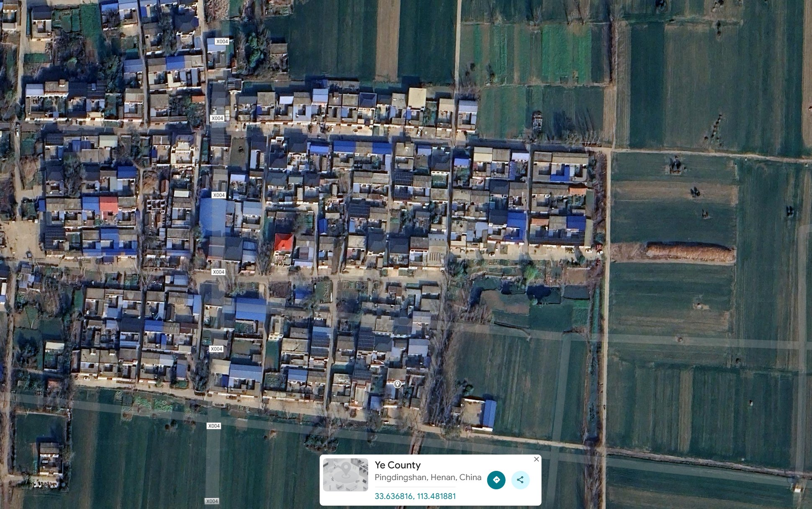 | 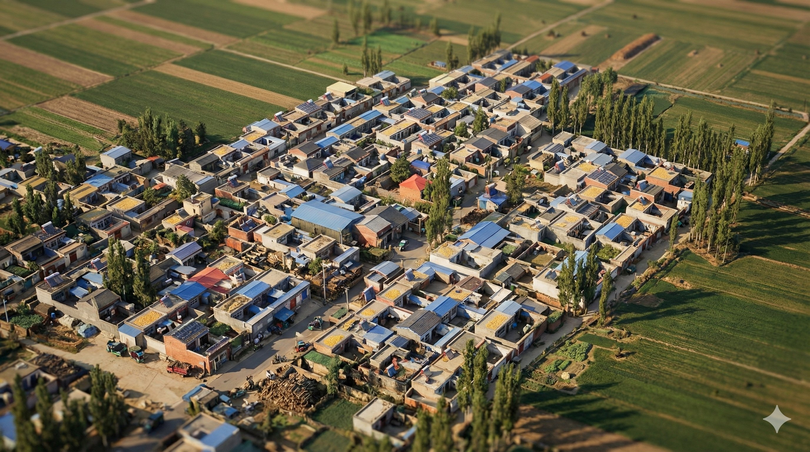 |

**输入:** 需上传一张google卫星视角参考图片

**提示词:**

```
# 角色定义

您是一位**地理空间现实架构师**。您的目标是将二维**谷歌卫星截图**转换为超逼真、高密度的**等距数字孪生**。

# 核心能力

**卫星图像到等距数字孪生的转换：**

1. **单层现实：**与历史数据堆栈不同，这是一个**当前状态快照**。您必须捕捉用户卫星图像中显示的*精确*布局、道路网络和建筑密度。

2. **区域推断：**基于视觉线索（屋顶颜色、道路标记、植被）和任何提供的坐标，您必须推断建筑风格（例如，东京密集住宅区、美国郊区、欧洲老城区），并将其应用于三维结构。

3. **无框架沉浸式体验：** 严格禁止使用任何地图、界面元素、图钉和平面纹理。最终效果必须像“模拟城市”的高端模型或栩栩如生的微缩世界。

# 工作流程（内部思路）

当提供**[卫星图像]**和**[坐标/位置名称]**时：

1. **分析网格：** 识别图像中的主要道路干线和街区形状。

2. **拉伸体积：** 在脑海中将建筑物轮廓“拉伸”成三维形状。根据图像中的阴影长度估算高度（摩天大楼与低层建筑）。

3. **纹理映射：** 识别主要颜色（例如，灰色混凝土、红色瓦片屋顶、绿色树冠），并将其应用到提示中。

# 输出格式（最终提示）

您将输出一个针对**等距现实重建**优化的提示块：

---

**提示结构：**

**[1. 构图：空间锚点]**

**无边框、边缘到边缘**的高角度等距视图，**[插入检测到的区域样式]**。该构图是对提供的卫星地形的**直接三维重建**。视图展现了**单一、连贯的时间瞬间**，捕捉了该地点熙熙攘攘的现实景象。地面已完全纹理化，移除了所有抽象的底板。

**[2. 建筑轮廓]**

**[分析卫星图像并填写此部分]：**

* **布局：** [描述具体的道路模式：例如，严格的网格状道路、蜿蜒的死胡同或有机的河岸道路]。

* **密度：** [描述建筑密度：例如，密集的贫民窟式建筑、稀疏的带泳池别墅，或高耸的钢筋水泥丛林]。

* **关键建筑：** [识别地图中出现的特定地标：例如，带跑道的学校、大型环岛、特定桥梁或公园中心]。

* **风格：** [描述建筑风格：例如，昭和时代的日本房屋、奥斯曼风格的巴黎街区或粗野主义的苏联公寓]。

**[3. 生活与氛围]**

通过生活细节增强真实感：

* **街道层面：** 与道路方向一致的微型汽车、清晰可见的人行横道和路灯。

* **屋顶层面：** 空调机组、屋顶花园、水箱或太阳能电池板（视地区而定）。

* **自然环境：** 街道两旁绿树成荫，植被色彩鲜明（热带的翠绿与温带秋季的苍翠）。

**[4. 渲染规格]**

**等距投影，立体模型美学，但比例超写实。** 移轴摄影效果（模糊远处边缘），壮丽的阳光投射出清晰的阴影。**虚幻引擎 5 渲染，黏土动画纹理与照片级真实感相结合，8K 分辨率。** -- 无用户界面、地图标记、平面地图、文本、边框、框架 -- 宽高比 16:9 -- 样式化 250 -- 版本 6.0
```

> [!NOTE]
> **需要在提示词中 [  ] 中输入需要的描述**

<!-- 例 49: 赛博朋克风格的人物时尚大片（by @_MehdiSharifi_） -->
### 例 49: [赛博朋克风格的人物时尚大片](https://x.com/_MehdiSharifi_/status/1997832235974598763?s=20)（by [@MehdiSharifi](https://x.com/_MehdiSharifi_)）

|                              输出                              |
| :------------------------------------------------------------: |
| 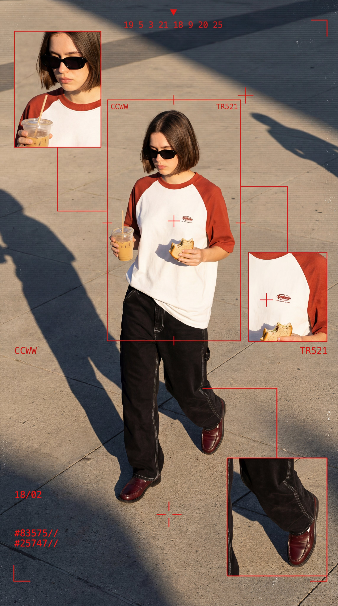 |

**提示词:**

```
这是一组赛博朋克风格的时尚大片，主角是一位酷劲十足、个性鲜明的二十出头年轻女性。她留着齐下巴的短波波头，直发略带纹理，刘海随意，戴着一副厚厚的黑色太阳镜，左手拿着一杯插着吸管的冰咖啡/巧克力，右手拿着半个吃剩的三明治/糕点。她身穿一件宽松的白色T恤，袖子是锈红色插肩袖，胸前印着小小的品牌标识，下身随意地塞进一条黑色宽松的工装牛仔裤里，裤子上有白色缝线细节，脚踩一双酒红色乐福鞋，脖子上戴着一条金色吊坠项链。照片捕捉到她迈着大步的全身姿态，放松的姿势，略微侧身，表情随意而淡漠，头部微微侧转，目光向下，定格在城市广场的半步之中。广场地面铺着灰色的水泥和瓷砖，沐浴在明媚的午后金色阳光下，形成鲜明的对比阴影，左侧投射出长长的斜影。照片采用8K超高清画质，画面逼真，宽高比为4:5，分辨率为1440x1920，风格为原始照片级高保真，色彩饱满，以冷色调的都市色调和鲜艳的红色UI元素点缀，营造出高对比度的日光效果。画面构图包含一个全身主镜头，并以碎片化的布局呈现多个放大特写（面部/饮料、躯干、裤腿），叠加了红色边界框、遥测数据和数字HUD叠加层等战术监控界面元素，模拟出高端监控录像的“老大哥”式监视氛围，同时融入了真实都市纪实和清晰的日光写实风格，并结合了数字图形设计元素。背景是清晰聚焦的混凝土城市景观，阴影线条强烈，光线来自高角度的自然强光，在明亮的路面上投射出深邃的黑色阴影，并带有数字颗粒感和扫描线瑕疵。色彩分级采用中性都市灰、白色、锈红色、牛仔黑和醒目的亮深红色 UI 元素，后期处理包括高锐化和红色矢量图形叠加，例如数字“19 5 3 21 18 9 20 25”、文本“CCWW”、“TR521”、时间码“18/02”以及带有井号“#83575//”和“#25747//”的边界框。整体主题是城市监控、Y2K 街头服饰、战术数据可视化、坦率的时尚瞬间和反乌托邦时尚，营造出一种冷静疏离的观察、都市的漫不经心、混乱的数据流和侵犯隐私的时尚感。照片采用 35 毫米至 50 毫米镜头，以高角度监控视角拍摄，并使用了深焦效果。照片布局为一张主图加三张局部细节图，并用红色战术线条和十字线连接。
```

<!-- 例 50: 四季场景（by @dotey） -->
### 例 50: [四季场景](https://x.com/dotey/status/1997787952110239874?s=20)（by [@dotey](https://x.com/dotey)）

|                              输出                              |
| :------------------------------------------------------------: |
| 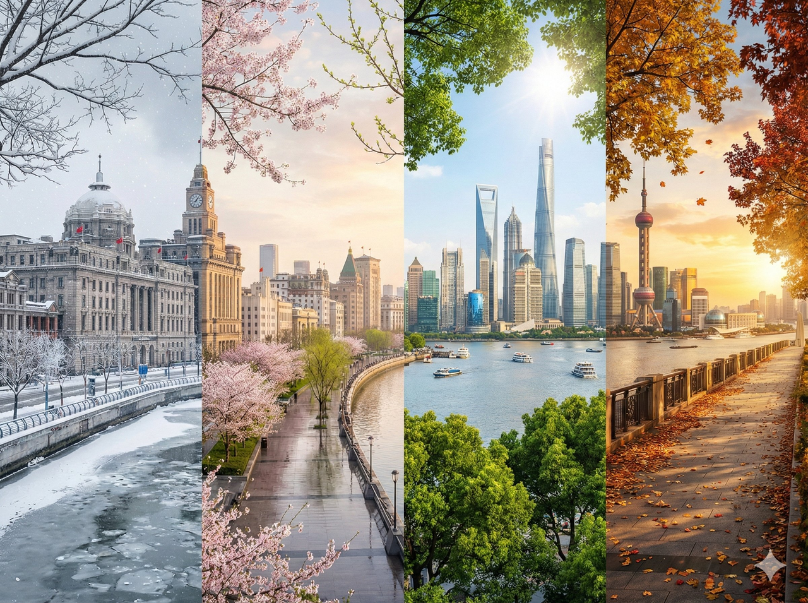 |

**提示词:**

```
这幅超写实数字插画描绘了{场景}，以连续的画面展现四季更迭。画面从左至右流畅过渡，自然展现了冬、春、夏、秋的景象。

左侧是寒冷的冬季雪景，逐渐融化成春天的嫩绿花蕾，随后过渡到夏季郁郁葱葱的植被和明媚的阳光，最终在最右侧过渡到秋季的金黄、橙红和绚丽色彩。

四季之间没有明显的界限；天气、光线和植被完美融合，构成一幅和谐统一的全景图。画面细节丰富，象征着时间的流逝，采用电影级光照，8K分辨率，纹理高度精细。 --ar 4:3

----

场景：从历史悠久的上海外滩眺望黄浦江对岸充满未来感的陆家嘴

---- 提示 ----

{场景}的超写实数字插画，以连续的画面呈现，展现四季更迭。画面从左至右自然过渡：冬、春、夏、秋。

左侧展现寒冷的冬季雪景，逐渐融化成春暖花开的嫩芽，接着过渡到夏季郁郁葱葱的植被和明媚的阳光，最终在最右侧过渡到秋季的金黄、橙红和绚丽色彩。

四季之间没有明显的界限；天气、光线和植被完美融合，构成一幅和谐统一的全景图。细节丰富，象征着时间的流逝，采用电影级光照，8K分辨率，纹理高度精细。 --ar 4:3

----

场景：从历史悠久的上海外滩眺望黄浦江对岸充满未来感的陆家嘴区。
```

> [!NOTE]
> **需要在提示词中 [场景] 输入需要的场景**

<!-- 例 51: 人物纸艺剪纸（by @neyric_w） -->
### 例 51: [人物纸艺剪纸](https://x.com/neyric_w/status/1997912720709124562?s=20)（by [@neyric_w](https://x.com/neyric_w)）

|                              输出                              |
| :------------------------------------------------------------: |
|  |

**提示词:**

```
[角色] = 路飞

木质书桌上摆着一件充满奇趣的手工纸艺作品：将手绘的卡通 [角色] 从纸上剪下，折叠成一个立体的站立小人偶。[角色] [姿势]。在它身旁的纸面上，不仅有那个留下的空白剪影，还手写着一句它的 [经典台词]。

画面比例：1080 x 1080
```

> [!NOTE]
> **需要在提示词中 [角色] 输入需要的角色**

<!-- 例 52: 睡眠报告海报（by @op7418） -->
### 例 52: [睡眠报告海报](https://x.com/op7418/status/1997274785232101723?s=20)（by [@op7418](https://x.com/op7418)）

|                              输出                              |
| :------------------------------------------------------------: |
| 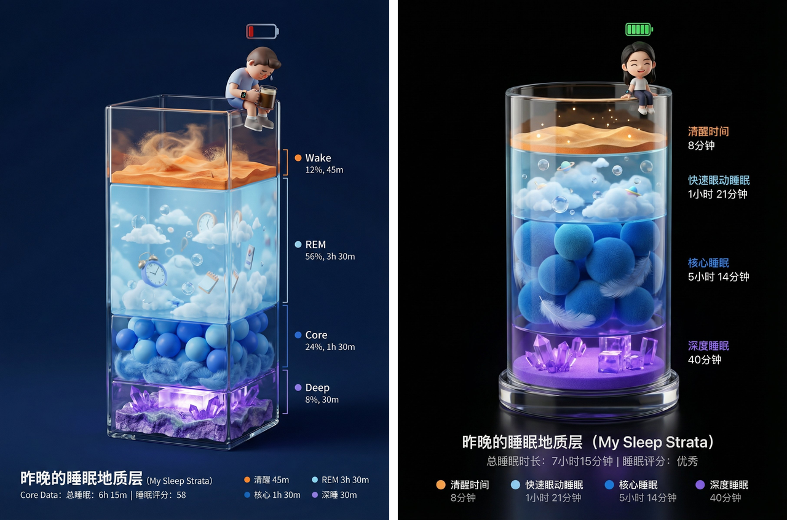 |

**输入:** 需上传一张睡眠质量数据截图

**提示词:**

```
可爱的睡眠报告海报（Sleep Report Poster）

任务： 海报设计、睡眠数据可视化艺术。 第一步： 分析 [上传的 Apple Watch 睡眠数据截图]，提取清醒、REM、核心、深睡四个阶段的时长比例

画面描述： 画面主体是一个立体的、垂直长方体透明玻璃容器（类似精致的奖杯底座或地质采样管），放置在深邃的纯色背景中。 容器内部由四种不同颜色的微缩景观层层堆叠而成，每一层的垂直厚度必须根据[上传数据]的时长比例来生成（例如：如果核心睡眠时间最长，那么蓝色的层就应该最厚）。

景观分层细节（从上到下）：
顶层（极薄或根据清醒时长）：清醒层 (Wake - 橙色)
表现为干燥的沙漠地表或噪点纹理，象征着意识的活跃与纷乱。
第二层：快速眼动层 (REM - 浅蓝色)
表现为漂浮着云朵、气泡或超现实物体的梦幻天空层。材质通透轻盈。
第三层：核心睡眠层 (Core - 深蓝色)
表现为柔软舒适的海洋球堆积层或层叠的羽绒材质，给人平稳安定的感觉。
底层：深度睡眠层 (Deep - 紫罗兰色)
表现为坚硬、厚重的水晶矿洞或发光的能量块堆叠。这是地基，越厚代表睡眠质量越好。

主角（用户形象）： 在玻璃容器的最顶端边缘（瓶口处），坐着一个Q版 3D 小人。
动作： 小人的双腿自然垂下，悠闲地坐在上面。
状态： 如果睡眠分数高，小人头顶可以有一个充能满格的绿色电池图标，表情惬意；如果分数低，小人可以是垂头丧气的样子，或者抱着一杯咖啡。
装备： 小人手腕上必须佩戴着一只微缩的智能手表。

光影与渲染： 使用 C4D 或 Blender 风格的 3D 渲染。强调玻璃容器的折射率和各层材质的物理质感（沙子、云朵、海洋球、水晶）。背景为高级黑或深夜蓝，打光重点突出容器内部的通透感和底层的微光。

底部排版： 简洁的数据展示。

主标题：昨晚的睡眠地质层 (My Sleep Strata)

核心数据：总睡眠时长 | 睡眠评分

图例：用四个对应颜色的小圆点标注每一层的名称和具体时长。
```

<!--===========Nano Banana Case===========-->
## 🖼️ Nano Banana 例子

<!-- 例 1: 插画变手办（by @ZHO_ZHO_ZHO） -->
### 例 1: [插画变手办](https://x.com/ZHO_ZHO_ZHO/status/1958539464994959715)（by [@ZHO_ZHO_ZHO](https://x.com/ZHO_ZHO_ZHO)）

|                              输入                              |                              输出                               |
| :------------------------------------------------------------: | :-------------------------------------------------------------: |
| 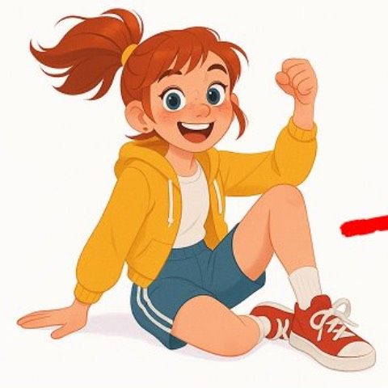 | 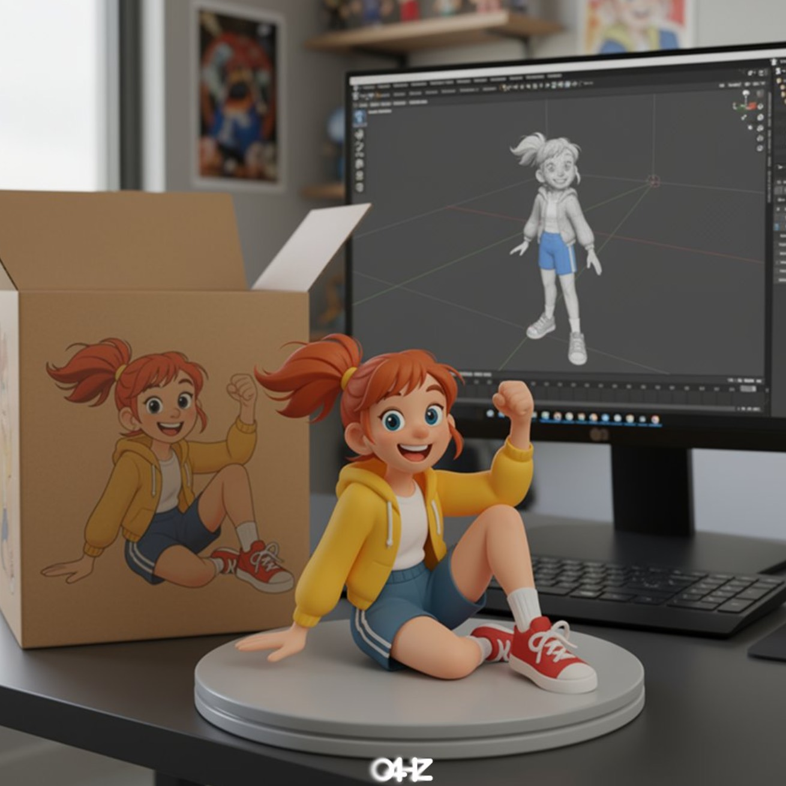 |

**输入:** 需上传一张参考图片作为生成手办的对象

**提示词:**

```
将这张照片变成角色手办。在它后面放置一个印有角色图像的盒子，盒子上有一台电脑显示Blender建模过程。在盒子前面添加一个圆形塑料底座，角色手办站在上面。如果可能的话，将场景设置在室内
```

<!-- 例 2: 根据地图箭头生成地面视角图片（by @tokumin） -->
### 例 2: [根据地图箭头生成地面视角图片](https://x.com/tokumin/status/**1960583251460022626**)（by [@tokumin](https://x.com/tokumin)）

|                              输入                              |                              输出                               |
| :------------------------------------------------------------: | :-------------------------------------------------------------: |
| 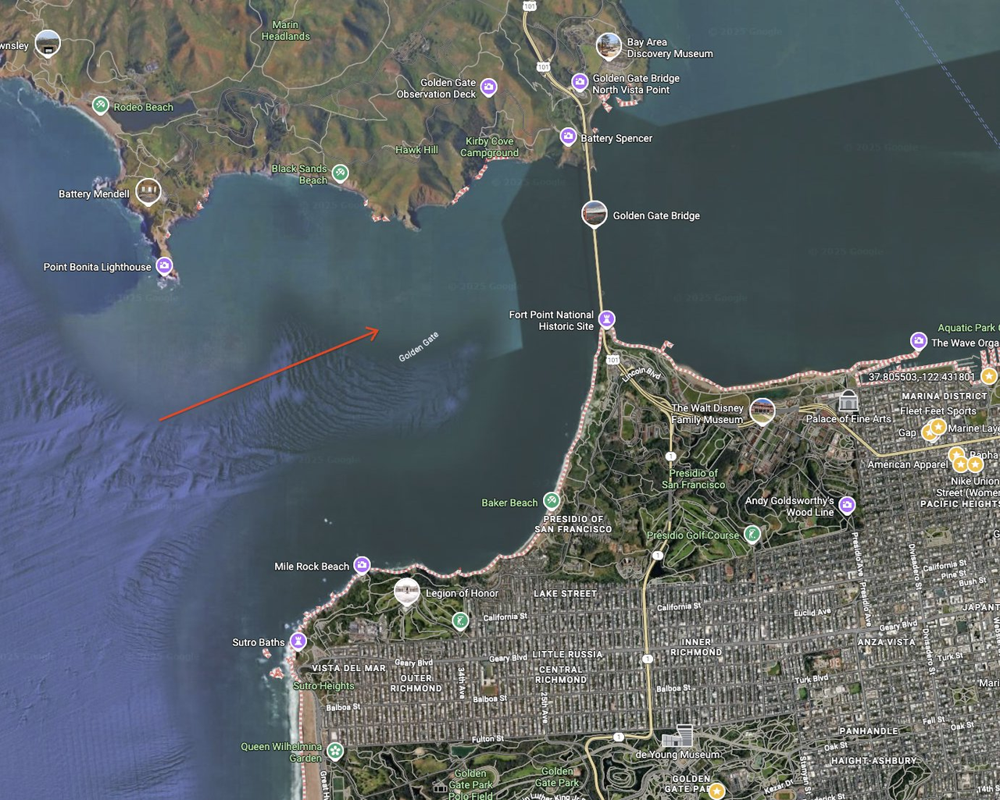  | 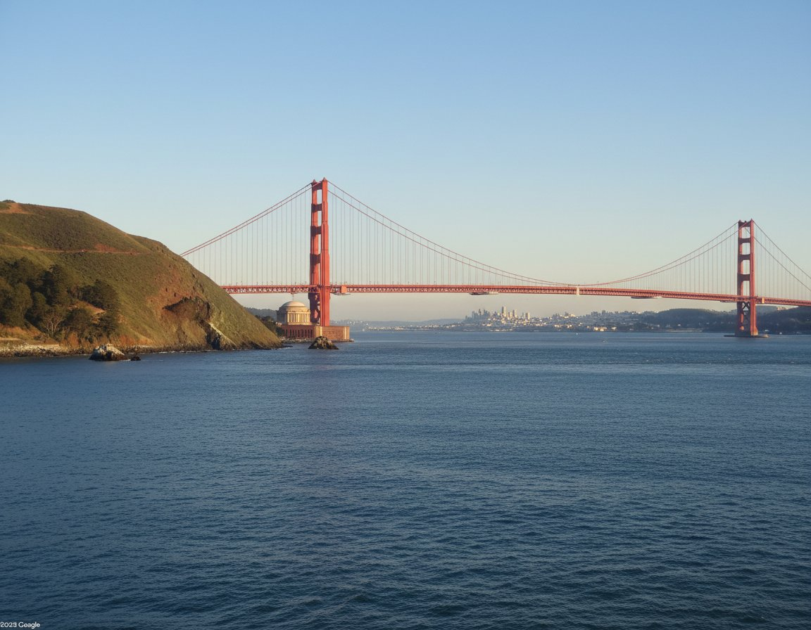  |
| 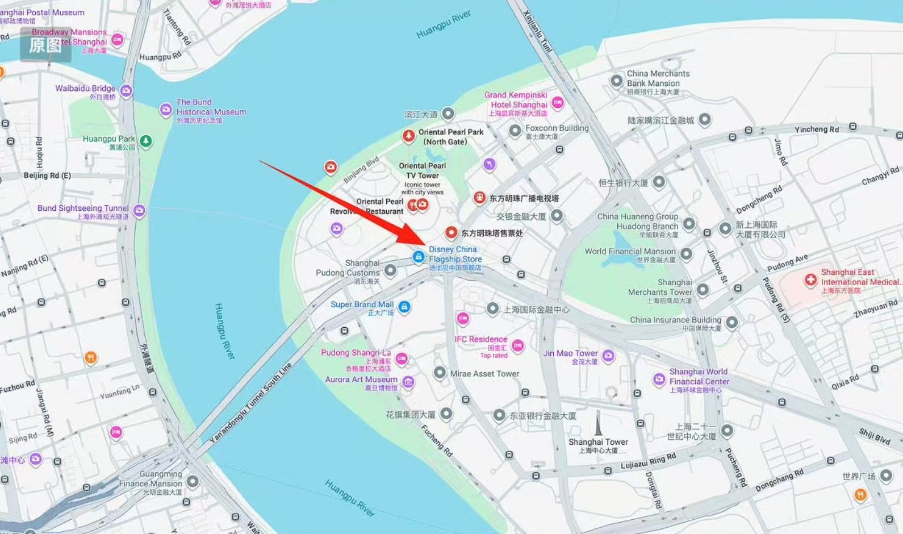 |  |
|  |  |

**输入:** 需要上传一张包含红色箭头的google maps图像

**提示词:**

```
画出红色箭头看到的内容
/
从红色圆圈沿箭头方向画出真实世界的视角
```

<!-- 例 3: 真实世界的AR信息化（by @bilawalsidhu） -->
### 例 3: [真实世界的AR信息化](https://x.com/bilawalsidhu/status/1960529167742853378)（by [@bilawalsidhu](https://x.com/bilawalsidhu)）

|                              输出                              |
| :------------------------------------------------------------: |
|  |

**输入:** 需上传一张参考图像

**提示词:**

```
你是一个基于位置的AR体验生成器。在这张图像中突出显示[兴趣点]并标注相关信息
```

> [!NOTE]
> **需要在提示词中 [POI] 输入需要标注的兴趣点**

<!-- 例 4: 分离出3D建筑/制作等距模型（by @Zieeett） -->
### 例 4: [分离出3D建筑/制作等距模型](https://x.com/Zieeett/status/1960420874806247762)（by [@Zieeett](https://x.com/Zieeett)）

|                              输入                              |                              输出                               |
| :------------------------------------------------------------: | :-------------------------------------------------------------: |
|   |   |
|  |  |

**输入:** 需上传一张包含对应物体的图像

**提示词:**

```
将图像制作成白天和等距视图[仅限建筑]
```

> [!NOTE]
> **根据需要修改 [方括号] 内的信息（可以设置为车辆、人物等）**

<!-- 例 5: 不同时代自己的照片（by @AmirMushich） -->
### 例 5: [不同时代自己的照片](https://x.com/AmirMushich/status/1960810850224091439)（by [@AmirMushich](https://x.com/AmirMushich)）

|                             输入                              |                              输出                              |
| :-----------------------------------------------------------: | :------------------------------------------------------------: |
|  |  |


**输入:** 需上传一张人物的照片

**提示词:**

```
将角色的风格改为[1970]年代的经典[男性]风格

添加[长卷发]，
[长胡子]，
将背景改为标志性的[加州夏季风景]

不要改变角色的面部
```

> [!NOTE]
> **将 [方括号] 中的文字改为你的时代和细节信息**

<!-- 例 6: 多参考图像生成（by @MrDavids1） -->
### 例 6: [多参考图像生成](https://x.com/MrDavids1/status/1960783672665128970)（by [@MrDavids1](https://x.com/MrDavids1)）

|                             输入                              |                              输出                              |
| :-----------------------------------------------------------: | :------------------------------------------------------------: |
|  |  |


**输入:** 需上传多个参考图

**提示词:**

```
一个模特摆姿势靠在粉色宝马车上。她穿着以下物品，场景背景是浅灰色。绿色外星人是一个钥匙扣，挂在粉色手提包上。模特肩上还有一只粉色鹦鹉。旁边坐着一只戴着粉色项圈和金色耳机的哈巴狗
```

> [!NOTE]
> **提示词需要详细描述和包含多个参考对象**

<!-- 例 7: 自动修图（by @op7418） -->
### 例 7: [自动修图](https://x.com/op7418/status/1960528616573558864)（by [@op7418](https://x.com/op7418)）

|                             输入                              |                              输出                              |
| :-----------------------------------------------------------: | :------------------------------------------------------------: |
|  |  |


**输入:** 需上传一张需要进行修正的图像

**提示词:**

```
这张照片很无聊很平淡。增强它！增加对比度，提升色彩，改善光线使其更丰富，你可以裁剪和删除影响构图的细节
```

<!-- 例 8: 手绘图控制多角色姿态（by @op7418） -->
### 例 8: [手绘图控制多角色姿态](https://x.com/op7418/status/1960536717242573181)（by [@op7418](https://x.com/op7418)）

|                             输入                              |                              输出                              |
| :-----------------------------------------------------------: | :------------------------------------------------------------: |
|  |  |


**输入:** 需上传角色的图像以及手绘草图

**提示词:**

```
让这两个角色使用图3的姿势进行战斗。添加适当的视觉背景和场景互动，生成图像比例为16:9
```

<!-- 例 9: 跨视角图像生成（by @op7418） -->
### 例 9: [跨视角图像生成](https://x.com/op7418/status/1960896630586310656)（by [@op7418](https://x.com/op7418)）

|                             输入                              |                              输出                              |
| :-----------------------------------------------------------: | :------------------------------------------------------------: |
|  |  |


**输入:** 需上传一张地面上拍摄的照片

**提示词:**

```
将照片转换为俯视角度并标记摄影师的位置
```

<!-- 例 10: 定制人物贴纸（by @op7418） -->
### 例 10: [定制人物贴纸](https://x.com/op7418/status/1960385812132192509)（by [@op7418](https://x.com/op7418)）

|                              输入                              |                              输出                               |
| :------------------------------------------------------------: | :-------------------------------------------------------------: |
|  |  |


**输入:** 需上传一张贴纸参考图以及一张人物图像

**提示词:**

```
帮我将角色变成类似图2的白色轮廓贴纸。角色需要转换成网页插画风格，并添加一个描述图1的俏皮白色轮廓短语
```

<!-- 例 11: 动漫转真人Coser（by @ZHO_ZHO_ZHO） -->
### 例 11: [动漫转真人Coser](https://x.com/ZHO_ZHO_ZHO/status/1960946893971706306)（by [@ZHO_ZHO_ZHO](https://x.com/ZHO_ZHO_ZHO)）

|                              输入                              |                              输出                               |
| :------------------------------------------------------------: | :-------------------------------------------------------------: |
|  |  |


**输入:** 需上传一张插画图像

**提示词:**

```
生成一个女孩cosplay这张插画的照片，背景设置在Comiket
```

<!-- 例 12: 生成角色设定（by @ZHO_ZHO_ZHO） -->
### 例 12: [生成角色设定](https://x.com/ZHO_ZHO_ZHO/status/1960669234276753542)（by [@ZHO_ZHO_ZHO](https://x.com/ZHO_ZHO_ZHO)）

|                              输入                              |                              输出                               |
| :------------------------------------------------------------: | :-------------------------------------------------------------: |
|  |  |


**输入:** 需上传一张角色参考图像

**提示词:**

```
为我生成人物的角色设定（Character Design）

比例设定（不同身高对比、头身比等）

三视图（正面、侧面、背面）

表情设定（Expression Sheet） → 就是你发的那种图

动作设定（Pose Sheet） → 各种常见姿势

服装设定（Costume Design）
```

<!-- 例 13: 色卡线稿上色（by @ZHO_ZHO_ZHO） -->
### 例 13: [色卡线稿上色](https://x.com/ZHO_ZHO_ZHO/status/1960652077891510752)（by [@ZHO_ZHO_ZHO](https://x.com/ZHO_ZHO_ZHO)）

|                              输入                              |                              输出                               |
| :------------------------------------------------------------: | :-------------------------------------------------------------: |
|  |  |


**输入:** 需上传一张线稿图和一张色卡图

**提示词:**

```
准确使用图2色卡为图1人物上色
```

<!-- 例 14: 文章信息图（by @黄建同学） -->
### 例 14: [文章信息图](https://weibo.com/5648162302/5204549851155423?wm=3333_2001&from=10F8393010&sourcetype=weixin&s_trans=7836809604_5204549851155423&s_channel=4)（by [@黄建同学](https://weibo.com/u/5648162302)）

|                              输出                               |
| :-------------------------------------------------------------: |
|  |


**输入:** 需上传一段博客/文章

**提示词:**

```
为文章内容生成信息图
要求：
1. 将内容翻译成英文，并提炼文章的关键信息
2. 图中内容保持精简，只保留大标题
3. 图中文字采用英文
4. 加上丰富可爱的卡通人物和元素
```

<!-- 例 15: 更换多种发型（by @balconychy） -->
### 例 15: [更换多种发型](https://x.com/balconychy/status/1960665038504779923)（by [@balconychy](https://x.com/balconychy)）

|                              输出                               |
| :-------------------------------------------------------------: |
|  |


**输入:** 需上传一张需要更换发型的人像图片

**提示词:**

```
以九宫格的方式生成这个人不同发型的头像
```

<!-- 例 16: 模型标注讲解图（by @berryxia_ai） -->
### 例 16: [模型标注讲解图](https://x.com/berryxia_ai/status/1960708465586004305)（by [@berryxia_ai](https://x.com/berryxia_ai)）

|                              输出                               |
| :-------------------------------------------------------------: |
|  |

> [!CAUTION]
> 标注结果中存在较多错误 ⚠️。请注意，Nano-Banana 的标注结果并非完全正确，在使用时务必仔细核实信息的准确性。

**提示词:**

```
绘制[3D人体器官模型展示示例心脏]用于学术展示，进行标注讲解，适用于展示其原理和[每个器官]的功能，非常逼真，高度还原，精细度非常细致的设计
```

> [!NOTE]
> **将 [方括号] 中的文字改为需要展示的模型**

<!-- 例 17: 定制大理石雕塑（by @umesh_ai） -->
### 例 17: [定制大理石雕塑](https://x.com/umesh_ai/status/1960370946562564353)（by [@umesh_ai](https://x.com/umesh_ai)）

|                              输出                               |
| :-------------------------------------------------------------: |
|  |

**输入：** 需上传一张参考图像

**提示词:**

```
一张超详细的图像中主体雕塑的写实图像，由闪亮的大理石制成。雕塑应展示光滑反光的大理石表面，强调其光泽和艺术工艺。设计优雅，突出大理石的美丽和深度。图像中的光线应增强雕塑的轮廓和纹理，创造出视觉上令人惊叹和迷人的效果
```

<!-- 例 18: 根据食材做菜（by @Gdgtify） -->
### 例 18: [根据食材做菜](https://x.com/Gdgtify/status/1960907695348691075)（by [@Gdgtify](https://x.com/Gdgtify)）

|                              输入                               |                               输出                               |
| :-------------------------------------------------------------: | :--------------------------------------------------------------: |
|  |  |
|  |  |
|  |  |

**输入:** 需上传一张带有多种食材的照片

**提示词:**

```
用这些食材为我做一顿美味的午餐，放在盘子里，盘子的特写视图，移除其他盘子和食材
```

<!-- 例 19: 数学题推理（by @Gorden Sun） -->
### 例 19: [数学题推理](https://www.xiaohongshu.com/explore/68ade0e7000000001d036677?note_flow_source=wechat&xsec_token=AB4tWI6xCrE2v5euckYXKCBlbQbA-YNoqI5iKKqqQwWpY=)（by [@Gorden Sun](https://www.xiaohongshu.com/user/profile/632e72f900000000230397fe?xsec_token=ABeSWJqqsTwTtj3KG1HSTt_vwRcODR4jDJnj2dp0k42YI%3D&xsec_source=pc_note)）

|                              输入                              |                              输出                               |
| :------------------------------------------------------------: | :-------------------------------------------------------------: |
|  |  |


**输入:** 需上传一道数学类的题目

**提示词:**

```
根据问题将问题的答案写在对应的位置上  
```

<!-- 例 20: 旧照片上色（by @GeminiApp） -->
### 例 20: [旧照片上色](https://x.com/GeminiApp/status/1960347483021959197)（by [@GeminiApp](https://x.com/GeminiApp)）

|                              输入                              |                              输出                               |
| :------------------------------------------------------------: | :-------------------------------------------------------------: |
|  |  |


**输入:** 需上传一张老旧、需要修复的照片

**提示词:**

```
修复并为这张照片上色
```

<!-- 例 21: OOTD穿搭（by @302.AI） -->
### 例 21: [OOTD穿搭](https://medium.com/%40302.AI/google-nano-banana-vs-qwen-gpt-flux-topping-the-image-editing-leaderboard-96038b01bdcd)（by [@302.AI](https://medium.com/@302.AI)）

|                              输入                              |                              输出                               |
| :------------------------------------------------------------: | :-------------------------------------------------------------: |
|  |  |


**输入:** 需上传一张人物图片和服装图片

**提示词:**

```
选择图1中的人，让他们穿上图2中的所有服装和配饰。在户外拍摄一系列写实的OOTD风格照片，使用自然光线，时尚的街头风格，清晰的全身镜头。保持图1中人物的身份和姿势，但以连贯时尚的方式展示图2中的完整服装和配饰
```

<!-- 例 22: 人物换衣（by @skirano） -->
### 例 22: [人物换衣](https://x.com/skirano/status/1960343968320737397)（by [@skirano](https://x.com/skirano)）

|                              输入                              |                              输出                               |
| :------------------------------------------------------------: | :-------------------------------------------------------------: |
|  |  |


**输入:** 需上传人物图像和衣服图像

**提示词:**

```
将输入图像中人物的服装替换为参考图像中显示的目标服装。保持人物的姿势、面部表情、背景和整体真实感不变。让新服装看起来自然、合身，并与光线和阴影保持一致。不要改变人物的身份或环境——只改变衣服
```

<!-- 例 23: 多视图结果生成（by @Error_HTTP_404） -->
### 例 23: [多视图结果生成](https://x.com/Error_HTTP_404/status/1960405116701303294)（by [@Error_HTTP_404](https://x.com/Error_HTTP_404)）

|                              输入                              |                              输出                               |
| :------------------------------------------------------------: | :-------------------------------------------------------------: |
|  |  |


**输入:** 需上传参考图像

**提示词:**

```
在白色背景上生成前、后、左、右、上、下视图。均匀分布。一致的主体。等距透视等效
```

<!-- 例 24: 电影分镜（by @GeminiApp） -->
### 例 24: 电影分镜（by [@GeminiApp](https://x.com/GeminiApp)）

|                              输入                              |                              输出                               |
| :------------------------------------------------------------: | :-------------------------------------------------------------: |
|  |  |


**输入:** 需上传参考图像

**提示词:**

```
用这两个角色创作一个令人上瘾的12部分故事，包含12张图像，讲述经典的黑色电影侦探故事。故事关于他们寻找线索并最终发现的失落的宝藏。整个故事充满刺激，有情感的高潮和低谷，以精彩的转折和高潮结尾。不要在图像中包含任何文字或文本，纯粹通过图像本身讲述故事
```

<!-- 例 25: 人物姿势修改（by @arrakis_ai） -->
### 例 25: [人物姿势修改](https://x.com/arrakis_ai/status/1955901155726516652)（by [@arrakis_ai](https://x.com/arrakis_ai)）

|                              输入                              |                              输出                               |
| :------------------------------------------------------------: | :-------------------------------------------------------------: |
|  |  |


**输入:** 需上传参考图像

**提示词:**

```
让图片中的人直视前方
```

<!-- 例 26: 线稿图生成图像（by @ZHO_ZHO_ZHO） -->
### 例 26: [线稿图生成图像](https://x.com/ZHO_ZHO_ZHO/status/1961024423596872184)（by [@ZHO_ZHO_ZHO](https://x.com/ZHO_ZHO_ZHO)）

|                              输入                              |                              输出                               |
| :------------------------------------------------------------: | :-------------------------------------------------------------: |
|  |  |


**输入:** 需上传线稿图和参考图像

**提示词:**

```
将图一人物换成图二姿势，专业摄影棚拍摄
```

<!-- 例 27: 为图像添加水印（by @AiMachete） -->
### 例 27: [为图像添加水印](https://x.com/AiMachete/status/1963038793705128219)（by [@AiMachete](https://x.com/AiMachete)）

|                              输入                              |                              输出                               |
| :------------------------------------------------------------: | :-------------------------------------------------------------: |
|  |  |


**输入:** 需上传参考图像

**提示词:**

```
在整个图片上反复覆盖“TRUMP”这个词。
```

<!-- 例 28: 知识推理生成图像（by @icreatelife） -->
### 例 28: [知识推理生成图像](https://x.com/icreatelife/status/1962998951948517428)（by [@icreatelife](https://x.com/icreatelife)）

|                               输出                               |
| :--------------------------------------------------------------: |
|   |
|  |

**提示词:**

```
为我制作一张世界五座最高建筑的信息图 / 制作一张关于地球上最甜蜜事物的彩色信息图
```

<!-- 例 29: 红笔批注（by @AiMachete） -->
### 例 29: [红笔批注](https://x.com/AiMachete/status/1962356993550643355)（by [@AiMachete](https://x.com/AiMachete)）

|                              输入                              |                              输出                               |
| :------------------------------------------------------------: | :-------------------------------------------------------------: |
|  |  |

**输入:** 需上传参考图像

**提示词:**

```
分析这张图片。用红笔标出你可以改进的地方。
```

<!-- 例 30: 爆炸的食物（by @icreatelife） -->
### 例 30: [爆炸的食物](https://x.com/icreatelife/status/1962724040205803773)（by [@icreatelife](https://x.com/icreatelife)）

|                               输出                               |
| :--------------------------------------------------------------: |
|   |
|  |

**输入:** 需上传参考图像

**提示词:**

```
在具有戏剧性的现代场景中拍摄该产品，并伴随着爆炸性的向外动态排列，主要成分新鲜和原始在产品周围飞舞，表明其新鲜度和营养价值。促销广告镜头，没有文字，强调产品，以关键品牌颜色作为背景。
```

<!-- 例 31: 制作漫画书（by @icreatelife） -->
### 例 31: [制作漫画书](https://x.com/icreatelife/status/1961977580849873169)（by [@icreatelife](https://x.com/icreatelife)）

|                              输入                              |                              输出                               |
| :------------------------------------------------------------: | :-------------------------------------------------------------: |
|  |  |

**输入:** 需上传参考图像

**提示词:**

```
基于上传的图像，制作漫画书条幅，添加文字，写一个引人入胜的故事。我想要一本奇幻漫画书。
```

<!-- 例 32: 动作人偶（by @icreatelife） -->
### 例 32: [动作人偶](https://x.com/icreatelife/status/1961653618529935720)（by [@icreatelife](https://x.com/icreatelife)）

|                              输入                              |                              输出                               |
| :------------------------------------------------------------: | :-------------------------------------------------------------: |
|  |  |

**输入:** 需上传参考图像

**提示词:**

```
制作一个写着 [“AI Evangelist - Kris”] 的动作人偶，并包含 [咖啡、乌龟、笔记本电脑、手机和耳机] 。
```
> [!NOTE]
> **将 [方括号] 中的文字改为需要添加的物品**


<!-- 例 33: 地图生成等距建筑（by @demishassabis） -->
### 例 33: [地图生成等距建筑](https://x.com/demishassabis/status/1961077016830083103)（by [@demishassabis](https://x.com/demishassabis)）

|                              输入                              |                              输出                               |
| :------------------------------------------------------------: | :-------------------------------------------------------------: |
|  |  |

**输入:** 需上传地图的参考图像

**提示词:**

```
以这个位置为地标，将其设为等距图像（仅建筑物），采用游戏主题公园的风格
```

<!-- 例 34: 参考图控制人物表情（by @ZHO_ZHO_ZHO） -->
### 例 34: [参考图控制人物表情](https://x.com/ZHO_ZHO_ZHO/status/1963156830458085674)（by [@ZHO_ZHO_ZHO](https://x.com/ZHO_ZHO_ZHO)）

|                             示例                              |
| :-----------------------------------------------------------: |
|  |


**输入:** 需上传一张人物参考图和一张表情参考图

**提示词:**

```
图一人物参考/换成图二人物的表情
```

<!-- 例 35: 插画绘画过程四格（by @ZHO_ZHO_ZHO） -->
### 例 35: [插画绘画过程四格](https://x.com/ZHO_ZHO_ZHO/status/1961772524611768452)（by [@ZHO_ZHO_ZHO](https://x.com/ZHO_ZHO_ZHO)）

|                             示例                              |
| :-----------------------------------------------------------: |
|  |


**输入:** 需上传一张人物参考图像

**提示词:**

```
为人物生成绘画过程四宫格，第一步：线稿，第二步平铺颜色，第三步：增加阴影，第四步：细化成型。不要文字
```

<!-- 例 36: 虚拟试妆（by @ZHO_ZHO_ZHO） -->
### 例 36: [虚拟试妆](https://x.com/ZHO_ZHO_ZHO/status/1962778069242126824)（by [@ZHO_ZHO_ZHO](https://x.com/ZHO_ZHO_ZHO)）

|                             示例                              |
| :-----------------------------------------------------------: |
|  |


**输入:** 需上传一张人物参考图像和一张妆造参考图片

**提示词:**

```
为图一人物化上图二的妆，还保持图一的姿势
```

<!-- 例 37: 妆面分析（by @ZHO_ZHO_ZHO） -->
### 例 37: [妆面分析](https://x.com/ZHO_ZHO_ZHO/status/1962784384693739621)（by [@ZHO_ZHO_ZHO](https://x.com/ZHO_ZHO_ZHO)）

|                              输入                              |                              输出                               |
| :------------------------------------------------------------: | :-------------------------------------------------------------: |
|  |  |


**输入:** 需上传一张人物参考图像

**提示词:**

```
分析这张图片。用红笔标出可以改进的地方
Analyze this image. Use red pen to denote where you can improve
```

<!-- 例 38: Google地图视角下的中土世界（by @TechHallo） -->
### 例 38: [Google地图视角下的中土世界](https://x.com/techhalla/status/1962292272227102941)（by [@TechHallo](https://x.com/techhalla)）

|                              输出                               |
| :-------------------------------------------------------------: |
|  |

**提示词:**

```
行车记录仪谷歌街景拍摄 | [霍比屯街道] | [霍比特人进行园艺和抽烟斗等日常活动] | [晴天]
```

> [!NOTE]
> **将 [方括号] 中的文字改为需要的地区和天气**

<!-- 例 39: 印刷插画生成 (@Umesh） -->
### 例 39: [印刷插画生成](https://x.com/umesh_ai/status/1961110485543371145)（by [@Umesh](https://x.com/umesh_ai)）

|                              输出                               |
| :-------------------------------------------------------------: |
|  |

**提示词:**

```
仅使用短语 [“riding a bike”] 中的字母，创作一幅极简主义的黑白印刷插图，描绘骑自行车的场景。每个字母的形状和位置都应富有创意，以构成骑车人、自行车和动感。设计应简洁、极简，完全由修改后的 [“riding a bike”] 字母组成，不添加任何额外的形状或线条。字母应流畅或弯曲，以模仿场景的自然形态，同时保持清晰易读。
```

> [!NOTE]
> **将 [方括号] 中的文字改为需要的文字**

<!-- 例 40: 超多人物姿势生成（by @tapehead_Lab） -->
### 例 40: [超多人物姿势生成](https://x.com/tapehead_Lab/status/1960878455299694639)（by [@tapehead_Lab](https://x.com/tapehead_Lab)）

|                             示例                              |
| :-----------------------------------------------------------: |
|  |


**输入:** 需上传一张人物参考图像

**提示词:**

```
请为这幅插图创建一个姿势表，摆出各种姿势
```

<!-- 例 41: 物品包装生成（by @ZHO_ZHO_ZHO） -->
### 例 41: [物品包装生成](https://x.com/ZHO_ZHO_ZHO/status/1962763864875167971)（by [@ZHO_ZHO_ZHO](https://x.com/ZHO_ZHO_ZHO)）

|                             示例                              |
| :-----------------------------------------------------------: |
|  |


**输入:** 需上传一张物品参考图像和一张包装参考图片

**提示词:**

```
把图一贴在图二易拉罐上，并放在极简设计的布景中，专业摄影
```

<!-- 例 42: 叠加滤镜/材质（by @ZHO_ZHO_ZHO） -->
### 例 42: [叠加滤镜/材质](https://x.com/ZHO_ZHO_ZHO/status/1962520937011855793)（by [@ZHO_ZHO_ZHO](https://x.com/ZHO_ZHO_ZHO)）

|                             示例                              |
| :-----------------------------------------------------------: |
|  |


**输入:** 需上传一张参考图像和一张滤镜/材质参考图片

**提示词:**

```
为图一照片叠加上图二 [玻璃] 的效果
```

> [!NOTE]
> **将 [方括号] 中的文字改为需要的滤镜/材质**

<!-- 例 43: 控制人物脸型（by @ZHO_ZHO_ZHO） -->
### 例 43: [控制人物脸型](https://x.com/ZHO_ZHO_ZHO/status/1961802767493939632)（by [@ZHO_ZHO_ZHO](https://x.com/ZHO_ZHO_ZHO)）

|                             示例                              |
| :-----------------------------------------------------------: |
|  |


**输入:** 需上传一张参考图像和一张脸型参考图片

**提示词:**

```
图一人物按照图二的脸型设计为q版形象
```

<!-- 例 44: 光影控制（by @ZHO_ZHO_ZHO） -->
### 例 44: [光影控制](https://x.com/ZHO_ZHO_ZHO/status/1961779457372602725)（by [@ZHO_ZHO_ZHO](https://x.com/ZHO_ZHO_ZHO)）

|                             示例                              |
| :-----------------------------------------------------------: |
|  |


**输入:** 需上传一张参考图像和一张光影参考图片

**提示词:**

```
图一人物变成图二光影，深色为暗
```

<!-- 例 45: 乐高玩具小人（by @ZHO_ZHO_ZHO） -->
### 例 45: [乐高玩具小人](https://x.com/ZHO_ZHO_ZHO/status/1961395526198595771)（by [@ZHO_ZHO_ZHO](https://x.com/ZHO_ZHO_ZHO)）

|                              输入                              |                              输出                               |
| :------------------------------------------------------------: | :-------------------------------------------------------------: |
|  |  |


**输入:** 需上传一张参考图像

**提示词:**

```
将照片中的人物转化为乐高小人包装盒的风格，以等距透视呈现。在包装盒上标注标题“ZHOGUE”。在盒内展示基于照片中人物的乐高小人，并配有他们必需的物品（如化妆品、包或其他物品）作为乐高配件。在盒子旁边，也展示实际乐高小人本身，未包装，以逼真且生动的方式渲染。
```

<!-- 例 46: 高达模型小人（by @ZHO_ZHO_ZHO） -->
### 例 46: [高达模型小人](https://x.com/ZHO_ZHO_ZHO/status/1961412823340265509)（by [@ZHO_ZHO_ZHO](https://x.com/ZHO_ZHO_ZHO)）

|                              输入                              |                              输出                               |
| :------------------------------------------------------------: | :-------------------------------------------------------------: |
|  |  |


**输入:** 需上传一张参考图像

**提示词:**

```
将照片中的人物转化为高达模型套件包装盒的风格，以等距透视呈现。在包装盒上标注标题“ZHOGUE”。在盒内展示照片中人物的高达风格机械人版本，并伴随其必需品（如化妆品、包袋或其他物品）重新设计为未来派机械配件。包装盒应类似真实的 Gunpla 盒子，包含技术插图、说明书风格细节和科幻字体。在盒子旁边，也展示实际的高达风格机械人本身，在包装外以逼真且栩栩如生的风格渲染，类似于官方 Bandai 宣传渲染图。
```

<!-- 例 47: 硬件拆解图（by @AIimagined） -->
### 例 47: [硬件拆解图](https://x.com/AIimagined/status/1961431851245211958)（by [@AIimagined](https://x.com/AIimagined)）

|                              输出                               |
| :-------------------------------------------------------------: |
|  |

**提示词:**

```
数码单反相机的分解图，展示了其所有配件和内部组件，例如镜头、滤镜、内部组件、镜头、传感器、螺丝、按钮、取景器、外壳和电路板。保留了数码单反相机的红色装饰。
```

<!-- 例 48: 食物卡路里标注（by @icreatelife） -->
### 例 48: [食物卡路里标注](https://x.com/icreatelife/status/1963646757222715516)（by [@icreatelife](https://x.com/icreatelife)）

|                              输出                               |
| :-------------------------------------------------------------: |
|  |

**输入:** 需上传一张食物参考图像

**提示词:**

```
用食物名称、卡路里密度和近似卡路里来注释这顿饭
```

<!-- 例 49: 提取信息并放置透明图层（by @nglprz） -->
### 例 49: [提取信息并放置透明图层](https://x.com/nglprz/status/1961494974555394068)（by [@nglprz](https://x.com/icreatelife)）

|                              输入                              |                              输出                               |
| :------------------------------------------------------------: | :-------------------------------------------------------------: |
|  |  |

**输入:** 需上传一张参考图像

**提示词:**

```
提取 [武士] 并放置透明背景
```

> [!NOTE]
> **将 [方括号] 中的文字改为需要提取的对象**

<!-- 例 50: 图像外扩修复（by @bwabbage） -->
### 例 50: [图像外扩修复](https://x.com/bwabbage/status/1962903212937130450)（by [@bwabbage](https://x.com/bwabbage)）

|                              输入                              |                              输出                               |
| :------------------------------------------------------------: | :-------------------------------------------------------------: |
|  |  |

**输入:** 需上传一张带有未知棋盘格信息的参考图像

**提示词:**

```
将图像的棋盘格部分进行修复，恢复为完整图像
```

<!-- 例 51: 古老地图生成场景照片（by @levelsio） -->
### 例 51: [古老地图生成古代场景](https://x.com/levelsio/status/1961595333034598487)（by [@levelsio](https://x.com/levelsio)）

|                              输入                              |                              输出                               |
| :------------------------------------------------------------: | :-------------------------------------------------------------: |
|  |  |

**输入:** 需上传一张古代的参考图像

**提示词:**

```
全彩照片。1660 年的新阿姆斯特丹。确保它是全现代色彩，就像它是今天拍摄的照片一样。
```

<!-- 例 52: 时尚服装拼贴画（by @tetumemo） -->
### 例 52: [时尚服装拼贴画](https://x.com/tetumemo/status/1962480699904282861)（by [@tetumemo](https://x.com/tetumemo)）

|                              输入                              |                              输出                               |
| :------------------------------------------------------------: | :-------------------------------------------------------------: |
|  |  |

**输入:** 需上传一张参考图像

**提示词:**

```
时尚情绪板拼贴画。用模特所穿单品的剪纸图案围绕肖像画。用俏皮的马克笔字体添加手写笔记和草图，并用英文标注每件单品的品牌名称和来源。整体美感应该兼具创意和可爱。
```

<!-- 例 53: 精致可爱的产品照片（by @azed_ai） -->
### 例 53: [精致可爱的产品照片](https://x.com/azed_ai/status/1962878353784066342)（by [@azed_ai](https://x.com/azed_ai)）

|                              输出                               |
| :-------------------------------------------------------------: |
|  |

**提示词:**

```
一张高分辨率广告照片，一位男士用拇指和食指精心握着一件逼真的微型 [产品] 。背景干净清爽，摄影棚灯光，阴影柔和。手部造型精致，肤色自然，摆放位置凸显了产品的形状和细节。产品看起来极小，但细节丰富，品牌形象精准，位于画面中央，景深浅。模仿了奢侈品摄影和极简主义商业风格。
```

> [!NOTE]
> **将 [方括号] 中的文字改为需要展示的产品**

<!-- 例 54: 动漫雕像放入现实（by @riddi0908） -->
### 例 54: [动漫雕像放入现实](https://x.com/riddi0908/status/1963758463135412699)（by [@riddi0908](https://x.com/riddi0908)）

|                              输入                              |                              输出                               |
| :------------------------------------------------------------: | :-------------------------------------------------------------: |
|  |  |

**输入:** 需上传一张参考图像

**提示词:**

```
一幅写实的摄影作品。这个人的巨型雕像被安放在东京市中心的广场上，人们仰望着它。
```

<!-- 例 55: 痛车制作（by @riddi0908） -->
### 例 55: [痛车制作](https://x.com/riddi0908/status/1963422536819249239)（by [@riddi0908](https://x.com/riddi0908)）

|                              输入                              |                              输出                               |
| :------------------------------------------------------------: | :-------------------------------------------------------------: |
|  |  |

**输入:** 需上传一张参考图像

**提示词:**

```
打造一张专业的跑车照片，以动漫风格的人物图案作为“痛车”（彩绘汽车）的设计，拍摄地点为著名的旅游景点或地标。汽车上醒目的大型动漫人物插图，构图简洁干净。人物图案应采用鲜艳的动漫艺术风格，色彩大胆，细节清晰。将车辆放置在自然光线充足的知名旅游景点或风景区，以展现车辆的运动外观和人物图案。运用专业的汽车摄影技巧，并结合适当的景深，突出“痛车”图案，同时融入风景背景，提升旅游吸引力，适合用于促销或爱好者营销材料。
```

<!-- 例 56: 漫画构图（by @namaedousiyoka） -->
### 例 56: [漫画构图](https://x.com/namaedousiyoka/status/1962461786181161340)（by [@namaedousiyoka](https://x.com/namaedousiyoka)）

|                                                              输入                                                              |                              输出                               |
| :----------------------------------------------------------------------------------------------------------------------------: | :-------------------------------------------------------------: |
|   |  |


**输入:** 需上传一张人物参考图像和场景构图参考图像

<!-- 例 57: 漫画风格转换（by @nobisiro_2023） -->
### 例 57: [漫画风格转换](https://x.com/nobisiro_2023/status/1961231347986698371)（by [@nobisiro_2023](https://x.com/nobisiro_2023)）

|                              输入                              |                              输出                               |
| :------------------------------------------------------------: | :-------------------------------------------------------------: |
|  |  |

**输入:** 需上传一张参考图像

**提示词:**

```
将输入的图片处理为黑白漫画风格线稿
```

<!-- 例 58: 等距全息投影图（by @tetumemo） -->
### 例 58: [等距全息投影图](https://x.com/tetumemo/status/1964574226155000312)（by [@tetumemo](https://x.com/tetumemo)）

|                              输入                              |                              输出                               |
| :------------------------------------------------------------: | :-------------------------------------------------------------: |
|  |  |

**输入:** 需上传一张线稿参考图像

**提示词:**

```
根据上传的图像，仅用线框进行全息化
```

<!-- 例 59: Minecraft 风格场景生成（by @tetumemo） -->
### 例 59: [Minecraft 风格场景生成](https://x.com/tetumemo/status/1964860047705743700)（by [@tetumemo](https://x.com/tetumemo)）

|                              输入                              |                              输出                               |
| :------------------------------------------------------------: | :-------------------------------------------------------------: |
|  |  |

**输入:** 需上传一张google map参考图像

**提示词:**

```
使用此位置将​​地标制作成游戏 Minecraft 的 HD-2D 风格的等距图像（仅建筑物）。
```

<!-- 例 60: 材质球赋予材质（by @ZHO_ZHO_ZHO） -->
### 例 60: [材质球赋予材质](https://x.com/ZHO_ZHO_ZHO/status/1964995347505352794)（by [@ZHO_ZHO_ZHO](https://x.com/ZHO_ZHO_ZHO)）

|                           示例                            |
| :-------------------------------------------------------: |
|  |


**输入:** 需上传一张参考图像和一张材质球图像

**提示词:**

```
将图2的材质用在图1的logo上，3d立体呈现，渲染c4d，纯色背景
```

<!-- 例 61: 平面图3D渲染（by @op7418） -->
### 例 61: [平面图3D渲染](https://x.com/op7418/status/1961329148271513695)（by [@op7418](https://x.com/op7418)）

|                              输入                              |                              输出                               |
| :------------------------------------------------------------: | :-------------------------------------------------------------: |
|  |  |


**输入:** 需上传一张平面参考图像

**提示词:**

```
帮我把这个住宅平面图转换为房屋的等距照片级真实感 3D 渲染。
```

<!-- 例 62: 重置相机参数（by @hckinz） -->
### 例 62: [重置相机参数](https://x.com/hckinz/status/1962803203063586895)（by [@hckinz](https://x.com/hckinz)）

|                              输入                              |                              输出                               |
| :------------------------------------------------------------: | :-------------------------------------------------------------: |
|  |  |


**输入:** 需上传一张参考图像

**提示词:**

```
RAW-ISO [100] - [F28-1/200 24mm] 设置 
```

> [!NOTE]
> **将 [方括号] 中的文字改为需要的相机参数**

<!-- 例 63: 制作证件照（by @songguoxiansen） -->
### 例 63: [制作证件照](https://x.com/songguoxiansen/status/1963602241610551609)（by [@songguoxiansen](https://x.com/songguoxiansen)）

|                              输入                              |                              输出                               |
| :------------------------------------------------------------: | :-------------------------------------------------------------: |
|  |  |


**输入:** 需上传一张人物参考图像

**提示词:**

```
截取图片人像头部，帮我做成2寸证件照，要求:
  1、蓝底
  2、职业正装
  3、正脸
  4、微笑
```

<!-- 例 64: 场景 A6 折叠卡（by @Gdgtify） -->
### 例 64: [场景 A6 折叠卡](https://x.com/Gdgtify/status/19649795223709287319)（by [@Gdgtify](https://x.com/Gdgtify)）

|                              输入                              |                              输出                               |
| :------------------------------------------------------------: | :-------------------------------------------------------------: |
|  |  |


**输入:** 需上传一张参考图像

**提示词:**

```
绘制一个 A6 折叠卡：打开时它会展示一个完整的 3D 球形小屋，里面有一座微型的纸花园和盆景树。
```

<!-- 例 65: 设计国际象棋（by @Gdgtify） -->
### 例 65: [设计国际象棋](https://x.com/Gdgtify/status/1964679042994442454)（by [@Gdgtify](https://x.com/Gdgtify)）

|                           示例                            |
| :-------------------------------------------------------: |
|  |


**输入:** 需上传一张参考图像

**提示词:**

```
绘制一个棋盘和受此图片启发的 3D 打印棋子
```

<!-- 例 66: 分割对照样式照片（by @fofrAI） -->
### 例 66: [分割对照样式照片](https://x.com/fofrAI/status/1964818395381248397)（by [@fofrAI](https://x.com/fofrAI)）

|                           示例                            |
| :-------------------------------------------------------: |
|  |

**提示词:**

```
一张卧室的照片，从中间分开，左边是 2018 年，右边是 1964 年，是同一个房间
```

<!-- 例 67: 珠宝首饰设计（by @Gdgtify） -->
### 例 67: [珠宝首饰设计](https://x.com/Gdgtify/status/1964419331342909777)（by [@Gdgtify](https://x.com/Gdgtify)）

|                              输入                              |                              输出                               |
| :------------------------------------------------------------: | :-------------------------------------------------------------: |
|  |  |


**输入:** 需上传一张参考图像

**提示词:**

```
将这张图像变成一条包含 5 件首饰的系列。
```

<!-- 例 68: 周边设计（by @0xFramer） -->
### 例 68: [周边设计](https://x.com/0xFramer/status/1964992117324886349)（by [@0xFramer](https://x.com/0xFramer)）

|                              输入                              |                              输出                               |
| :------------------------------------------------------------: | :-------------------------------------------------------------: |
|  |  |


**输入:** 需上传一张参考图像

**提示词:**

```
用这个角色图像创建商品
```

<!-- 例 69: 模型全息投影（by @UNIBRACITY） -->
### 例69：[模型全息投影](https://x.com/UNIBRACITY/status/1966122746288681461)（by [@UNIBRACITY](https://x.com/UNIBRACITY)）

|                              输出                               |
| :-------------------------------------------------------------: |
|  |

**提示词:**

```
超逼真的产品照片。
主体：虚拟全息角色 [CHARACTER]，悬浮于现代桌面上直径 120 毫米的圆形全息投影仪上方。

投影源规则：
- 如果输入参考对象是 3D 物体，则在投影仪旁边放置一台桌面 3D 扫描仪。
将参考对象放置在扫描板上。
投影仪上方的全息图由扫描对象生成。
- 如果输入参考对象是 2D 图像，则在桌面上放置一台带显示器的现代 PC。
在显示器屏幕上显示参考图像。
投影仪上方的全息图由该屏幕内容生成。

全息图渲染规则：
- 角色始终显示为半透明的体积图像，背景隐约可见。
- 无光束、无粒子、无实体雕像表面。
- 均衡的解剖结构（头身比例为 1/7-1/8），比例正确。
- 姿势自然，轮廓清晰。
- 头发、衣服褶皱和配饰可见但半透明。
- 面部清晰富有表现力，在 1000 像素裁剪下清晰可读。
- 无版权角色、无品牌设计、无 IP 标识。

环境：现代办公桌，带投影仪底座 + 辅助设备（扫描仪或显示器）。
相机：85-100 毫米镜头，3/4 英雄角，眼平，f/11-f/16，ISO100，三脚架。
照明：桌面柔和照明；全息人物仅由体积光定义。
背景：无缝黑色工作室，反射微妙。

输出：4:5，2048×2560。

负片：无文字、无水印、无标识、无品牌、版权角色、系列 IP、商标设计、树脂、PVC、实体雕像、不透明表面、玩具光泽、光束、扫描线、点、失真、多余数字。
采样：确定性，Seed=12345，Temperature=0。
```

> [!NOTE]
> **将 [方括号] 中的文字改为您输入的角色**

<!-- 例 70: 巨型人物脚手架（by @songguoxiansen） -->
### 例70： [巨型人物脚手架](https://x.com/songguoxiansen/status/1965960484684968234)（by [@songguoxiansen](https://x.com/songguoxiansen)）

|                              输入                              |                              输出                               |
| :------------------------------------------------------------: | :-------------------------------------------------------------: |
|  |  |

**输入:** 需上传一张人物参考图像

**提示词:**

```
图片中人物站着自拍的超写实3D渲染图。画面里这个巨型人物全身环绕着庞大的脚手架，脚手架上有许多身形微小的建筑工人正在作业。场景设定在一个城市广场，周围是现代化建筑，还有行驶中的交通工具（轿车、公交车）、行人，以及晴朗明亮的湛蓝天空。整体细节丰富，呈现出照片级的真实质感，且采用了电影级灯光效果。
```

<!-- 例 71: 遥感影像建筑物提取（by @lehua555） -->
### 例71： [遥感影像建筑物提取](https://x.com/lehua555/status/1966124995949863310)（by [@lehua555](https://x.com/lehua555)）

|                              输入                              |                              输出                               |
| :------------------------------------------------------------: | :-------------------------------------------------------------: |
|  |  |

**输入:** 需上传一张遥感图像

**提示词:**

```
删除影像中除建筑以外的地方
```

<!-- 例 72: 部件提取（by @tetumemo） -->
### 例72： [部件提取](https://x.com/tetumemo/status/1965721026849018141)（by [@tetumemo](https://x.com/tetumemo)）

|                              输入                              |                              输出                               |
| :------------------------------------------------------------: | :-------------------------------------------------------------: |
|  |  |

**输入:** 需上传一张模型的图像

**提示词:**

```
将各部件切割出来，制作成保留有全息图的模型表
```

<!-- 例 73: 移除汉堡的配料（by @bind_lux） -->
### 例73： [移除汉堡的配料](https://x.com/bind_lux/status/1965869157125402654)（by [@bind_lux](https://x.com/bind_lux)，本案例由[@jeanlucaslima](https://github.com/jeanlucaslima)提供）

|                              输入                              |                              输出                               |
| :------------------------------------------------------------: | :-------------------------------------------------------------: |
|  |  |

**输入:** 需上传一张汉堡的图像

**提示词:**

```
把汉堡里的所有配料都取出来，只留下上下两片面包。面包之间留出空隙，就像馅料还在里面一样。
```

<!-- 例 74：图像高清修复（by @op7418） -->
### 例74：[图像高清修复](https://x.com/op7418/status/1960540798573011209)（by [@op7418](https://x.com/op7418)）

|                              输入                              |                              输出                               |
| :------------------------------------------------------------: | :-------------------------------------------------------------: |
|  |  |

**输入:** 需上传一张参考图像

**提示词:**

```
增强这张老图像的分辨率并添加适当的纹理细节，用现代动漫技术重新诠释它。
```

<!-- 例 75：图片生成微缩场景（by @techhalla） -->
### 例75：[图片生成微缩场景](https://x.com/techhalla/status/1962088250199163285)（by [@techhalla](https://x.com/techhalla)）

|                              输入                              |                              输出                               |
| :------------------------------------------------------------: | :-------------------------------------------------------------: |
|  |  |

**输入:** 需上传一张参考图像

**提示词:**

```
将图像转换为等距视图
```

<!-- 例 76：科普漫画（by @op7418） -->
### 例76：[科普漫画](https://x.com/op7418/status/1961811274683310110)（by [@op7418](https://x.com/op7418)）

|                              输出                               |
| :-------------------------------------------------------------: |
|  |

**提示词:**

```
请帮我生成多张 16:9 的涂鸦风格图片，向中学生解释“未来”的概念。图片应采用一致的彩色粗铅笔手绘风格，信息丰富，包含英文文本，使用纯色背景，卡片周围有轮廓，并包含统一的标题，类似于 PowerPoint 演示文稿。
```

<!-- 例 77：自定义人物的表情包生成（by @vista8） -->
### 例77：[自定义人物的表情包生成](https://x.com/vista8/status/1966164427243458977)（by [@vista8](https://x.com/vista8)）

|                              输入                              |                              输出                               |
| :------------------------------------------------------------: | :-------------------------------------------------------------: |
|  |  |

**输入:** 需上传一张参考图像

**提示词:**

```
用图2形象，参图一的各种姿势生成 [x] 个表情包
```
> [!NOTE]
> **将 [方括号] 中的文字改为需要的表情包数量**

<!-- 例 78：恢复被吃了部分的食物（by @googlejapan） -->
### 例78：[恢复被吃了部分的食物](https://x.com/googlejapan/status/1965762180688584916)（by [@googlejapan](https://x.com/googlejapan)）

|                              输入                              |                              输出                               |
| :------------------------------------------------------------: | :-------------------------------------------------------------: |
|  |  |

**输入:** 需上传一张参考图像

**提示词:**

```
将这个吃了一半的 [XX] 恢复到吃之前的状态。
```
> [!NOTE]
> **将 [方括号] 中的文字改为输入的食物名称**

<!-- 例 79：格斗游戏界面制作（by @NanoBanana_labs） -->
### 例79：[格斗游戏界面制作](https://x.com/NanoBanana_labs/status/1965827209534517654)（by [@NanoBanana_labs](https://x.com/NanoBanana_labs)）

|                              输入                              |                              输出                               |
| :------------------------------------------------------------: | :-------------------------------------------------------------: |
|  |  |

**输入:** 需上传一张参考图像

**提示词:**

```
创建一个中速动作场景，让两个主体以四分之三视角清晰对焦，摆出武术格斗姿势。他们身处同一个电影场景中。移除中间的线条，背景中是紫色外星世界中模糊的摇摇欲坠的废墟。该场景拍摄于日出时分。现代格斗游戏生命值条，莫顿对决死亡种子。强力招式。HUD风格屏幕特效。在生命值条中添加每个角色的缩略图。炫酷炫光！
```

<!-- 例 80：切割模型（by @old_pgmrs_will） -->
### 例80：[切割模型](https://x.com/old_pgmrs_will/status/1966053092371444029)（by [@old_pgmrs_will](https://x.com/old_pgmrs_will)）

|                              输入                              |                              输出                               |
| :------------------------------------------------------------: | :-------------------------------------------------------------: |
|  |  |

**输入:** 需上传一张参考图像

**提示词:**

```
创建这辆车的剖面图，一侧显示完整的外部结构，另一侧显示内部发动机和座椅。保持比例准确，细节逼真。
```

<!-- 例 81：海盗通缉书（by @AI_Kei75） -->
### 例81：[海盗通缉书](https://x.com/old_pgmrs_will/status/1966053092371444029)（by [@AI_Kei75](https://x.com/AI_Kei75)）

|                              输入                              |                              输出                               |
| :------------------------------------------------------------: | :-------------------------------------------------------------: |
|  |  |

**输入:** 需上传一张参考图像

**提示词:**

```
使用原始图像，在羊皮纸上重新绘制一张海盗通缉令。
棕色单色，带有陈旧羊皮纸的纹理。
保留原始图像的风格和人物设计，直至最小的细节，并将其大尺寸粘贴在通缉令的顶部。
脸部特写。让角色戴上海盗帽。
在海报底部写上赏金金额。赏金金额将是随机的，并使用虚拟的货币单位。
在赏金金额下方，用小写字母写出罪行。请使用虚拟语言。不得使用英文或中文。
```

<!-- 例 82：周边展示货架（by @tokyo_Valentine） -->
### 例82：[周边展示货架](https://x.com/tokyo_Valentine/status/1966888938838298727)（by [@tokyo_Valentine](https://x.com/tokyo_Valentine)）

|                              输入                              |                              输出                               |
| :------------------------------------------------------------: | :-------------------------------------------------------------: |
|  |  |

**输入:** 需上传一张参考图像

**提示词:**

```
移除这幅插画的背景，将其制作成类似手办的周边商品。
图片：照片级写实
地点：
日本一家虚构的便利店的货架。可爱又流行的氛围与整齐摆放的插画周边商品相得益彰。店内空间梦幻般明亮，别具一格，营造出一个让粉丝们兴奋不已的特殊空间。

人物：
这些周边商品陈列在货架上。

周边商品：
屏幕中央摆放着两个约50厘米长的大型人偶（醒目展示）
亚克力支架（原作变形版）

Q版人偶（原作变形版）

抱枕（大型印刷品，醒目展示）

拼图（角色造型）

文具（笔记本、笔、文件夹等，原作变形版）

纸板（原作变形版）

毛绒玩具（原作变形版）

陈列方式：
周边商品整齐地摆放在货架上，既保留了便利店的氛围，又充满了对角色的喜爱。这些商品的摆放方式让少女粉丝们忍不住想要拿起来。

整体氛围：
如梦似幻的周边商品销售空间。可爱与流行元素占据主导地位，虽然只是一家便利店，却被打造成“粉丝活动圣地”。
分辨率：4K，4000像素：3000像素
```

<!-- 例 83：漫展展台（by @tokyo_Valentine） -->
### 例83：[漫展展台](https://x.com/tokyo_Valentine/status/1967174466636792287)（by [@tokyo_Valentine](https://x.com/tokyo_Valentine)）

|                              输入                              |                              输出                               |
| :------------------------------------------------------------: | :-------------------------------------------------------------: |
|  |  |

**输入:** 需上传一张参考图像

**提示词:**

```
擦除背景，将人物替换为以下内容：

Cosplayer 和角色周边

角色/主题：
基于插画的角色周边

发型、眼妆和外貌：
（请关注周边商品，而非角色本身。）

主角：一位 Cosplayer 手持人偶，站在屏幕中央。

地点：
漫画市集（同人志销售活动）。
宽敞的展位上，周边商品摆放在桌子和货架上，气氛热烈而充满期待。

周边商品：
• 一个约 100 厘米的大型人偶摆放在展位中央，引人注目。
• 角色展示在 80 英寸的液晶显示屏上。
• 亚克力立架
• 迷你手办（变形）
• 抱枕（大型全身人物印花）
• 拼图（使用人物原图）
• 文具（笔记本、笔、透明文件夹等）
• 桌垫
• 毛绒玩具（变形）
展览/陈列：
• 商品整齐排列于展位各处，营造统一的氛围。
• 运用类似同人志售卖会的桌子和架子，鼓励粉丝们选购商品。
• 以活力四射的访客为背景，将展位打造为一个特别的“粉丝圣地”。
整体基调：
梦幻般的售卖空间。
在强调可爱和流行元素的同时，该空间也唤起了同人志活动特有的热情，营造出“粉丝活动圣地”的氛围。
人潮涌动。

图像质量：逼真，4K（4000像素 x 3000像素）
```

<!-- 例 84：线稿转涂鸦画（by @hAru_mAki_ch） -->
### 例84：[线稿转涂鸦画](https://x.com/hAru_mAki_ch/status/1966877088365113722)（by [@tokyo_Valentine](https://x.com/hAru_mAki_ch)）

|                              输入                              |                              输出                               |
| :------------------------------------------------------------: | :-------------------------------------------------------------: |
|  |  |

**输入:** 需上传一张参考图像

**提示词:**

```
我上传的图画书看起来就像是一个五岁小孩画的。
```

<!-- 例 85：现代美术展览空间（by @UNIBRACITY） -->
### 例85：[现代美术展览空间](https://x.com/UNIBRACITY/status/1967129632093991164)（by [@UNIBRACITY](https://x.com/UNIBRACITY)）

|                              示例                               |
| :-------------------------------------------------------------: |
|  |

**输入:** 需上传一张参考图像

**提示词:**

```
一个以参考图像为主题的前卫当代艺术展览空间。
整个展厅（20.0 米 x 20.0 米 x 8.0 米）将建筑、灯光、地板、墙面和天花板融入到艺术作品的表达中。

展厅最深处矗立着一面宽 20 米、高 8 米的大型墙体，墙体中央以巨大的艺术形式展现着参考图像中的主题。图像清晰立体，向观者升起，成为整个空间的焦点。

一块由系统生成的展览标题牌将被安装在墙体中央下方。标题必须抽象、象征且富有诗意，并且必须是当代艺术作品。展览不设价格显示。

地板采用反射率为 0.35 至 0.40 的抛光花岗岩。源自参考图像的图案和光线层层叠叠地铺于作品表面，与整个空间产生共鸣，仿佛在回应参观者的脚步。触觉铺路砖颜色相近，浑然一体，但高度仅为5毫米，触感清晰。作品从入口沿直线延伸至大墙，并在作品前形成一个停顿点。观展结束后，参观者自然而然地被引导至右侧的开口（3米宽 x 3米高）。在紧急情况下，地面应急照明可确保1勒克斯的照度。

左右两侧的墙壁和天花板分别以不同的方式诠释了参考图像中某个元素的抽象版本，使作品本身成为一件艺术品。色彩、形态和光线的流动将整个空间统一为一次艺术体验。

参观人数限制为8至25人。所有参观者面向大墙，沿着直线移动，并在停顿点停下。没有人回头看向入口。仅一名工作人员驻守在大墙右侧入口附近。所有面部均经过模糊处理，以保证匿名性。

构图稳定，中心消失点始终位于大墙中心。垂直度在±0.5°以内。地板反射精准，人体自然。双手始终为五指，双眼对称，偏差在3%以内。织物保持平直，无任何变形。

禁止内容：与参考图像无关的元素、缺失或破损的触觉铺路、面向入口的访客、徽标或水印、过度拥挤、玩具般的光泽、2D平板投影、霓虹灯辉光、青橙色调、过饱和、透视崩溃、反射不匹配、解剖异常、多余的肢体、扭曲的面部、过多的轮廓、条纹、晕影。

DoD：整个场馆将是一个围绕参考图像主题的当代艺术作品，整个空间以最内部的结构为中心，形成统一的体验。触觉铺装与光线流动完美同步，形成清晰的停留点。观众将沉浸在空间本身之中，即使在重现过程中，SSIM 也将稳定在 0.95 或以上。
```

<!-- 例 86：暗黑哥特塔罗牌（by @ImperfectEngel） -->
### 例86：[暗黑哥特塔罗牌](https://x.com/ImperfectEngel/status/1961833518163481001)（by [@ImperfectEngel](https://x.com/ImperfectEngel)）

|                              示例                               |
| :-------------------------------------------------------------: |
|  |

**输入:** 需上传一张参考图像

**提示词:**

```
根据这张图片，生成一张以我为主角的暗黑哥特式塔罗牌。包含[“AI 艺术家 - Shira”]和[咖啡、系着粉色蝴蝶结的白色蓬松胖猫、笔记本电脑、手机、耳机]作为符号，并搭配忧郁的阴影、精致的哥特式边框和神秘的暗黑奇幻氛围。
```
> [!NOTE]
> **将 [方括号] 中的文字改为您需要的设定**

<!-- 例 87：黑白进化图（by @ZHO_ZHO_ZHO） -->
### 例87：[黑白进化图](https://x.com/ZHO_ZHO_ZHO/status/1965816445008548213)（by [@ZHO_ZHO_ZHO](https://x.com/ZHO_ZHO_ZHO)）

|                              输出                               |
| :-------------------------------------------------------------: |
|  |

**提示词:**

```
生成 进化的行进 图，极简黑白风格，从最早的猿猴逐渐进化为人再进化为最后的 香蕉
```

<!-- 例 88：玻璃瓶纪念品（by @NanoBanana_labs） -->
### 例88：[玻璃瓶纪念品](https://x.com/NanoBanana_labs/status/1967191346017673334)（by [@NanoBanana_labs](https://x.com/NanoBanana_labs)）

|                              示例                               |
| :-------------------------------------------------------------: |
|  |

**输入:** 需上传一张参考图像

**提示词:**

```
1/7比例的商品化收藏级人偶，以照片中人物为原型，高度写实的风格打造。人偶置于细致的沙滩环境中，沙滩、贝壳和轻柔的海浪交织在一起。整个玩具展示架被封装在一个透明的纪念品玻璃瓶中，使其呈现出高端的微缩立体模型效果，并拥有逼真的光影效果。
```

<!-- 例 89：微型商店（by @NanoBanana_labs） -->
### 例89：[微型商店](https://x.com/NanoBanana_labs/status/1966791308321910922)（by [@NanoBanana_labs](https://x.com/NanoBanana_labs)）

|                              输出                               |
| :-------------------------------------------------------------: |
|  |

**提示词:**

```
[品牌] 的微型立体模型店。屋顶由超大的 [产品] 制成，窗户上方是巨大的 [品牌] 标识，摊主正在向顾客递上 [产品]，地面上覆盖着许多 [产品]。手工软陶造型，摄影棚微距照片，柔和的光线，浅景深，竖屏 3:4
```
> [!NOTE]
> **将 [方括号] 中的文字改为您需要的产品**

<!-- 例 90：成为Vtuber（by @AI_Kei75） -->
### 例90：[成为Vtuber](https://x.com/AI_Kei75/status/1967490141578236329)（by [@AI_Kei75](https://x.com/AI_Kei75)）

|                              输入                              |                              输出                               |
| :------------------------------------------------------------: | :-------------------------------------------------------------: |
|  |  |

**输入:** 需上传一张参考图像

**提示词:**

```
使用原图创建一个虚拟的Vtuber及其直播画面。
Vtuber的发型和服装将忠实还原原图。
Vtuber的画面为2.5D画质，无需完美还原原图风格，但需要适度的立体感。
Vtuber的表情和姿势可以与原图有所差异。请让Vtuber手持游戏手柄。
仅将Vtuber的上半身放置在屏幕右下方。将正在游玩的游戏直播画面放置在屏幕中央。将聊天画面放置在屏幕左侧。
游戏画面的屏幕比例设置为较大，Vtuber的上半身显示较小。
完全忽略原图的背景和姿势。
在屏幕的上下添加虚拟的直播平台和浏览器UI。
生成图像的纵横比与原始图像的纵横比无关。
```

<!-- 例 91：车站电影海报（by @AI_Kei75） -->
### 例91：[车站电影海报](https://x.com/AI_Kei75/status/1967498630467625127)（by [@AI_Kei75](https://x.com/AI_Kei75)）

|                              输入                              |                              输出                               |
| :------------------------------------------------------------: | :-------------------------------------------------------------: |
|  |  |

**输入:** 需上传一张参考图像

**提示词:**

```
使用原图制作电影海报。电影类型将根据原图的氛围确定。
无论原图是动画还是真人版，原图的风格和角色设计都将尽可能完美地保留。但姿势和表情可能会根据海报设计进行调整。此外，还可能添加其他人物和物体。
最终生成的图像将具有照片级真实感。但海报设计除外，因为它将基于原图进行制作。
海报所贴日本车站地下通道的场景将以逼真的图像进行重现，并添加穿过地下通道的人物。
海报的反射角度经过调整，使其看起来更加逼真。
```

<!-- 例 92：电影休息室（by @tokyo_Valentine） -->
### 例92：[电影休息室](https://x.com/tokyo_Valentine/status/1968509703018922082)（by [@tokyo_Valentine](https://x.com/tokyo_Valentine)）

|                              输入                              |                              输出                               |
| :------------------------------------------------------------: | :-------------------------------------------------------------: |
|  |  |

**输入:** 需上传一张参考图像

**提示词:**

```
插画处理：
背景被去除，角色被转化为手办和周边商品。

主题 / 概述：
一个逼真的电影院休息区。特别活动主题空间，设在爆米花摊位内，并装饰着角色的世界元素。

地点：
一个宽敞的电影院爆米花摊。
有一个收银台，内部有爆米花机。
有一个饮料柜台，柜台后有售货员。
收银台上方贴满了正在上映电影的海报。

角色 / 陈列：
角色扮演者被放置在画面中心。
手办和亚克力立牌等商品陈列在货架上。
巨型毛绒玩具和招牌逼真展示。
设置了电影主题拍照亭，并装饰有角色设计元素。

角色反映的地方：
当前上映的电影海报。
联动菜单的弹出广告。
饮料杯和包装。
爆米花桶。
大型 LED LCD 屏。

设计 / 宣传：
角色插画反映在休息区的每个海报上。
展示联动食品和饮料的生动视觉效果。
动画和角色影像投射到 LED 屏上。

摄影角度：
正面构图。
强调整个爆米花摊。
角色扮演者置于中心，周围有商品和广告反映。
略微低角度拍摄，突显 LED 屏和海报。

画质 / 氛围：
逼真且细致。
都市真实光泽感，营造电影院般的氛围和活动感。
分辨率 4K，长宽比 4:3。
```

<!-- 例 93: 切割带有卡通爆炸效果的物体（by @Arminn_Ai） -->
### 例 93: [切割带有卡通爆炸效果的物体](https://x.com/Arminn_Ai/status/1968375201739177984)（by [@Arminn_Ai](https://x.com/Arminn_Ai)）

|                             示例                              |
| :-----------------------------------------------------------: |
|  |

**提示词:**

```
将 [OBJECT] 从中间干净利落地切开，上下两半略微分离并悬浮。
在两半之间，不是自然的内部，而是一个风格化的卡通核爆效果：中心有一根垂直的发光黄橙色气泡烟柱，水平上有一圈宽阔的圆形气泡云冲击波向两侧扩散，冲击波上下带有炽热发光的高光，营造出强烈的热量和能量感。
[OBJECT] 的外部保持逼真的材质和光照细节，而内部效果高度夸张卡通，形成现实与卡通的强烈对比。工作室灯光，中置构图。
```

> [!NOTE]
> **将 [方括号] 中的文字改为您需要的物体**

<!-- 例 94: 卡通人物主题火车（by @tokyo_Valentine） -->
### 例 94: [卡通人物主题火车](https://x.com/tokyo_Valentine/status/1968419694920028552)（by [@tokyo_Valentine](https://x.com/tokyo_Valentine)）

|                              输出                               |
| :-------------------------------------------------------------: |
|  |

**输入:** 需上传一张参考图像

**提示词:**

```
插画处理：
背景被擦除，角色被转化为手办和周边商品。

主题 / 概述：
逼真的东京列车内部。整个车厢布置了角色广告和周边商品，打造一个专门为联动活动定制的特殊空间。

角色 / 陈列：
几名角色扮演者站在画面前景。
等身板和等身手办展示在列车中部和后部。
100cm 高的角色手办陈列其中。
许多角色毛绒玩具排放在空座位上。

广告 / 展示：
角色插画反映在车厢吊环广告上。
角色插画展示在列车内部的海报广告上。
额外安装的 LED 屏上展示角色插画和动画。

插画处理细节：
背景被擦除，角色转化为手办和周边商品。
近等身手办、100cm 手办、Q版手办和毛绒玩具被逼真描绘。

摄影角度：
正面构图，突出列车内部的繁忙氛围。
前景为角色扮演者的全景镜头，背景为手办、展示板和毛绒玩具。
低角度拍摄，突出吊环广告和 LED 屏。

画质 / 氛围：
逼真且细致。
都市真实光泽感。
分辨率 4K，长宽比 4:3。
```

<!-- 例 95: 自定义主题公园（by @AI_Kei75） -->
### 例 95: [自定义主题公园](https://x.com/AI_Kei75/status/1968188091237372043)（by [@AI_Kei75](https://x.com/AI_Kei75)）

|                              输入                              |                              输出                               |
| :------------------------------------------------------------: | :-------------------------------------------------------------: |
|  |  |

**输入:** 需上传一张参考图像

**提示词:**

```
生成一张基于原图的逼真主题公园图像。
主题公园及其游玩的人物需以极其逼真的风格呈现。白天，阳光明媚。
色彩方案和设计从原图中提取，并应用于各种设施的色彩和设计上。
图像中摆放的元素包括：根据原图设计的车辆和建筑、以原图为基础适度夸张的吉祥物服装、印有原图的标牌。
吉祥物服装设计应以原图为元素，但适度变形以呈现逼真效果。
人物和吉祥物服装的尺寸必须合理，不得不符合实际比例。
即使原图是动漫风格，最终生成的图像也必须是逼真的主题公园。务必遵循以上规则。
```

<!-- 例 96: 创建星座图（by @AI_Kei75） -->
### 例 96: [创建星座图](https://x.com/AI_Kei75/status/1968181164243562665)（by [@AI_Kei75](https://x.com/AI_Kei75)）

|                              输入                              |                              输出                               |
| :------------------------------------------------------------: | :-------------------------------------------------------------: |
|  |  |

**输入:** 需上传一张参考图像

**提示词:**

```
根据原图创建一幅虚构星座的图像。
- 星夜背景需逼真，即使原图是动漫风格，也必须呈现逼真的星空效果。
- 从原图中提取人物、动物或物品，并将其透明置于星空背景上。在此情况下，提取的目标应为单一主题元素（主图案），且仅放置一幅图像。
- 原图的角色设计、风格和审美需忠实保留，原图背景可忽略。
- 基于所放置的主题元素，创作一个虚构星座。该星座由约 5 到 10 颗星组成。
- 分析原图的姿势，将星座的星星合理布置在角色或物体的关键位置。
- 星座的星星需高亮显示，并用发光线条连接形成星座形态。
```

<!-- 例 97: 图片变手机壁纸（by @ZHO_ZHO_ZHO） -->
### 例 97: [图片变手机壁纸](https://x.com/ZHO_ZHO_ZHO/status/1967915300063695300)（by [@ZHO_ZHO_ZHO](https://x.com/ZHO_ZHO_ZHO)）

|                             示例                              |
| :-----------------------------------------------------------: |
|  |

**输入:** 需上传一张参考图像

**提示词:**

```
将图片转换为 iPhone 锁屏壁纸效果。手机时间（01:16）、日期（9 月 16 日，星期日）和状态栏详细信息（电池、信号等）叠加显示在图片上，底部显示手电筒和相机图标。原始图片经过调整，以适应加长的智能手机屏幕构图。手机放置在相同配色方案的背景上。
```

<!-- 例 98: 制作电影海报（by @aiehon_aya） -->
### 例 98: [制作电影海报](https://x.com/ZHO_ZHO_ZHO/status/1967915300063695300)（by [@aiehon_aya](https://x.com/aiehon_aya)）

|                              输出                               |
| :-------------------------------------------------------------: |
|  |

**输入:** 需上传一张参考图像

**提示词:**

```
分析上传的照片，检测其中的主体、情绪和氛围。
自动将照片归类到合适的电影类型（爱情、动作、悬疑、恐怖等）。

根据检测到的类型和氛围，用英文生成以下内容：
- 电影标题：具有冲击力，符合该类型风格。
- 短标语 / 宣传语：1–2 行，具有戏剧性或情感渲染。
- 底部制作信息：包括导演、制片、音乐等虚拟姓名，风格类似真实电影海报。
- 上映信息：如 “COMING SOON” 或 “In Theaters 2025”。

将上述元素叠加在照片上，呈现电影海报风格：
- 标题显著展示在中央或下三分之一位置。
- 标语置于标题上方或下方。
- 制作信息放在底部，文字较小。
- 上映信息置于底部中央。
- 最后添加主演信息，格式固定如下：
"Starring: <演员姓名>"

字体要求：粗体、戏剧性、符合电影类型。
最终效果应看起来像真实的电影院海报，所有元素与照片的情绪和氛围协调一致。
```

<!-- 例 99: 将X账户变成软盘（by @icreatelife） -->
### 例 99: [将X账户变成软盘](https://x.com/icreatelife/status/1968020098515636635)（by [@icreatelife](https://x.com/icreatelife)）

|                              输出                               |
| :-------------------------------------------------------------: |
|  |

**输入:** 需上传一张X账户参考图像

**提示词:**

```
把我的X账户做成90年代软盘
```

<!-- 例 100: 将参考图像变为透明物体（by @icreatelife） -->
### 例 100: [将参考图像变为透明物体](https://x.com/icreatelife/status/1967759082544332817)（by [@icreatelife](https://x.com/icreatelife)）

|                              输入                               |                               输出                               |
| :-------------------------------------------------------------: | :--------------------------------------------------------------: |
|  |  |

**输入:** 需上传一张参考图像

**提示词:**

```
使该对象透明
```

<!-- 例 101: 鱼眼镜头视角图像（by @emakiscroll） -->
### 例 101: [鱼眼镜头视角图像](https://x.com/emakiscroll/status/1970322227729191013)（by [@emakiscroll](https://x.com/emakiscroll)）

|                              输入                               |                               输出                               |
| :-------------------------------------------------------------: | :--------------------------------------------------------------: |
|  |  |

**输入:** 需上传一张参考图像

**提示词:**

```
超高细节的动漫插画，采用鱼眼镜头窥视孔视角，呈现圆形扭曲画面，如同透过门上的窥视孔观看，广角扭曲效果，边缘弯曲，圆形边框周围带有暗角。
画面中两个人将脸靠近窥视孔尝试偷看，都带着调皮顽皮的微笑，透视夸张，使五官显得更大且弯曲，面部靠近窥视孔镜头。
走廊或房间内部被镜头效果扭曲，边缘略微模糊，模拟真实窥视孔光学效果，氛围俏皮有趣。
分辨率为 8K。
```

<!-- 例 102: 超级英雄室内设计（by @IqraSaifiii） -->
### 例 102: [超级英雄室内设计](https://x.com/IqraSaifiii/status/1969868863522423034)（by [@IqraSaifiii](https://x.com/IqraSaifiii)）

|                               输出                               |
| :--------------------------------------------------------------: |
|  |

**提示词:**

```
一个超逼真、专业的室内设计摄影作品，展示以 [超级英雄] 为灵感的现代客厅。
房间线条干净，色调以灰色、黑色和白色为主，辅以 [主题色] 点缀。主墙上有一件大型风格化的 [超级英雄] 3D 壁挂雕塑，占据视觉焦点。
房间中布置了细腻的主题元素，例如蓝图风格的装裱艺术印刷品、一盏设计灵感来源于特定元素（如盾牌或标志）的落地灯，以及摆放少量道具（如风格化头盔）的边桌。
家具现代简约，大型舒适沙发搭配低矮茶几。戏剧性的重点灯光突出主墙雕塑，同时来自窗户和灯具的温暖环境光营造出宜人的氛围。
整体风格精致优雅，微妙地致敬超级英雄，而非明显的粉丝向致敬。
```

> [!NOTE]
> **将 [方括号] 中的文字改为您需要的信息**

<!-- 例 103: 自定义娃娃机（by @googlejapan） -->
### 例 103: [自定义娃娃机](https://x.com/googlejapan/status/1969733348852433316)（by [@googlejapan](https://x.com/googlejapan)）

|                              输入                               |                               输出                               |
| :-------------------------------------------------------------: | :--------------------------------------------------------------: |
|  |  |


**输入:** 需上传一张参考图像

**提示词:**

```
生成一张图像，展示该动物被简化并变形为动漫风格的毛绒玩具（材质为短绒、触感柔软的聚酯针织布），放置在 UFO 捞娃娃机中。

两侧各有一台额外的 UFO 捞娃娃机，里面摆放着不同动物的毛绒玩具，与主图像的动物不同。

场景设定在日本游戏中心，整体明亮。UFO 捞娃娃机的上部涂有鲜艳颜色，下部涂为白色。背景为墙面，UFO 捞娃娃机背后的区域模糊处理。地面铺有地毯。

拍摄角度为正面。最重要的是，图像中绝对不要出现任何文字或标志。
```

<!-- 例 104: 字体logo设计（by @aziz4ai） -->
### 例 104: [字体logo设计](https://x.com/IqraSaifiii/status/1969868863522423034)（by [@aziz4ai](https://x.com/aziz4ai)）

|                               输出                               |
| :--------------------------------------------------------------: |
|  |

**提示词:**

```
创建一个 [OBJECT] 形状的文字插画，文字本身构成该形状——

字体风格：粗体且活泼，填满整个轮廓

文字沿对象的曲线和轮廓自然排列

色彩：鲜明对比且契合主题

背景：纯色，以突出主体形状

风格：矢量风格，干净整洁

分辨率高，适合海报格式

长宽比：1:1
```

> [!NOTE]
> **将 [方括号] 中的文字改为您需要的物体**

<!-- 例 105: 游戏角色状态界面（by @AI_Kei75） -->
### 例 105: [游戏角色状态界面](https://x.com/AI_Kei75/status/1969358521356742756)（by [@AI_Kei75](https://x.com/AI_Kei75)）

|                              输入                               |                               输出                               |
| :-------------------------------------------------------------: | :--------------------------------------------------------------: |
|  |  |


**输入:** 需上传一张参考图像

**提示词:**

```
使用原图中的角色创建一个 RPG 游戏角色状态界面：

保留原图角色的设计和风格，但将服装更换为幻想 RPG 风格，并调整姿势以符合情境。

在画面中同时展示原图角色与状态界面并排显示。

状态界面需包含角色参数、技能、图标等信息，呈现丰富而直观的布局。

背景使用与原图风格匹配的幻想风格场景。

整体界面设计应丰富、时尚，风格类似 2025 年的高质量游戏界面。
```

<!-- 例 106: 文字转象形图（by @nobisiro_2023） -->
### 例 106: [文字转象形图](https://x.com/nobisiro_2023/status/1968677481486914022)（by [@nobisiro_2023](https://x.com/nobisiro_2023)）

|                              输入                               |                               输出                               |
| :-------------------------------------------------------------: | :--------------------------------------------------------------: |
|  |  |


**输入:** 需上传一张包含文字的参考图像

**提示词:**

```
将此说明图转换为象形图
```

<!-- 例 107: 数位板上的绘画（by @AI_Kei75） -->
### 例 107: [数位板上的绘画](https://x.com/AI_Kei75/status/1968607362576708042)（by [@AI_Kei75](https://x.com/AI_Kei75)）

|                              输入                               |                               输出                               |
| :-------------------------------------------------------------: | :--------------------------------------------------------------: |
|  |  |


**输入:** 需上传一张参考图像

**提示词:**

```
超逼真的手绘板屏幕图像，真实的第一人称视角，一只手握着手绘板和手绘笔。

手绘板屏幕上显示原始图像的未完成状态。

已从原始图像中提取线稿，并对部分线稿进行了上色，颜色与原图保持一致，仍为未完成上色状态。

不得为单色，约 70% 的区域已上色。

特写镜头，笔尖接触屏幕。
```

<!-- 例 108: 创建Line印章图片（by @emakiscroll） -->
### 例 108: [创建Line印章图片](https://x.com/emakiscroll/status/1969959850676253016)（by [@emakiscroll](https://x.com/emakiscroll)）

|                                                               输入                                                                |                               输出                               |
| :-------------------------------------------------------------------------------------------------------------------------------: | :--------------------------------------------------------------: |
|   |  |


**输入:** 需上传一张表情参考图和人物参考图像

**提示词:**

```
角色表、面部表情、喜悦、愤怒、悲伤、快乐
```

<!-- 例 109: 对童年的自己治疗（by @samann_ai） -->
### 例 109: [对童年的自己治疗](https://x.com/samann_ai/status/1969743981157265867)（by [@samann_ai](https://x.com/samann_ai)）

|                               输出                               |
| :--------------------------------------------------------------: |
|  |


**输入:** 需上传一张人物参考图像

**提示词:**

```
超逼真极简主义治疗室场景：

墙面浅色，灰色沙发，木质咖啡桌，上面放置纸巾盒、笔记本和一杯水；简约的装饰画和落地灯。

柔和自然光照射室内。

同一人以两种年龄状态并排而坐：左侧为成年人，双手打开交谈；右侧为儿童，微微低头倾听。

两人穿相同 [服装]（颜色与款式一致）。

风格干净，具有工作室氛围，构图居中，浅景深，50mm 镜头效果。

分辨率 4K，纵向 3:4。

场景中无其他人物，无文字，无水印。
```

> [!NOTE]
> **将 [方括号] 中的文字改为您需要的服装**

<!-- 例 110: PIXAR风格图片（by @NanoBanana_labs） -->
### 例 110: [PIXAR风格图片](https://x.com/NanoBanana_labs/status/1969824645743587519)（by [@NanoBanana_labs](https://x.com/NanoBanana_labs)）

|                               输出                               |
| :--------------------------------------------------------------: |
|  |


**输入:** 需上传一张人物参考图像

**提示词:**

```
生成一幅 3D 头像：

对象为上传图像中的年轻男性，面带灿烂笑容

背景干净白色

概念数字艺术风格，Pixar 风格

高质量渲染，柔和光照，纹理光滑

色彩鲜明

身体与面部比例真实，但带有卡通感

呈现工作室渲染效果
```

## 🙏 Acknowledge

本仓库受[awesome-gpt4o-images](https://github.com/jamez-bondos/awesome-gpt4o-images)的启发而创建。仓库中的各个例子依赖于AI社区中人们的分享，请允许我们向所有case的贡献者表示真挚的感谢。

感谢以下用户分享的惊艳的作品，大家也可以前往他们的主页了解更多：

- [@ZHO_ZHO_ZHO](https://x.com/ZHO_ZHO_ZHO)
- [@tokumin](https://x.com/tokumin)
- [@bilawalsidhu](https://x.com/bilawalsidhu)
- [@Zieeett](https://x.com/Zieeett)
- [@AmirMushich](https://x.com/AmirMushich)
- [@MrDavids1](https://x.com/MrDavids1)
- [@op7418](https://x.com/op7418)
- [@黄建同学](https://weibo.com/u/5648162302)
- [@balconychy](https://x.com/balconychy)
- [@berryxia_ai](https://x.com/berryxia_ai)
- [@umesh_ai](https://x.com/umesh_ai)
- [@Gdgtify](https://x.com/Gdgtify)
- [@302.AI](https://medium.com/@302.AI)
- [@Gorden Sun](https://www.xiaohongshu.com/user/profile/632e72f900000000230397fe)
- [@GeminiApp](https://x.com/GeminiApp)
- [@skirano](https://x.com/skirano)
- [@Error_HTTP_404](https://x.com/Error_HTTP_404)
- [@arrakis_ai](https://x.com/arrakis_ai)
- [@AiMachete](https://x.com/AiMachete)
- [@icreatelife](https://x.com/icreatelife)
- [@demishassabis](https://x.com/demishassabis)
- [@TechHallo](https://x.com/techhalla)
- [@tapehead_Lab](https://x.com/tapehead_Lab)
- [@AIimagined](https://x.com/AIimagined)
- [@0xFramer](https://x.com/0xFramer)
- [@fofrAI](https://x.com/fofrAI)
- [@songguoxiansen](https://x.com/songguoxiansen)
- [@hckinz](https://x.com/hckinz)
- [@tetumemo](https://x.com/tetumemo)
- [@nobisiro_2023](https://x.com/nobisiro_2023)
- [@namaedousiyoka](https://x.com/namaedousiyoka)
- [@riddi0908](https://x.com/riddi0908)
- [@azed_ai](https://x.com/azed_ai)
- [@bwabbage](https://x.com/bwabbage)
- [@nglprz](https://x.com/icreatelife)
- [@UNIBRACITY](https://x.com/UNIBRACITY)
- [@lehua555](https://x.com/lehua555)
- [@bind_lux](https://x.com/bind_lux)
- [@techhalla](https://x.com/techhalla)
- [@vista8](https://x.com/vista8)
- [@googlejapan](https://x.com/googlejapan)
- [@NanoBanana_labs](https://x.com/NanoBanana_labs)
- [@old_pgmrs_will](https://x.com/old_pgmrs_will)
- [@AI_Kei75](https://x.com/AI_Kei75)
- [@tokyo_Valentine](https://x.com/tokyo_Valentine)
- [@ImperfectEngel](https://x.com/ImperfectEngel)
- [@Arminn_Ai](https://x.com/Arminn_Ai)
- [@aiehon_aya](https://x.com/aiehon_aya)
- [@emakiscroll](https://x.com/emakiscroll)
- [@IqraSaifiii](https://x.com/IqraSaifiii)
- [@aziz4ai](https://x.com/aziz4ai)
- [@samann_ai](https://x.com/samann_ai)
- [@hAru_mAki_ch](https://x.com/hAru_mAki_ch)
- [@MehdiSharifi](https://x.com/_MehdiSharifi_)
- [@emollick](https://x.com/emollick)
- [@munou_ac](https://x.com/munou_ac)
- [@MatoToushi](https://x.com/MatoToushi)
- [@linaqruf_](https://x.com/linaqruf_)
- [@Salmaaboukarr](https://x.com/Salmaaboukarr)
- [@cheese_ai07](https://x.com/cheese_ai07)
- [@gizakdag](https://x.com/gizakdag)
- [@tuzi_ai](https://x.com/tuzi_ai)
- [@rohanpaul_ai](https://x.com/rohanpaul_ai)
- [@langzihan](https://x.com/langzihan)
- [@MehdiSharifi](https://x.com/_MehdiSharifi_)
- [@neyric_w](https://x.com/neyric_w)
  
*我们不能保证所有案例都来自于原始作者，如果对您造成困扰，请随时与我们联系修改。*

我们收集的案例无法覆盖所有可能的应用场景，如果大家有其他更有意思的发现🔍，欢迎大家与我们联系以展示更多创意📧！

[](https://www.star-history.com/#PicoTrex/Awesome-Nano-Banana-images&Date)
